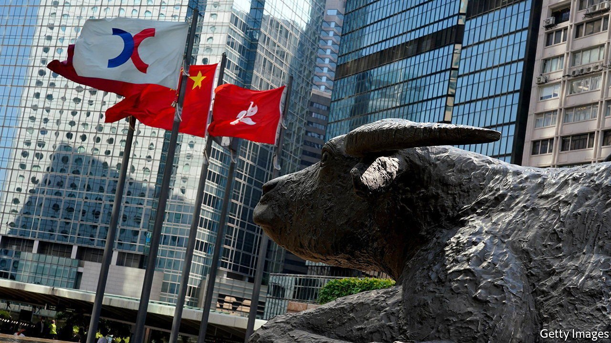

###### Culture clash

# Hong Kong’s regulators try to push back against Chinese market practices 

##### A proposal to codify banking conduct could stir controversy 

 

> Jul 3rd 2021 

HONG KONG is where China meets the outside world. The territory has long been a training ground for mainland Chinese bankers hoping to take on the planet. But recently it is Wall Street banks that are being schooled in Chinese practices. As companies from the mainland have come to dominate initial public offerings (IPOs) and bond issuances in the territory, so too have mainland methods crept into the underwriting process behind the deals.

Western banks have decried the shift, claiming it hampers price discovery. Global investors are also up in arms about what they say are inflated stock and bond offerings. Hong Kong’s Securities and Futures Commission (SFC) is attempting to address the clash. It has released a consultation paper that proposes codifying Western norms. The results of the consultation are expected in coming weeks and could add a new set of rules to the SFC’s existing code of conduct for bankers. Whatever the outcome, it is sure to stir controversy.


The process of bringing an IPO or bond to investors is generally defined by many unwritten practices shaped by the market where the deal is underwritten. Hong Kong’s investment-banking culture borrowed heavily from the Eurobond market that developed in London in the 1970s and 1980s. Companies issuing securities have usually appointed a lead bank among the syndicate of institutions underwriting the deal at an early stage in the process. The role of the banks, and the purpose of their fees, has been clear. Crucially, the lead bank can advise the company on pricing and allocating shares to investors. This helps ensure the demand for securities is genuine. The setup also brings in investors with experience in valuing securities, and keeps out speculative cash.

All this has been changing, however. Today many companies, mainly ones hailing from mainland China, do not assign roles to the banks until the last possible moment, allowing for a scrum of investment banks to vie for supremacy—and fees—in the syndicate. In some recent bond deals dozens of banks have ended up on the ticket, each scrapping for a puny fee. Instead of a co-ordinated pricing process, the result is muddied price discovery.

Banks knowingly take inflated orders, driving up the price of the security. In one case the SFC found that the heads of an IPO syndicate spread misleading information that overstated the demand for shares. In debt deals some banks submit “X orders” that do not disclose the identity of their clients and make it harder to assess true demand. It is these newer practices that Hong Kong’s regulators want to push back against, while acknowledging the older methods as best practice.

Many global banks support the establishment of a set of standards. “We all have to be singing from the same hymn sheet,” notes one banker. Mainland institutions, though, have a different tale to tell. They say the griping from Western rivals mainly reflects sour grapes. Chinese companies have gone from issuing about $20bn in US-dollar denominated bonds in 2011, or about 1% of global issuance, to about $209bn in 2019, or 6% of the global market, according to Dealogic, a data provider. They have also made Hong Kong one of the world’s largest IPO venues for a decade. Mainland banks have shot up in the league tables for such offerings in that time. It is only natural, a banker at one such firm says, that they have greater control over market practices.

The SFC is in the unenviable position of having to pick sides. Its proposed rules implicitly reject the creeping influence from mainland financial institutions and could disadvantage Chinese companies seeking to raise capital in Hong Kong and their mainland bankers, while giving Wall Street banks and global investors an edge. No wonder, then, that it only reluctantly took up the case for a code, after years of lobbying by global investment managers and banks. But there are worse imaginable scenarios for the regulator—such as one in which opacity slowly engulfs the market, and investors see little distinction between Hong Kong and the mainland. ■

