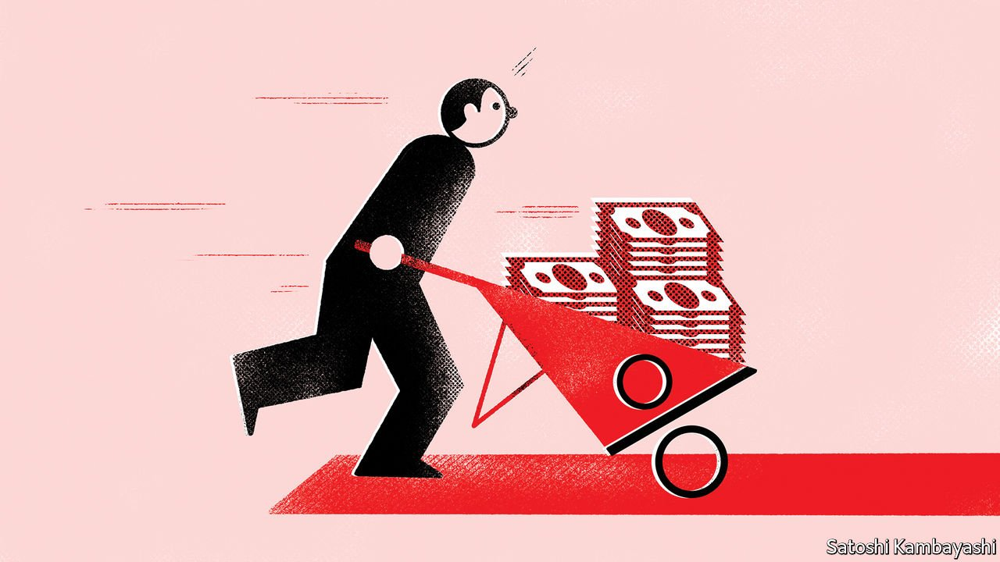

###### Buttonwood

# The return of the carry trade 

##### Interest-rate rises in some big emerging markets will entice foreign capital 

 

> Jul 3rd 2021 

I F YOU LIKE a central bank that responds to inflation surprises by—and here’s a retro touch—raising interest rates, then the Banco de México might be the one for you. On June 24th it surprised the markets by increasing its benchmark rate from 4% to 4.25%. Although it said in its statement that much of the recent rise in inflation was “transitory”, the scale and persistence of inflation was worrying enough to warrant higher interest rates.

Mexico is no outlier. Brazil’s central bank has pushed up interest rates to 4.25% from a low of 2% in March. Russia has raised its main rate to 5.5% in three separate moves. These countries belong to the high-yielders, a group of biggish emerging-market economies, where interest rates are some distance from the rich-world norm of zero. All three believe a lot of today’s inflation will fade. But none is taking any chances.


Scan the central banks’ statements, and a clear concern emerges: keeping expectations of inflation in check. This is in part, or even mostly, about exchange rates. Higher interest rates keep domestic savings onshore in the local currency. They also entice capital from yield-starved foreigners. This is called the carry trade—and it is coming back.

High interest rates are now so rare in large economies that where they occur they require explanations. Latin America has a history of inflation. It is hard to get people to trust a currency when memories of betrayal linger. A related explanation is high public debt. Brazil’s burden is nearing 100% of GDP. Fiscal incontinence in developing countries often leads to inflation. High yields are needed to compensate for that risk. But such explanations only get you so far. Though Poland has suffered an episode of hyperinflation in living memory, it is a low-yielder. Turkey’s yields are high even though its public-debt burden is well below the emerging-market average.

High yields are in the end a reflection of a lack of domestic savings, says Gene Frieda of PIMCO, a fixed-income fund manager. A telltale sign is a country’s current-account balance. As a matter of accounting, a deficit means that domestic savings are not sufficient to cover investment. Foreign capital is needed and high yields are the lure. Much of emerging Asia runs a surplus on its current account and has high domestic savings—and thus low yields. Poland and the Czech Republic, both low-yielders, were able to reliably augment their domestic savings with EU grants and direct investment from Western European firms. Russia, which has high yields and a current-account surplus, looks like an exception. But the surplus reflects its ultra-conservative monetary and fiscal policies, says Mr Frieda. The net effect is to raise yields and lower GDP growth but strengthen the balance of payments. Russia’s rulers accept this to avoid being beholden to foreign capital.

That brings us to the carry trade. Policymakers in emerging markets are galled by the vagaries of capital flows. But carry traders are their friends. The inflation expectations that central bankers bang on about are entwined with the exchange rate. A weakening currency can be a sign of anxiety about inflation. And in the past year, currency weakness has also been a source of emerging-market inflation, says Gabriel Sterne of Oxford Economics, a consultancy. So when a central bank raises interest rates, it is in part because it wants a stronger currency to curb import costs. This might be the quickest way to bring inflation down.

For their part, carry traders like a yield curve that is steep—meaning five- or ten-year bond yields are a lot higher than short-term interest rates. A steep curve captures expectations of future rises in policy rates. Traders also hope to bet on an appreciating currency. Factors other than interest rates then come into play. One is valuation. If a currency has fallen a long way recently, it has greater scope to rise again. Another is a country’s terms of trade, the prices of its exports relative to imports. Oil exporters are in favour now because of high oil prices. Carry traders must be mindful of influences that could blow up a currency. Turkey has attractively high yields, but its erratic monetary policy creates a minefield.

Brazil, Mexico and Russia are at the leading edge of a new trend. Economists at JPMorgan Chase, a bank, reckon that Chile, Colombia and Peru will soon be raising rates. South Africa will join them before the year is out. The Banco de México and company are not going to hang out a sign saying “carry traders welcome”. But they might as well put one up. The more their currencies rise, the less work they have to do. ■

