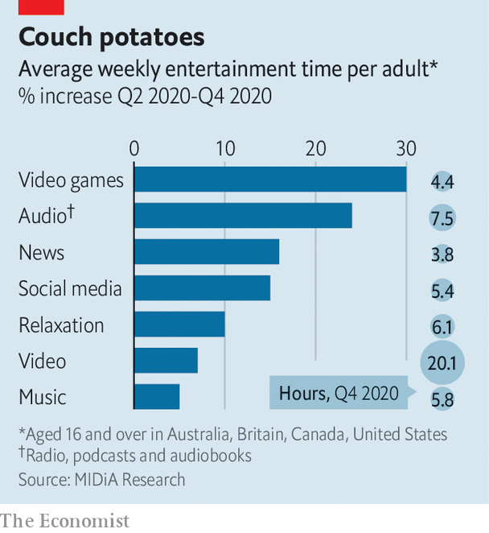

###### Home entertainment

# As lockdowns lift, media firms brace for an “attention recession” 

##### People have spent a year glued to screens, but now the attention boom is turning to bust 

 

> Jul 1st 2021 

“THE NUMBER of people who are in a new size is pretty staggering,” Chip Bergh, the head of Levi Strauss, admitted in June. After more than a year of on-and-off lockdowns, the denim-maker told the Associated Press that a quarter of customers no longer fit in their jeans.

The long spell on the sofa may have been bad for the world’s waistlines, but it has been a golden era for the industries that provide in-home distractions. As entertainment options outside the home were shut down, and commuting gave way to home-working, people had time on their hands. Consumption of everything from books and podcasts to music and video games shot up (see chart).


Now, as  begin to do their job, governments in many rich countries are starting to lift stay-at-home orders, and people are venturing back out. Offices are reopening, restaurants are taking orders and live audiences are back, everywhere from Cannes to Wimbledon. Our “normalcy index” shows that life in many of the 50 countries included is creeping back to business as usual.

 


As the amount of spare time at home starts to shrink, the attention boom of 2020 is giving way to what Mark Mulligan of MIDiA Research, a firm of analysts, dubs an “attention recession”. The squeeze on free time means that media companies are now all asking the same question, says Brendan Brady of Antenna, a company that measures video-streaming subscriptions: “Is this now a period of stability? Or are we going to fall off a cliff?”

Twiddling their thumbs

The average full-time worker gained about 15% more spare time during the pandemic, according to a survey by MIDiA of consumers in America, Australia, Britain and Canada. Not only did they have more time, but those who kept their jobs had more money, too. Americans’ spending on recreation such as sports, theme parks and holidays, fell by 30% in 2020.

Instead, people turned to their screens. In Britain, the time people spent online last year (including television streaming services) rose by more than half an hour a day, to nearly five hours, according to Ofcom, a communications regulator. Being connected became essential. At the start of the pandemic one in ten British homes lacked internet access, but since then about half of those have gone online. Seeking new distractions, smartphone users around the world installed 143bn new apps, a quarter more than in 2019 (and more than double the previous year’s rate of growth), according to Craig Chapple of Sensor Tower, which monitors app stores.

The biggest share of the extra screen-time went to television: video-viewing rose by about 80 minutes a week in rich countries, finds MIDiA. Video-gaming saw the biggest proportional jump, as people devoted an extra hour per week, or 30% more time, to games. Listening to music edged up by 5%, while podcasts and audiobooks rose by nearly a quarter.

Books of the printed variety also got a boost. In Britain, four out of ten people reported that they were reading more than they used to, according to Nielsen, a data firm. The jump was most pronounced among young people, particularly women, who spent 50% more time reading than they did before the pandemic. Some of this was escapism, but much of the reading had a practical motive: cooking and gardening books were the top choices in non-fiction, while in children’s books, home-learning saw the biggest increase.

As spare time dries up, the question is which of these newly acquired habits will stick and which will be dropped. In the ultra-competitive video-streaming market, there are early signs that audiences may be cutting back. The average number of streaming services used by viewers in America is falling for the first time, according to Omdia, a research firm. In April the typical viewer used 7.06 services (including free ones), down from 7.23 in November. Worldwide, 5m people signed up to , the market leader, in the first quarter of the year, down from 15m in the same period in 2020. Disney+, a leading rival, also undershot analysts’ sign-up forecasts.

Yet the main losers in the attention recession, when it comes to viewing, will be old-school formats. Cable-viewing in America, long in decline, rose slightly during the depths of 2020’s lockdown. But reopening has set it sliding faster than ever: by 23% year on year in the second quarter of 2021, according to MoffettNathanson, a firm of analysts. Viewership of American broadcast television dropped by the same amount. And although most  have reopened, the year-long disruption was enough to persuade film studios to change the way they do business. Some now release their new blockbusters on their streaming services on the same date that they make their cinema debut. The long “theatrical window”—the three months when a new film could only be seen on big screens—has been permanently cut short (see Business section).

As well as hastening the switch from old to new formats, covid-19 has shown how different sorts of media increasingly compete with each other for consumers’ attention. Until a decade ago, people accessed different media using different hardware: TV sets for video, computers for gaming, stereos for music. Today all varieties are delivered by smartphone.

People don’t have a specific slot in their schedule for video, says Emmett Shear, chief executive of Twitch, a live-streaming company. Instead, “People think about, ‘Where am I going to get entertainment?’… and they go to the service that is providing the most of that.” As lockdowns lift, he adds, Twitch’s main competitors will probably be basketball, frisbee and the park.

The competition between different types of media is clearest in audio. During the downtime of 2020 people listened to more of everything, from music to podcasts and audiobooks. But music’s share of overall listening time went down. At the start of the pandemic, podcasts and audiobooks accounted for a fifth of all listening. By the end of last year their share had risen to a quarter, says MIDiA. As listening time returns to pre-pandemic levels, some evidence suggests that people are sticking with these new choices, and cutting back on music to make way for them. Spotify said in April that podcasts had nibbled away at music to reach an all-time high in their share of customers’ total listening.

The rebalancing from music to podcasts suits streaming companies. Whereas they license most of their music from record companies, which own the rights to songs, they are increasingly commissioning podcasts of their own. This gives them both a way to differentiate themselves from their competitors—“Call Her Daddy” and “The Joe Rogan Experience” are exclusive to Spotify, for instance—and to increase their profit margins. Mr Mulligan notes that Amazon has an opportunity to differentiate its own audio offering by combining Amazon Music, its music- and podcast-streaming service, with Audible, its audiobook company.

No obstacles for Roblox

The single biggest new media habit to be formed during the pandemic appears to be gaming. The extra hour per week that people spent gaming last year represented the largest percentage increase of any media category. And unlike other lockdown hobbies, it is showing no sign of falling away as life gets back to normal. It has become “a sticky habit”, says Craig Chapple of Sensor Tower. He finds that last year people installed 56.2bn gaming apps, a third more than in 2019 (and three times the rate of increase the previous year). The easing of lockdowns is not denting the habit: the first quarter of 2021 saw more installations than any quarter of 2020. Roblox, a sprawling platform on which people make and share their own basic games, reported that in the first quarter of this year players spent nearly 10bn hours on the platform, nearly twice as much time as they spent in the same period in 2020.

 


Gaming’s popularity rests most heavily on Generation Z—roughly, under-25s—who account for most of Roblox’s users. A poll in February by Deloitte, a consultancy, found that whereas all other generations of Americans named television and films as their favourite form of home entertainment, Generation Z ranked them last, after video games, music, web browsing and social media. In time, “the dominant position that video entertainment has held could be challenged,” Deloitte argues.

The changing shape of post-lockdown life can also be seen through social media. People spent an extra 40 minutes a week on social networks last year, as well as an extra half-hour consuming news, sometimes via social-media platforms. In April this year Facebook said that the increased levels of engagement it had seen in 2020 were subsiding as lockdowns eased.

Snapchat, on the other hand, reported the opposite. Evan Spiegel, chief executive of Snap, the app’s developer, told investors that as lockdowns lifted in America in late February, the amount of content posted on it increased. Since the end of March, he said, there had been a rise in the rate of new friendships, as people began to socialise more in real life. “There doesn’t seem to be much concern that social-media usage will meaningfully erode as economies open up,” notes Michael Nathanson of MoffettNathanson in an analyst’s note. “With people able to meet more in person, it may indeed increase.”

Perhaps the most obvious winner among social networks will be dating apps. Match Group, which owns several such outfits including Tinder, reported that new sign-ups fell last year in April, as covid-19 arrived, and again in December, amid the virus’s second wave. But now people seem to be making up for lost time. So far this year sign-ups are running about 10% higher than they were before the pandemic. In February nearly 20% more messages were sent than a year earlier. As people’s attention turns from the screen back to real life, Match has told investors to look forward to a “summer of love”. ■

Dig deeper

All our stories relating to the pandemic and the vaccines can be found on our . You can also listen to , our podcast on the race between injections and infections, and find trackers showing ,  and the virus’s spread across  and .

A version of this article was published online on June 27th 2021

