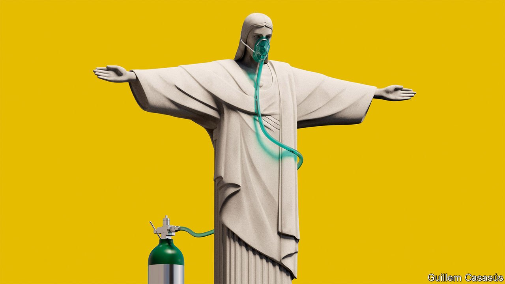

###### On Afghanistan, Tesla, UNESCO, Brazil, Geordies

# Letters to the editor 

##### A selection of correspondence 

 

> Jul 3rd 2021 


Proximate rivals

The role of Afghanistan’s near neighbours is missing from most analysis of what happens when America withdraws its troops (“”, June 12th). Arguably most benign is Iran. Apart from a dispute over the Herat river, the Iranians seek peaceful relations with their neighbour, wish to protect the Shia, Tajik and Hazara, groups, who were victims of Taliban massacres, and suppress the drugs trade, which is proving devastating to Iran’s urban youth. Iran actually supported NATO’s intervention in 2001. It is glad to see America go, but remains extremely wary of the Sunni Taliban and has no interest in stirring-up disorder.


Pakistan, unfortunately, has persuaded itself that Afghanistan represents strategic depth in its existential struggle with India. This is not so much territorial but in terms of being able to attract Pashtuns over the Durand Line to attack India. That it can hold this view, while simultaneously carrying out vicious military campaigns in Waziristan to suppress other groups of Pashtun Islamist extremists, demonstrates a fundamental ambivalence that has haunted the 20-year campaign. After the most recent American-Taliban talks, the latter flew straight to Islamabad to brief Pakistani officials.

Besides guaranteeing the Afghan government’s finances, perhaps the West’s most important task is drawing these countries into constructive dialogues, applying pressure where it can, like Pakistan, and perhaps easing pressure elsewhere, like Iran.

SIMON DIGGINS

Defence attaché, Kabul 2008-10

Rickmansworth, Hertfordshire

 


The secret of Tesla’s success

You offered a sober reminder to investors in new electric-vehicle companies that carmaking at the turn of the 20th century was “littered with defunct marques” (“”, June 5th). Indeed a blueprint for startups “vying to follow in Elon Musk’s tyre tracks” includes a vital element missing among the three you mentioned (finding a starting niche; producing cars at scale; and creating a sales, repair and distribution network). The dirty secret behind Tesla’s success is clean credits. Several states now require carmakers to sell a fixed percentage of zero-emission vehicles. Since most fall short, they must buy regulatory credits from companies like Tesla. In fact, without such credit sales, Tesla would have posted a net loss instead of a profit in 2020. Profits could depend less on car sales and more on credit sales.

FRANÇOIS MELESE

Pacific Grove, California

 


Clash of cultures

I found column revisiting C.P. Snow’s two cultures thought-provoking (June 19th). In 2007 the Royal Society was given £2m ($2.8m) to launch an investment fund supporting “deep science” businesses at their earliest and riskiest stage. The donor said he wanted the elite science community, which forms the society, to “get down from their ivory tower” and do more to support wealth creation. The fund subsequently raised more donations from living fellows of the society than any other initiative and made several successful investments. Despite this it was outsourced into oblivion in 2014. Maybe there are three cultures: humanities, sciences and trade?

ANDREW MACKINTOSH

Founding chief executive

Royal Society Enterprise Fund

Oxford

 


World heritage sites

“” (June 12th) reported on the objections from UNESCO to greening initiatives, such as wind turbines on the hills surrounding Bath. As the owner of a world heritage site, I can assure you that UNESCO does not have the authority to prohibit anything, though it can remove its world heritage label and the prestige that goes with it. One example is Dresden’s Elbe Valley, which had its world heritage status removed when a new bridge was built across the river. Ultimately, the choice is entirely one for local politicians.

JORDI GOETSTOUWERS ODENA

Van Nellefabriek

Rotterdam

 


The legacy of Brazil’s army

Although far from being the country’s only problem, Brazil’s politics are now so disreputable that it discourages those who could make a difference from running for office (, June 5th). Unless there's a structural break, 20 years from now I'll be reading about the same problems in The Economist.

Regarding the army, you presented the notion of Brazil’s dictatorship as benign compared with other Latin American countries. That is true in so far as the number of people it killed were in the low thousands. But the legacy of pain extends further than that. The dictatorship probably tortured tens of thousands, a staggering amount. And many of Brazil's current woes were created or exacerbated by the dictatorship, such as police brutality, the destruction of the Amazon and a poor education system.

Yes, Brazil has had time for the civilian leadership to deal with these problems, but the damage done by 20 years of military power was extensive and pervasive. The army’s reputation as a trusted institution is undeserved as it has not faced much scrutiny.

PEDRO FRANCO DE CAMPOS PINTO

Assistant professor

Musashi University

Tokyo

You encouraged Brazilians to vote Jair Bolsonaro out of office in 2022. However, the photograph accompanying your text of a protester likening Mr Bolsonaro to Adolf Hitler was ill-chosen. Making a parallel between a genocidal dictator and a democratic leader, no matter how bad he is at the job, is an affront to the former’s victims. And weakens an awareness of the threats that right- and left-wing populists pose on the still fragile Latin American democracies.

JOSÉ TOMÁS AGUIRRE EDWARDS

Santiago

Your report mentioned Rondônia, a state that is the posterchild of deforestation in Brazil. In May the state governor signed into law a project approved unanimously by the state assembly (where most members have cattle ranches) removing 151,000 hectares from Jaci Parana reserve and 50,000 hectares from Guajara Mirim state park. These reserves were created on public lands decades ago and supported by projects such as PLANAFLORO (funded by the World Bank). It is just the latest case of the state government pleasing developers of public lands, who are clearing them for pasture and, eventually, soyabeans. The best way to stop deforestation in the Amazon is for concerned foreign companies, governments and individuals to stop buying Brazilian.

FABIO OLMOS

São Paulo

 


Top tips

As a schoolboy in the 1980s from Gosforth, Viz was regularly digested with glee, so I greatly enjoyed Geordie Tory character (June 12th). Maybe he should extend his inspiration into a regular tips feature. Viz’s top tips often contained handy financial suggestions that serve me well today, such as changing one’s name to avoid the expense of paying for a personalised car-number plate.

MR EX19KPN

(aka ROBIN HILTON)

Harpenden, Hertfordshire

