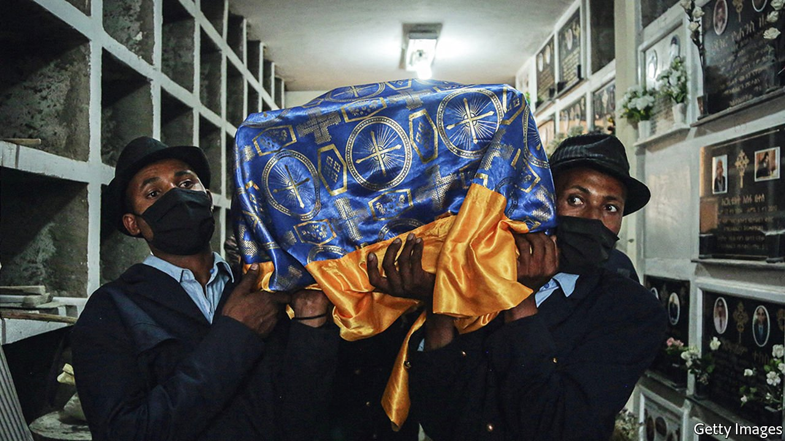
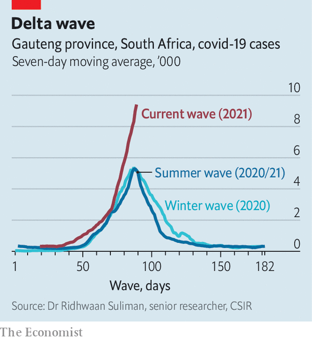

###### Third time unlucky

# Africa’s latest wave of covid-19 could be its worst yet 

##### A lack of vaccines means it will not be the last 

 

> Jul 1st 2021 

IN THE EARLY months of the pandemic it was common to hear that Africa had been  of covid-19. Experts pointed to low official rates of illness or death and speculated about whether they were a result of youthful demography, Africa’s experience of dealing with infectious diseases such as Ebola and HIV, or something else entirely, perhaps underlying immunity. The premise was shaky, however. Most African countries test tiny numbers of people. Only a few keep good track of deaths. One that does, South Africa, has suffered one of the world’s highest levels of excess mortality during the pandemic. The sanguine view also neglected how, even if Africa’s waves really were less deadly than elsewhere, there might also be more of them because of low vaccination rates.

Today there is little sign of the continent being spared. As of June 28th the seven-day rolling average of confirmed cases in South Africa was 267 per million people, more than five times the global average, and rising steeply. Almost a quarter of tests are positive, suggesting that many cases are going undetected. “The latest surge threatens to be Africa’s worst yet,” says Matshidiso Moeti, the head of the World Health Organisation (WHO) in Africa. Cases are rising especially quickly in 12 countries, she says, though “health systems are already pushed to breaking point” in many more. In Namibia, Uganda and Zambia, among other places, oxygen is running out and hospital beds are full. The WHO calculates that, within weeks, the Africa-wide caseload of the third wave will surpass the peak of the second, which in turn was higher than the peak of the first.


Dr Moeti highlights two reasons for the strength of the latest wave. The first is public fatigue. In rich countries covid-19 was seen as a once-in-a-lifetime event to be endured until vaccines arrived; in many African ones it is another burden among many, with no sign of relief. Governments have been slower to impose lockdowns this time around. They have no money to pay people to stay at home, fear the effects on commerce and note the lack of public clamour for restrictions. "The third wave has come with a severity that most countries were not prepared for,” adds John Nkengasong, the director of Africa Centres for Disease Control and Prevention (Africa CDC), a continent-wide public-health body.

 


The second is the arrival of new variants. Not every African country can sequence virus genomes. But more than half have reported the Alpha variant first detected in Britain and the Beta variant initially spotted in South Africa. Nearly a quarter have reported the Delta variant linked to India’s catastrophic second wave.

Those countries include Congo and Uganda. Neither has many confirmed cases of the virus. Congo, a country of 87m people, has recorded 40,000, fewer than Glasgow, a Scottish city of 630,000 people. But, in an indication of covid-19’s true spread, 32 of the country’s 600-odd MPs have died from the disease. In Uganda more than 200 MPs and parliamentary staff have tested positive in the past few weeks. This is part of a broader trend. As of February, Africa accounted for 17 of the 24 government ministers or heads of state who are reported to have died from covid-19, noted a paper in the British Medical Journal.

South Africa is at the centre of the continent’s third wave. On June 27th President Cyril Ramaphosa announced a partial lockdown, warning that cases would surpass previous peaks. Gauteng, the province that is home to Johannesburg and about a quarter of South Africans, accounts for more than half of recent cases. The week to June 26th saw more excess deaths in Johannesburg than at any time since records began in 1997. Hospitals are overwhelmed. Ambulances drive around looking for beds. In the absence of a government plan, doctors use WhatsApp groups to find out if other hospitals have space. Even the best private hospitals are wrestling with grim decisions about who gets a spot in intensive-care units—in other words, with who lives and who dies. “It’s real ‘Who gets the parachute?’ stuff,” says a doctor.

South Africa is also dealing with public fatigue, a battered economy and new variants. Delta is “rapidly displacing” the Beta variant, says Mr Ramaphosa. But the government has added to the carnage. There is no permanent health minister, following the suspension of Zweli Mkhize, who is accused of steering a contract to a firm run by associates (he denies the allegations). A large public hospital in Johannesburg is closed because the provincial government was slow to repair it after a fire in April. Mr Ramaphosa’s televised “family meetings” initially won plaudits. But his appearances are increasingly tone-deaf. The latest restrictions, which include another ban on alcohol sales, came late in the day.

Inoculation would have lessened the impact of the third wave. But just over 1% of Africans have been fully vaccinated. Of the nearly 3bn doses administered globally, fewer than 2% are in Africa.

Hesitancy remains a problem. Tanzania has yet to start jabbing arms because its late president, John Magufuli, denied the usefulness of vaccines. South Africa rejected a shipment of AstraZeneca doses on the grounds that data suggested it would not stop mild infection, an argument criticised by scientists who said it would probably reduce the risk of hospitalisation and death. In Gauteng those who can are seeking other options. Diplomatic missions are organising their own vaccines. Expatriates are flying home to get jabbed.

But the main reason for low vaccination rates is simple: a . Dr Nkengasong notes that African countries have placed enough orders to meet Africa CDC’s target of getting 60% of the continent vaccinated by the end of 2022. The problem has been turning orders into deliveries.

An announcement made on June 30th should help. The International Finance Corporation, an arm of the World Bank, and the American, French and German governments, said they would provide €600m in financing to help Aspen Pharmacare, a South African firm, manufacture vaccines. The deal could help produce as many as 250m single-shot Johnson &amp; Johnson doses for the continent this year, including 30m for South Africa. Such volumes raise the prospect that a fourth wave could be less deadly than the third. ■

Dig deeper

All our stories relating to the pandemic and the vaccines can be found on our . You can also listen to , our podcast on the race between injections and infections, and find trackers showing ,  and the virus’s spread across  and .

A version of this article was published online on June 28th 2021

