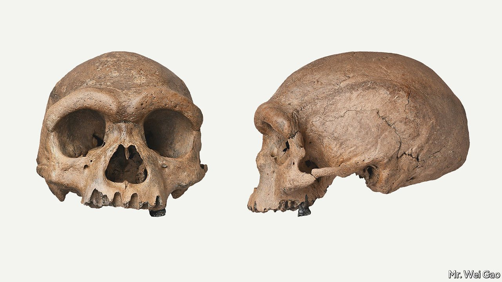

###### Palaeoanthropology

# A new human species may have been identified 

##### Or perhaps the first cranium of one already known 

 

> Jul 1st 2021 

TWO NEW studies add further pieces to the jigsaw puzzle that is human evolution. One reports a potential extra member of the genus Homo. The other casts light on possible interbreeding between three human species in the Middle East.

Homo longi—“Dragon man” as translated into English from Chinese, via Latin—is not a novel find, but a reinterpretation of an existing one. The cranium in question was dug up in Harbin in 1933 and is held at Hebei GEO University, in Shijiazhuang. It is 146,000 years old and was originally badged as an archaic form of Homo sapiens. But Ni Xijun and Ji Qiang, who work at the university, disagree. As they report in the Innovation, the cranium would indeed have contained a brain similar in size to a modern human’s, but the fossil is too large to be sapiens and has molars and eye sockets which dwarf those of people today. Dr Ni and Dr Ji also realised that it is too long and low to be sapiens. It lacks the roundness of a modern human cranium.


This is good news for supporters of the recent-African-origin theory, which holds that most non-African human beings alive today are descendants of a small number of migrants who crossed to Asia from the Horn of Africa about 60,000 years ago, meaning that any non-African human fossil from before that date is probably of another species descended from earlier, non-sapiens departures from Africa.

The question was, which earlier species did the Harbin fossil represent? By comparing it with known archaic humans, including Homo erectus, Homo floresiensis, Homo heidelbergensis and Homo neanderthalensis, Dr Ni and Dr Ji concluded that it was none of them, and must therefore be new to science and so worthy of its own name. There is, however, one other possibility—for there is a now-extinct type of human of which no cranium has yet been identified. Homo denisova‘s existence was established by the extraction of DNA from a finger bone, and traces of that DNA, a remnant of interspecies breeding, still exist in modern humans, notably in China. Since one of the Harbin fossil’s molars perfectly matches the size and root structure of a molar from the Denisova cave in Russia, after which Homo denisova is named, it may be that Dr Ni and Dr Ji have actually identified the first Denisovan cranium.

The other study, published in Science by Israel Hershkovitz of Tel Aviv University, also speaks to the question of interspecific interbreeding. Even supporters of the recent-African-origin theory recognise that there was, in addition, an earlier “leakage” of Homo sapiens from north-east Africa into the Levant. Dr Hershkovitz and his colleagues have been examining fossils of relevant antiquity—120,000-140,000 years—collected from Nesher Ramla, a site in Israel. These, they found, have sapiens-like jaw bones, Neanderthal-like molars and crania similar to those of Homo erectus. This suggests to them that they are the product of miscegenation between all three.

That so much interbreeding went on between groups of people who had evolved separately for hundreds of thousands of years is intriguing. Besides the imprint of Denisovan genes in modern Asians, it is also known that modern Europeans bear traces of Neanderthals and that some modern Africans similarly bear the imprint of a “ghost” hominid for which no fossil evidence has yet been found. The ancestry of Homo sapiens, it seems, is less a family tree than a worldwide web. ■

A version of this article was published online on June 25th 2021

