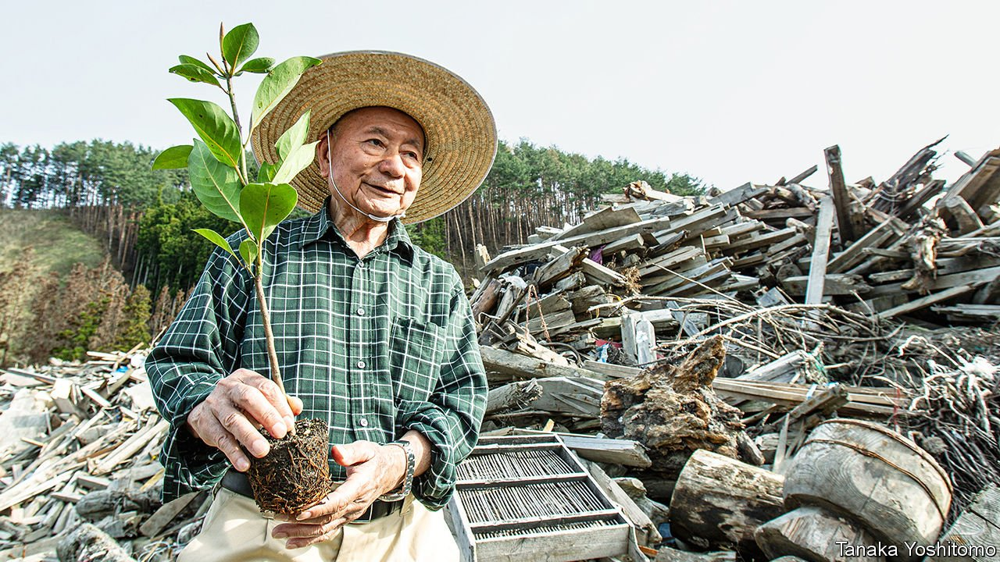
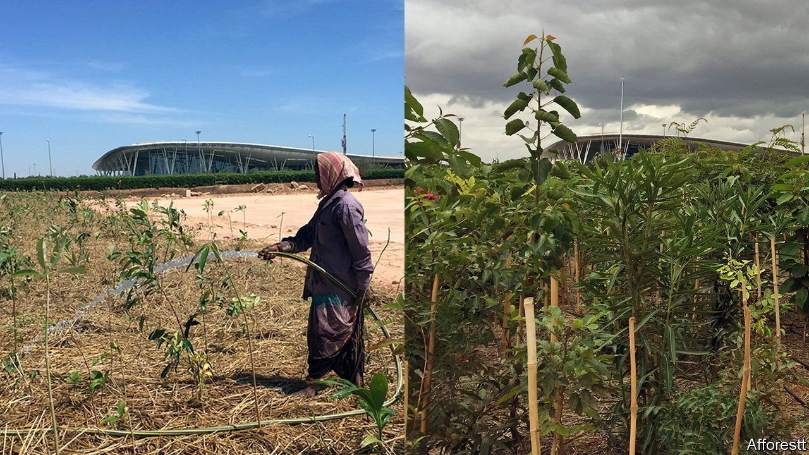

###### Urban environments

# Could miniature forests help air-condition cities? 

##### A Japanese botanist thinks the answer is “yes” 

 

> Jul 1st 2021 

CITY AIR is in a sorry state. It is dirty and hot. Outdoor pollution kills 4.2m people a year, according to the World Health Organisation. Concrete and tarmac, meanwhile, absorb the sun’s rays rather than reflecting them back into space, and also displace plants which would otherwise cool things down by evaporative transpiration. The relentless spread of buildings and roads thus turns urban areas into heat islands, discomforting residents and exacerbating dangerous heatwaves, which are in any case likely to become more frequent as the planet warms.

A possible answer to the twin problems of pollution and heat is trees. Their leaves may destroy at least some chemical pollutants (the question is debated) and they certainly trap airborne particulate matter, which is then washed to the ground by rain. And trees cool things down. Besides transpiration, they provide shade. Their leaves have, after all, evolved to intercept sunlight, the motor of photosynthesis.


To cool an area effectively, though, trees must be planted in quantity. In 2019 researchers at the University of Wisconsin found that American cities need 40% tree coverage to cut urban heat back meaningfully. Unfortunately, not all cities—and especially not those now springing up in the world’s poor and middle-income countries—are blessed with parks, private gardens or even ornamental street trees in sufficient numbers. And the problem is likely to get worse. At the moment, 55% of people live in cities. By 2050 that share is expected to reach 68%.

Under the greenwood tree

One group of botanists believe they have at least a partial solution to this lack of urban vegetation. It is to plant miniature simulacra of natural forests, ecologically engineered for rapid growth. Over the course of a career that began in the 1950s their leader, Miyawaki Akira, a plant ecologist at Yokohama National University, in Japan, has developed a way to do this starting with even the most unpromising derelict areas. Dr Miyawaki (pictured above) retired from his university post in 1993, but is still going strong. And the Miyawaki method, as it has become known, is finding increasing favour around the world.

Dr Miyawaki’s insight was to deconstruct and rebuild the process of ecological succession, by which bare land develops naturally into mature forest. Usually, the first arrival is grass. Shrubs sprout later, followed by small trees and, finally, larger ones. Incipient and mature woodlands therefore contain different species. The Miyawaki method skips some of the early phases and jumps directly to planting the kinds of species found in a mature wood.

When starting a Miyawaki forest, those involved, who often refer to themselves as gardeners, first analyse the soil in which it will grow. If necessary, they improve it by mixing in suitable fertilisers. These need not be expensive. Chicken manure and press mud (the solid residue left behind when sugar-cane juice is filtered) are effective and essentially free. They then select 100 or so local plant species to deploy. These are chosen by surveying the nearby area on foot instead of relying on published guidebooks, which have a habit of being out of date or even simply wrong.

Using a wide mix of species, not all of them trees, is important. Most plantations, having been created for commercial purposes, are monocultures. But trees, shrubs and ground-covering herbs all coexist in natural forests, and the Miyawaki versions therefore have this variety from the start. Not only does that pack more greenery into a given space, it also encourages the plants to grow faster—for there are lots of positive ecological relations in a natural forest. Vines rely on trees for support. Trees give shade to shrubs. And, beneath the surface, plants’ roots interact with each other, and with soil fungi, in ways that enable a nutrient exchange which is only now beginning to be understood.

After selecting their species, the gardeners gather seeds and plant them at random, rather than in rows. And they plant at high density. The seedlings therefore have to fight for sunlight, so only the fastest-growing survive. Trees planted in this way can shoot up as much as 14% more rapidly than normal. For three years, the gardeners water and nurture their handiwork. Then it is left to fend for itself. A couple of decades later the whole thing reaches maturity.

Dr Miyawaki has supervised the planting of more than 1,500 of these miniature forests, first in Japan, then in other parts of the world. Others are now following in his footsteps. India is particularly keen. In Mumbai, more than 200,000 trees are found in Miyawaki forests throughout the city and its suburbs. In Bangalore, more than 50,000 (see before-and-after picture below, for a forest planted near the city’s airport). A group in Chennai has set up 25 such forests. The authorities in Tirunelveli, in the country’s south, use the Miyawaki method to create green cover in the city’s schools. Hyderabad started growing the largest individual forest of the lot, across four hectares, in 2020.

 


Over India’s western border, in Pakistan, people are following suit. The Ministry of Climate Change claims the country has 126 Miyawaki forests, with 51 in Lahore, 20 in Islamabad and five in Karachi. And to India’s north, in Nepal, the city of Janakpur is likewise planning a Miyawaki blitz.

The method is becoming popular outside Asia, too. In Europe, Belgium, France and the Netherlands are all home to Miyawaki forests. There are also a handful in Latin America. Wherever they are planting, though, gardeners are not constrained to follow nature’s recipe book to the letter. Miyawaki forests can be customised to local requirements. A popular choice, for example, is to include more fruit trees than a natural forest might support, thus creating an orchard that requires no upkeep.

One such pomologist is Shubhendu Sharma. Mr Sharma has, through Afforestt, a firm he founded in 2011, become a leading proponent of the Miyawaki method. He was once an engineer at Toyota’s factory in Bangalore and has brought his experience building cars to bear on the question of tree planting. He is particularly hot on time and motion. He has measured how long, on average, it takes to plant each sort of seed or seedling and uses that information to schedule their sowing. Since its foundation, Afforestt has created 138 forests in ten countries in this way, and is currently setting up four more. It has also spawned at least 15 imitators, in places as disparate as Australia, Chile and Iran.

Here’s one I prepared earlier

Mr Sharma’s epiphany came one day in 2009, when Dr Miyawaki arrived at his workplace to plant a forest there. He was so impressed by this that he decided to transform his own backyard in like manner, with a planting that featured especially guava trees. When he began, only seven types of bird lived in the yard. Two years later he counted 17. Beforehand, rain used to gather in puddles, forming a breeding ground for mosquitoes. Once the trees were established, the soil opened up and the puddles disappeared. The forest also successfully cooled the air. Mr Sharma found that the temperature under his trees was 5°C below that of the surrounding area. As to guava, the forest grew so many of them that his mother had to give them away to neighbours.

What Mr Sharma and others like him offer looks like a modern version of the 19th-century movements that brought city parks and their associated health benefits to the industrialising West. In those days the prevailing attitude towards nature was to try to tame it, and the parks created reflect that in their controlled, formal design. Now, greenery and environmentalism are the fashion, and the quasi-wild Miyawaki approach reflects this to a T. The purpose is the same as before—to introduce rus in urbe. But the means are completely in tune with the times.

The Miyawaki method will never work for large-scale reafforestation. It is too labour intensive. Relying on nature and the passage of time is probably the best bet for replanting extensive areas of damaged woodlands, though technophiles dream of speeding things up by distributing seeds by drone. But if your goal is to better your immediate locale, rather than to save the planet from global warming—and maybe to grow a few guava on the side—then Dr Miyawaki might well be your man. ■

A version of this article was published online on June 30th 2021

