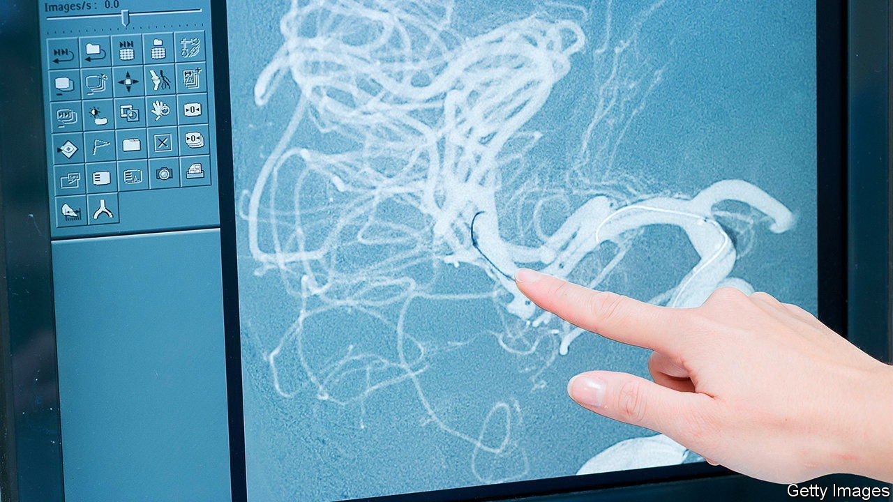

###### Medical testing

# Virtual clinical trials are on their way 

##### They will save on volunteers, and be cheaper 

 

> Jul 1st 2021 

CLINICAL TRIALS are expensive, time-consuming and risky for those taking part. The hunt is therefore on for computer models good enough to replace warm bodies for at least the preliminary phases of trials. In a paper in Nature Communications, Alejandro Frangi of the University of Leeds, in Britain, and his colleagues have published the results of the most comprehensive such virtual trial yet attempted.

Dr Frangi and his team are investigating stent-like devices called intracranial flow diverters. These control the passage of blood through brain arteries and are often used to treat cerebral aneurysms—bulges that form in an arterial wall, in which blood then accumulates. If a cerebral aneurysm bursts, it causes a so-called haemorrhagic stroke, damaging surrounding tissue by engulfing it in blood. Inserting a flow diverter directs the bloodstream away from the aneurysm, permitting blood already within the bulge to stay in place and clot, thus blocking the aneurysm up.


The researchers’ experimental “subjects” were computer models derived from detailed three-dimensional scans of the brains of 82 volunteers with cerebral aneurysms. The team inserted software representations of flow diverters into these models and recorded the consequences for virtual blood flow through the virtual brains in question. They then compared their results with those from three trials of the procedure carried out in the real world in recent years. They confirmed what these real trials had found—that the flow diverters do indeed encourage clots to form in aneurysms—and they rated the stents’ effectiveness at this task as similarly good.

Besides confirming what was already known, Dr Frangi’s virtual trial also investigated previously untested phenomena. For example, past reports in the literature have suggested that for aneurysms near places where arteries fork into two branches, inserting a flow-diverter actually increases the risk of a second type of stroke, ischaemic strokes. But this has never been definitely proved.

Ischaemic strokes are a consequence of a vessel getting blocked. This stops blood flowing to the part of the brain distal to the blockage, which then dies. The virtual trials showed that the risk of an ischaemic stroke did indeed rise if a flow-diverter was fitted near an arterial fork. It also predicted that patients with higher than normal blood pressure were at even greater risk of such fork-related strokes—a finding that had not (and still has not yet) been shown in the real world.

Trial offer

Though it is hard to imagine virtual trials of this sort completely replacing real ones, they could certainly reduce their number by suggesting in advance which avenues are worth exploring. They might also reduce the need for animal trials—and might indeed be more effective than these if they proved better models of human physiology than the laboratory mice now popular for the purpose.

Virtual trials bring other advantages, too. One is that the same procedure can be tested over and over again in the same “patient”, but with different variables. The observation about blood pressure which emerged from Dr Frangi’s work was made this way. And procedures that would be hard to get past an ethics committee if proposed for trial on people can be tested first in a computer, so that only those reckoned most likely to work will need to undergo ethical scrutiny.

Preliminary virtual trials of this sort would also reduce the cost of real-world trials, which clock in at around $40,000 per patient. Regulators would clearly need persuading that virtual tests were reliable enough to yield appropriate data, but successful “hindcasting” of the sort Dr Frangi has just demonstrated will presumably help that happen. ■

A version of this article was published online on June 30th 2021

