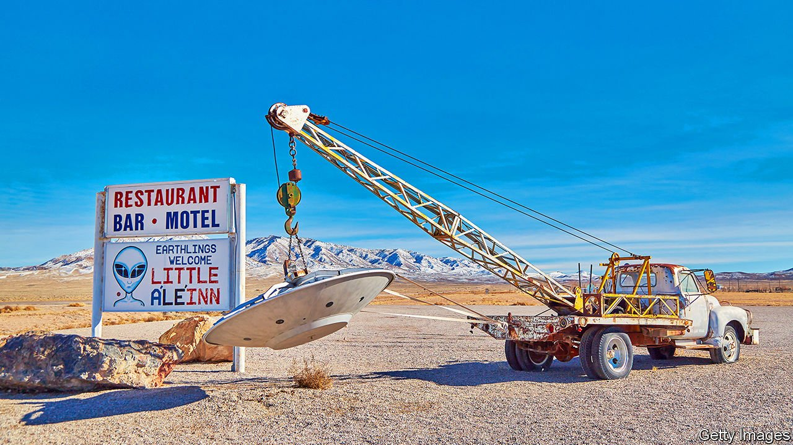

###### Stranger things

# America’s government comes clean on UFOs 

##### The Pentagon has no idea what its pilots are seeing 

 

> Jul 3rd 2021 

BETWEEN 2004 and 2021, American military pilots registered 144 reports of unidentified aerial phenomena (UAPs), the government’s po-faced term for UFOs. One turned out to be a large deflating balloon. The others are a mystery. So concluded a long-awaited report published on June 25th by the Office of the Director of National Intelligence (ODNI), which co-ordinates the work of American intelligence agencies. The nine-page “preliminary assessment” was the result of pressure from Congress. In June last year the Senate’s intelligence committee, then chaired by Marco Rubio, a Republican senator from Florida, asked the Department of Defence to create a UAP Task Force to streamline the collection of reports. In January it was given six months to publish its findings.

Some are striking. One is that UAPs “probably do represent physical objects”, rather than being technical anomalies or figments of pilots’ imaginations. That is because more than half the objects were registered across multiple sensors, including radar and infra-red. Moreover, 18 of the incidents suggested “unusual flight characteristics”, such as moving against the wind or manoeuvring abruptly, though the report warns that this could be the result of sensor errors or misperception.


Yet the report is thin gruel for alien hunters. The ODNI says that if the incidents are ever resolved, they will probably fall into one of five categories: airborne clutter (like hobbyists’ drones), natural atmospheric phenomena (ice crystals, for instance), classified aircraft programmes, “foreign adversaries” or a residual “other”—which is as close as the report comes to entertaining otherworldly possibilities.

Few in the Pentagon seem worried about extraterrestrial invaders. Their concerns are more prosaic, and geopolitical. UAPs present a “safety of flight issue”, for one thing; American pilots reported 11 near-misses. The other concern is that the incidents point to Chinese or Russia snooping or, worse, evidence of “breakthrough technologies”, such as revolutionary means of propulsion.

The report amounts to a giant shrug. The evidence is “largely inconclusive”, it says. Firmer conclusions will require more data. The UAP Task Force will now collect data from more sources, including historical radar records. It will make better use of artificial intelligence to spot patterns, such as whether UAPs coincide with balloons or wildlife. And it will standardise reporting from across military services, since much of the existing data is from the navy.

Part of the answer may lie in better, and more, sensors. An object that appears to travel at hypersonic speeds might be an artefact of a moving camera, an illusion known as parallax. Observing it through more sensors, including those that detect parts of the electromagnetic spectrum above and below visible light, would help.

There is a human element, too. Kathleen Hicks, the deputy secretary of defence, has ordered the Pentagon to put the UAP Task Force on a permanent footing and to ensure that it receives reports of sightings within two weeks.

But one of the biggest obstacles to the collection of data is the stigma associated with the issue. Aviators and analysts “describe disparagement” when they report or discuss UAPs, says the ODNI. “Reputational risk may keep many observers silent,” it warns, “complicating scientific pursuit of the topic.”

For more coverage of Joe Biden’s presidency, visit our dedicated 

