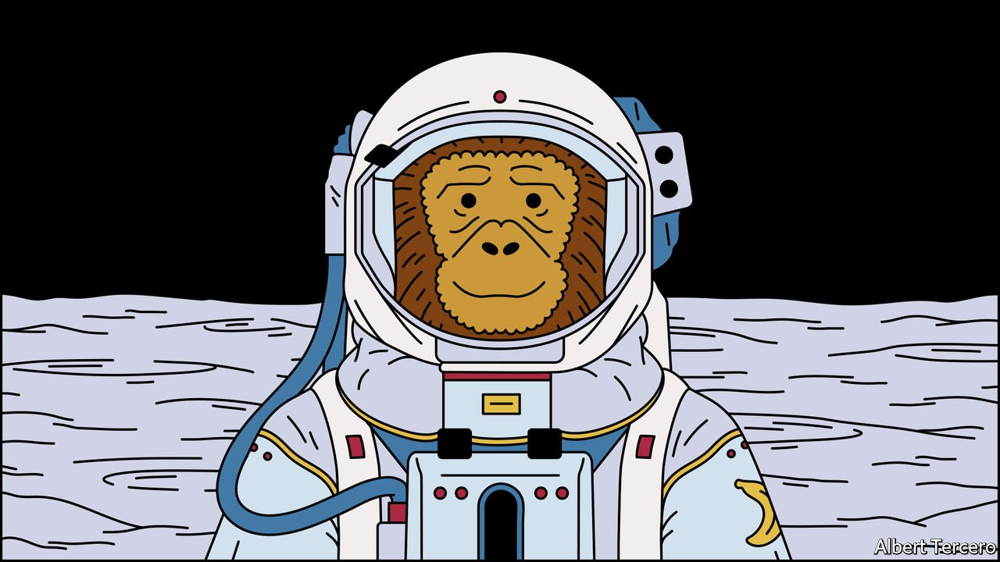
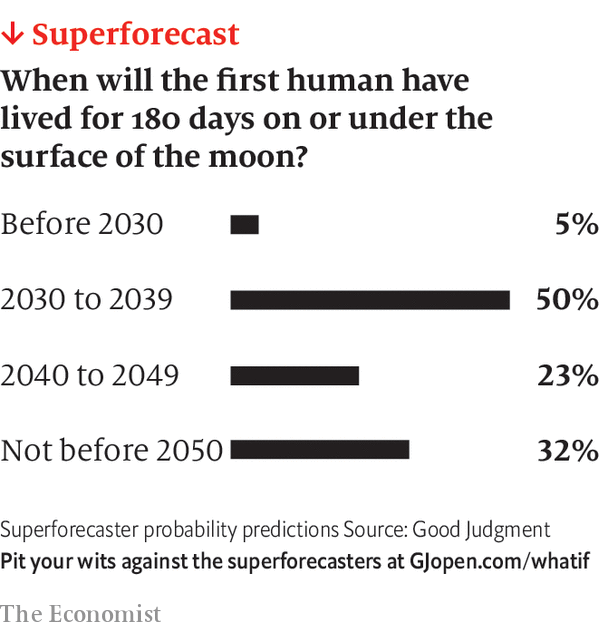

###### Mrs Chippy’s benediction: February 2055

# What if marmosets lived on the Moon? 

##### A primate colony set up to explore one fundamental aspect of the human condition has ended up illuminating another. An imagined scenario from 2055 

 

> Jul 3rd 2021 

 This year What If?, our annual collection of scenarios, considers the future of health. Each of these stories is fiction, but grounded in historical fact, current speculation and real science. They do not present a unified narrative but are set in different possible futures

THEY CAN, at times, look somewhat sinister, their faces oddly small for their heads, their white ear tufts jutting out almost aggressively. Their ability to throw themselves at people across seemingly unfeasible distances can be unsettling, and their buzzing and shrieking takes a lot of getting used to, as does their smell. But the members of the Caird collective will not hear a word spoken against the marmosets with whom they share their spaces at the Moon’s South Pole. As they sit in their insulated caves hoovering moondust out of the animals’ tails, few of the Cairders can imagine their life on the rim of Shackleton crater without them—and none wants to. The marmosets of the Moon are the first and best example of what has turned out to be a fundamental fact of space flight: that the further humans get from Earth, the more they benefit from the companionship of other Earthly animals.

The marmosets were originally brought to the Moon as unwilling participants in a vital research project. Marmosets are light—even under Earth gravity—and reasonably easy to care for, but they have placentas much more like those of humans than any other animal their size, and reasonably short gestation periods. That made them ideal for looking at a fundamental question: can humans have healthy pregnancies in the low gravity of the Moon, where things weigh only one-sixth what they do on Earth?


In the 2020s and 2030s, the years of what the novelist Wil McCarthy called the “Rich Man’s Sky”, questions of obstetrics and gynaecology received remarkably little attention. For many, the idea of staying in space long enough for such things to matter made little sense—space stations in Earth orbit and bases on the Moon were places for fixed-length work contracts and research sojourns, or for tourism. Babies were no more of an issue than they were in isolated 20th-century Antarctic research outposts.

 


There were, as it happens, a few babies born in Antarctica even back then, when its ice cover was all but intact. The Argentine and Chilean governments both saw the creation of natives on the continent as a way to establish sovereignty and arranged births to that end. But there was no reason to think that Antarctica was inimical to pregnancy and infancy. The long-term health effects of low gravity and microgravity—which for those in orbit include brittle bones, muscle wasting and eye disease—were something else. Adults could counter some of these effects with treadmills and tension cords. But as the title of an early paper on the subject succinctly put it, “The fetus cannot exercise like an astronaut.”

Even those, like Elon Musk, who talked of permanent settlements on Mars spent little time working on the question. It was left to a small team of scientists in the Japanese modules of the Artemis base founded in 2029 by America and its allies to explore the question experimentally with the help of marmosets, gene-splicing technology, intra-uterine monitoring devices and a giant centrifuge.

They had some success. Like human fetuses, marmoset fetuses spend most of their gestation with a density equal to that of the amniotic fluid around them, a neutral buoyancy that leaves them indifferent to local gravity; only relatively late on do differences due to gravity start to crop up. After a few years of trial and error, and some dainty gene-editing to rebalance the rate at which bones grow when not stressed through use, the researchers developed a regime involving hormone treatments for the mothers and regular late-pregnancy sessions in their custom-made room-sized centrifuge, known as the marmo-go-round. This reliably produced pups with strong-enough bones and muscles and little by way of deformity, though their tails were impressively long even by marmoset standards.

Unfortunately, in 2038 that research was interrupted by the geopolitical meltdown of the wolf-and-wimp war and then by the 26 months of the Great Grounding. With all powered flight within or through the Earth’s atmosphere prohibited, the various Moon bases seemed doomed even after they agreed to pool their resources to create what became known as the Polynational James Caird Collective. With all the group’s biotech know-how turned to increasing food production and nutrient recycling, the marmosets were at first ignored and then freed to roam within the bases. Their effect on morale was instantaneous and profound.

Primates inter pares

The importance of companion animals to the mental health of people engaged in a homeless lifestyle was well documented in pre-war societies. It has been suggested that the effect of the marmosets on the Caird collective was similar; cut off from Earth, the humans were more homeless than any group of people had ever been before. Caring for, playing with and grooming marmosets also became a basis for bonding between humans, many of whom had not known each other before the Grounding, and some of whose countries had been adversaries in the war. By the time the mysterious entity responsible for the Great Grounding finally abandoned its control of the Earth’s air-traffic-control and missile-defence systems, allowing traffic with the Moon to resume, the marmosets had become an indispensable part of the settlers’ new identity and society. Few believe that a lack of companion animals was, in itself, the reason that the Mars base failed during the Grounding. But it surely did not help.

The bond between the Moon’s larger and smaller primates persisted even as the rigours of separation came to an end. Almost all Cairders still dislike spending any significant time deprived of marmoset company. They cuddle them and relish their low-gravity acrobatics. In a joking way that seems, at some level, not to be a joke, they treat the abnormally long tails of the Moon-born marmosets as a sign of providence, holding the tail-fur to be particularly good at picking up moondust. The dust, which can cause lung disease, infiltrates their habitats despite all the airlock precautions; its suppression is a constant battle. Whether hoovering it out of tails which accumulate it in the manner of a feather duster is in fact more effective than the settlement’s electrostatic air-filtration systems is open to question. But it is clearly more therapeutic. And the marmosets enjoy the attention.

The oldest Earth-born marmoset, New Mrs Chippy (who is, despite his name, male) enjoys an honorary seat on the collective’s council. He has now reached the age of 31 with no obvious signs of ageing other than a pelt almost as white as his ear tufts. This is seen as a good omen for human longevity among those Cairders who refuse to countenance a return to Earth. In Japan, by contrast, laboratory marmosets rarely make it past their 21st birthday.

SANS everything

The most salient biological, as opposed to sociological, novelty among Moon-born marmosets is a very high prevalence of adolescent-onset blindness. The constellation of eyesight problems known as “Spaceflight Associated Neuro-ocular Syndrome” (SANS) has been studied since early this century. In adult humans SANS normally develops only during long stays in the microgravity conditions of space stations; it is rare and mild among humans on the Moon. But in marmosets born in low gravity it develops swiftly and severely at the onset of puberty and leads to almost complete loss of vision.

There is as yet no agreed explanation for this pathology. Some researchers believe it is not in fact gravity-related but the result of an off-target effect of the gene editing which realigned the calcium pathways used in bone growth, but it is hard to square this with the similarity to SANS as experienced by genotypical adult humans. Others think its onset could be avoided if newborn pups were required to spend more, or all, of their time in the simulated Earth-normal gravity of the centrifuge. But it has proved hard to test this hypothesis. Infants that have spent any time at all in lunar gravity are greatly distressed by the rigours of the centrifuge and will not suckle when put into it. And Cairders are unanimous in their opposition to anything that causes marmosets distress.

The blind marmosets are not badly off. Their sibling groups and human companions provide what little practical support they need. And they are happier than sighted marmosets to travel in the pouches which many Cairders have incorporated into the suits they use for working on the lunar surface. Sighted marmosets are clearly disturbed by the harsh monochrome landscape, even when emotionally supported with the amplified sound of their companion’s heartbeat.

Sudden-onset SANS leaves the question of whether human children can be born and raised on the Moon unanswered. It is sometimes suggested that a blind woman happy with the idea of a child who might also be blind could choose to join the collective and explore the issue. But bringing a child to term would require a centrifuge capable of holding a grown human, rather than a 250-gram marmoset. There is no appetite among Cairders for devoting resources to such a project, and their juche ethic of self-sufficiency will not let them accept funding for such experiments from Earth. Thus how well humans may eventually be able to breed on alien worlds remains unknown, even today.

That they will take animal companions with them, though, now seems certain. And some of those companions will surely have shocking-white ear tufts, odd little faces and very long tails.■

Full contents of this What If?


Mrs Chippy’s benediction, February 2055: What if marmosets lived on the Moon?*


