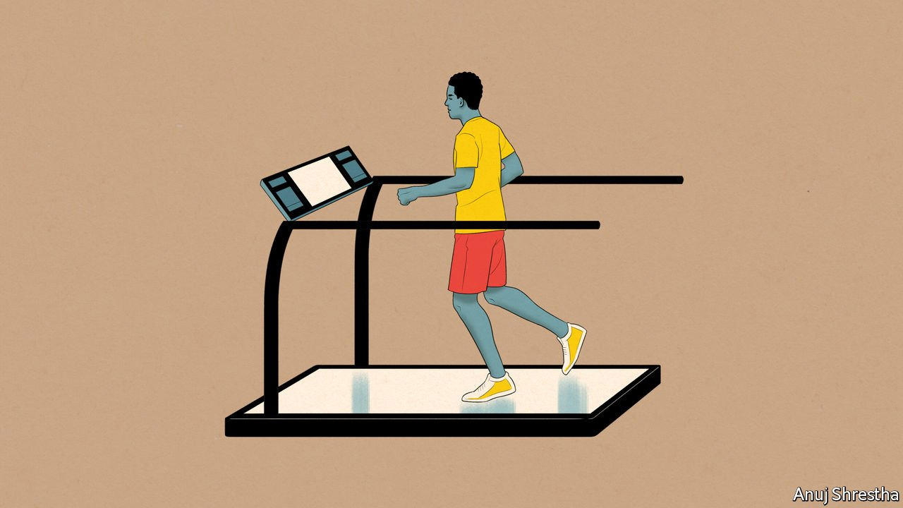

###### iHealthy: September 2028

# What if smartphones became personal health assistants? 

##### The latest model of Apple’s iconic iPhone is built around health-monitoring features. An imagined scenario from 2028 

 

> Jul 3rd 2021 

 This year What If?, our annual collection of scenarios, considers the future of health. Each of these stories is fiction, but grounded in historical fact, current speculation and real science. They do not present a unified narrative but are set in different possible futures

IN 2019 TIM COOK, then boss of Apple, gave an interview in which he said, “if you zoom out into the future…and you ask the question, ‘What was Apple’s greatest contribution to mankind?’ it will be about health.” It sounded like standard-issue CEO boosterism at the time. But nearly a decade later, with this week’s announcement of the iPhone XX (pronounced “iPhone 20”), might his prediction be about to come true?

The latest iPhone is not so much a phone as a personal medical-data hub. Some of its features are upgrades of existing functions, such as tracking of sleep, menstruation and movement, and seamless access to health records and other personal documents. Physically, the device itself looks much the same—little has changed about these slim black rectangles over the past 15 years. Instead, it is the myriad accessories unveiled this week that define the iPhone XX. They could be game-changers for both personal and public health.


For many years the company’s approach to health tracking has focused on the Apple Watch. Even the original model, launched in 2015, could measure movement and heart rate. Since then, sensors have been added to measure heart activity, blood pressure, body temperature and levels of oxygen, sugar and alcohol in the blood. In addition, software tweaks have granted it the ability to spot fevers, falls, irregular heart rhythms and early signs of dementia.

But not everyone wants (or can afford) to buy a fancy watch with all these features. Meanwhile, the market in consumer-health devices has boomed. With its new range of add-on accessories, Apple has both expanded and unbundled its health-tracking features. Unlike the clunky devices available at pharmacies, Apple’s are elegant, require minimal setup, integrate seamlessly with Apple handsets and are aimed at people with specific concerns. A $49 device for people with diabetes, for example, offers blood-sugar monitoring, while a $69 device for those with respiratory conditions includes an oximeter and a spirometer.

Other sensors focus on monitoring of sleep, hypertension, coeliac disease and fertility. Several have yet to win regulatory approval. In the past three years alone, Apple has acquired a dozen firms that make home-diagnostics tools, not all of which can be built into a watch or a smartphone. So it makes sense to start selling some health devices and services separately.

Alongside these devices, Apple unveiled a range of extra subscription services. The diabetes package, for instance, includes a nifty app that guesses the glycaemic index and nutritional and calorific content of any food at which you point your iPhone’s camera. After two weeks of learning about your diet, the app starts subtly suggesting substitutions and changes to your eating patterns. Each accessory comes with a year’s subscription to the relevant service. And while some accessories are compatible with older iPhones, only the new model works with all of them.

All of this could be a boon for public health. The more people walk around with devices constantly monitoring their vital signs, the more likely it is that ailments can be caught early, and outbreaks of infectious diseases nipped in the bud.

Yet there are huge worries, too. The first is privacy. Apple touts the iPhone as a secure repository for personal data of all kinds, and emphasises its model of storing and processing data locally, on the user’s device, rather than in the cloud. It also allows users to share data with medical specialists and participate in trials approved by its semi-autonomous data-ethics committee. But privacy activists say Apple’s rules are opaque and confusing. The second concern is fairness. Most people cannot afford an iPhone. Apple’s devices will therefore mostly benefit those who already have access to good diagnostics and doctors.

There is also cause for optimism, however. When Apple launched the iPhone in 2007, it seemed implausible that just over a decade later half the world’s population would possess a smartphone. If the past two decades are any guide, other companies (such as Samsung and Google) will copy Apple’s ideas—spurring an outburst of competition, innovation and mass adoption in health-monitoring and diagnostics, as previously happened in handsets. That, even more than what Apple does with its own devices, may be the true contribution it makes to humankind. ■

Full contents of this What If?


iHealthy, September 2028: What if smartphones become personal health assistants?*


