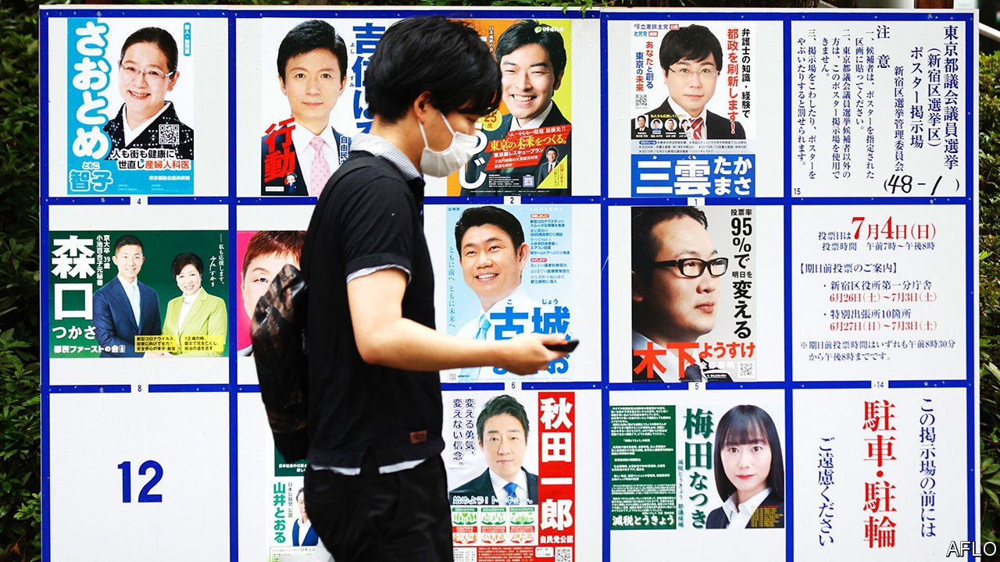

###### Tokyo drifts

# Election results from Tokyo bring bad news for Japan’s prime minister 

##### Yet his party is likely to remain the dominant force nationally 

 

> Jul 10th 2021 

ELECTIONS IN TOKYO often foretell national ones. In 2009 the opposition Democratic Party of Japan triumphed in the capital before sweeping the ruling Liberal Democratic Party (LDP) from power in national elections later that year. This year, too, the signs are again bad for the LDP. Party leaders had hoped to bag 50 or more seats in the 127-seat legislature in elections on July 4th. The LDP limped home with just 33, a slight improvement over a historic drubbing in 2017, but still its second-worst showing ever. The result leaves the Tokyo assembly split among several parties, and the LDP’s leader, Suga Yoshihide, who is also the prime minister, looking increasingly vulnerable ahead of a contest for his party’s presidency and national parliamentary elections in the autumn.

The flop reflects Tokyoites’ frustration with the government’s handling of the two issues at the top of voters’ minds: the Olympics, which will begin in the city on July 23rd, and covid-19, which looms large over them. The pace of inoculations has, at least, picked up. Japan is now putting needles into more than 1m arms a day. Yet just 16% of Japanese over the age of 12 are fully vaccinated, a lower proportion than in all but four of the 38 members of the OECD, a club mostly of rich countries. That might worry voters less if Tokyo were not about to host tens of thousands of athletes, administrators and hangers-on from more than 200 countries. Polls show that nearly two-thirds of Japanese would like to see the games cancelled or held without fans.


The Tokyo results may “destabilise” Mr Suga’s position as leader of the LDP, says Uchiyama Yu of the University of Tokyo. Mr Suga took over the post last year after his predecessor, Abe Shinzo, stepped down owing to ill health. He must stand for his own full term as LDP president in September. Though he and his cabinet initially enjoyed widespread support, approval ratings have since slipped from as high as 74% to around 40%. Tellingly, Mr Suga himself did not campaign in Tokyo; the party instead sent out other, more popular figures. Even so, nearly half the party’s candidates were rejected by voters. The shoddy results come after LDP-backed candidates lost in six special by-elections for Diet seats and governorships earlier this year. Mr Suga must now hope that swift progress on vaccinations and perhaps a few gold medals for Japan will change the mood.

He may also take comfort in the fact that Tokyo is not as reliable a portent as it once was. The electoral dynamics of the city have become more complicated since the emergence in 2017 of Tomin First No Kai (Tokyoites First), the party of Tokyo’s popular governor, Koike Yuriko, a former LDP heavyweight. At just six months old, the party won control of the capital’s assembly, and it seemed that Ms Koike’s new force might even muster a challenge to the LDP’s national dominance. But Tomin First flopped in Diet elections that year and never gained traction outside Tokyo. Ms Koike, who is said to harbour ambitions for higher office, has recently been cosying back up to the LDP, perhaps recognising that the road to national power still runs through her old party. Her ambiguous stance is probably one reason why Tomin First lost 14 of the 45 seats it held.

Even if Mr Suga joins a long list of short-lived Japanese prime ministers, there is a limit to how poorly the LDP can fare. There is no Tomin-style spoiler at the national level. Turnout in Tokyo was just 42%, the second-lowest level on record. But in general elections, low turnout favours the LDP and Komeito, its coalition partner, which have strong networks and infrastructure to get out their voters. Most importantly, the main opposition parties are deeply unpopular. “We have no alternative political forces besides the LDP,” says Toshikawa Takao, the editor of Insideline, a political newsletter. In Japan, dissatisfaction breeds apathy, not change.■

