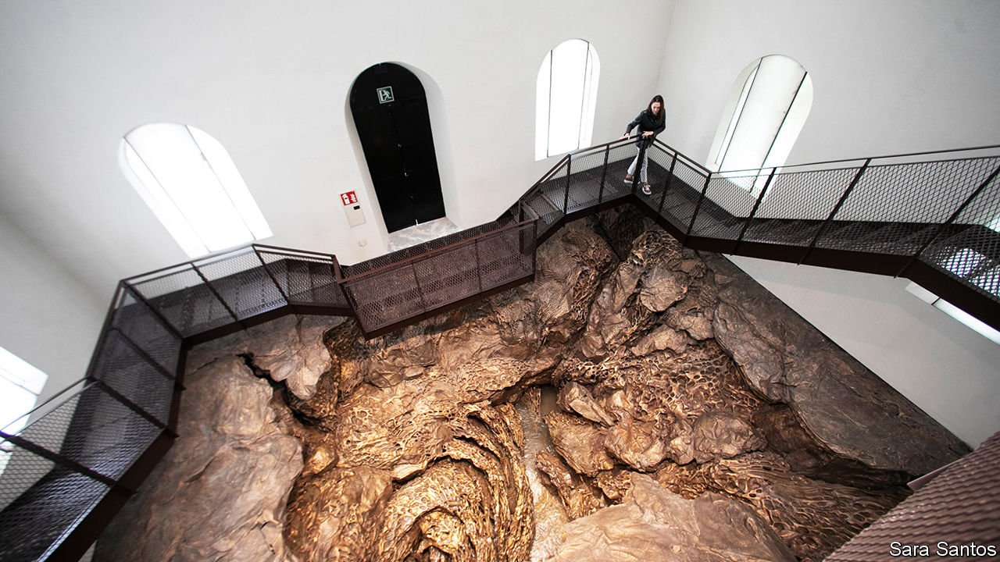

###### Contemporary art

# Cristina Iglesias makes liquid sculptures by the sea 

##### Her piece in San Sebastián’s lighthouse is a haunting comment on nature and time 

 

> Jul 10th 2021 

ON A ROCKY outcrop overlooking a Norwegian fjord she created a wall of aluminium leaves, making each of their gently curved shapes distinct. At the outdoor sculpture park of the Inhotim museum in southern Brazil she built a magical labyrinth lined with replica vegetation. In Baja California she fashioned a delicate sculptural monument that sits on the ocean floor, 14 metres beneath the surface. Fish swim in and out of the lettering she carved through the reinforced concrete. The only way to see the work, a tribute to marine preservation, is by scuba-diving.

Much of Cristina Iglesias’s art has been commissioned as public monuments for specific sites. She spends months, sometimes years, honing the individual character of each piece—yet they are all connected. She often draws inspiration from the fragile relationship between humanity and the natural world. She mixes the real with the imagined, the seen with the remembered. Typically, she took a long time to decide what she wanted to make for her home town by the sea, which she left at 18 but never forgot.


The city of San Sebastián in the Basque country of Spain had asked her several times for a sculpture; the initial request came in 1998, when Ms Iglesias put on an exhibition at the nearby Guggenheim Bilbao. Conscious that San Sebastián already boasted monumental pieces by Jorge Oteiza and Eduardo Chillida, two 20th-century Basque masters, as well as numerous religious statues that stand in the hills overlooking the Atlantic Ocean, she wanted to do something different.

And then it came to her. In the middle of the bay, around which San Sebastián hugs the ocean, is a small island called Santa Clara. No more than a few hundred metres from the shore, it is nonetheless remote from the daily rhythms of the city, observes Ms Iglesias’s longtime collaborator James Lingwood of Artangel, an art-promoting charity. In bygone times this was where victims of the plague were taken to die. Over the decades a small lighthouse flashed out both a warning and a welcome.

As a child Ms Iglesias used to gaze at it as she fished from the mainland. “Santa Clara was always part of the landscape for us,” she says; at 16 she swam across to the island with her brothers. But none of them had ever been inside the lighthouse. Creating an artwork within the building, which had been derelict since the mid-1960s, would, she decided, be her gift to the city.

The journey there is part of the experience. Visitors step into a small boat to cross the glassy sea. The shrieks of gulls fill the air. A narrow stone track curves up the hill, enclosed on both sides by ash trees, laurel, tamarisk and Japanese pittosporum. It is not until you reach the clearing near the top that you see the square lighthouse that has guarded the bay since the middle of the 19th century. When you open the door you are confronted by Ms Iglesias’s creation.

Creatures of the deep

After that, it is hard to look away. From a narrow platform just inside the entrance you gaze down at an undulating floor, cast in bronze but with the shape and texture of rock. Every few minutes the sea pounds in, flinging spray into the air before receding into the depths. There is something mesmerising about watching the water emerge, withdraw and return, a sensation intensified by the changing sight and sound of the sculpture as you follow the platform that snakes along the interior wall to consider it from new angles.

Learning how the extraordinary work was made enhances its theatrical power. Ms Iglesias’s team excavated a nine-metre hole in the rock beneath the lighthouse, then installed a hydraulic system through which the sea-spray is pumped up onto the bronze rock. The floor itself, curved to convey the eroded layers of sediment that emerge from the sea around the island—“the Earth’s ribs”, as Ms Iglesias calls them—was cast in a foundry and slowly winched into place from a helicopter. It was “one of the biggest challenges of my career”, says Hugo Corres, the structural engineer behind the project.

The result is a feeling of something, or everything, being swallowed and carried away to the void. It echoes the human peril in the story of Jonah and the whale, at the same time hinting at the vulnerability of marine animals. Ms Iglesias wanted the sculpture to have a name that would bring out what Mr Lingwood calls its “dark enchantment”. She enlisted the help of Beñat Sarasola, a young poet who, using an etymological dictionary, discovered an old Basque word he hadn’t known before: “Hondalea”, which roughly translates as “marine abyss”. “As soon as I heard it,” the artist says, “I knew it was perfect.”

Among her muses is Rachel Carson, an influential American conservationist who called the seashore “a place of unrest”. Carson’s book, “The Rocky Coast”, which Ms Iglesias read and reread while she worked on “Hondalea”, ends with the writer standing on a rock, thinking about the place where the deep time of geology meets the twice-daily movement of the tides, advancing and receding, covering and revealing. Ms Iglesias’s sculpture captures the same mood of transience and eternity, peril and fate. It grips your senses on the island and, back on the mainland, swirls and swells in your memory. ■

