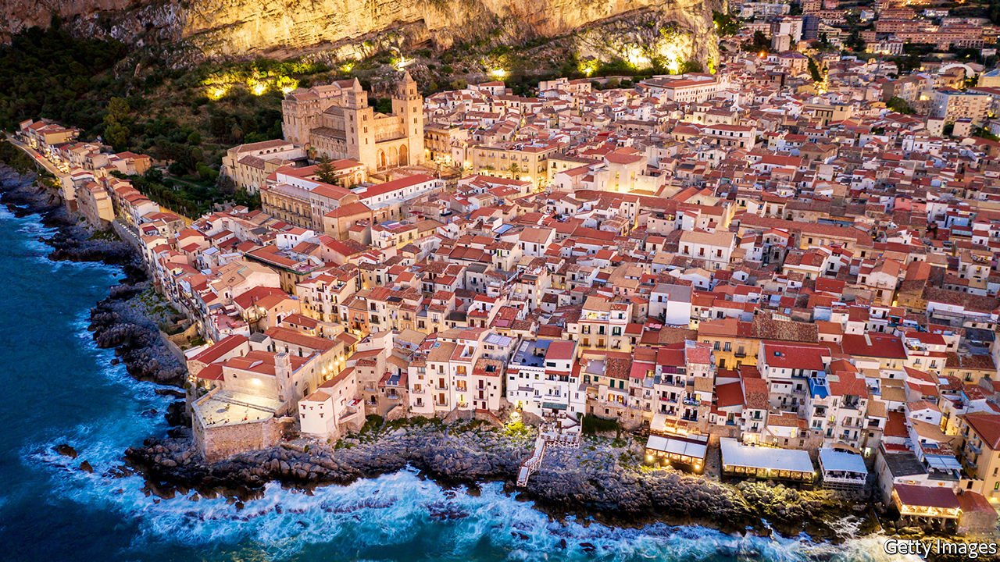

###### Mediterranean history

# Longing to travel? A chronicle of Sicily will make it worse 

##### The island, writes Jamie Mackay, has always seemed both alluring and perilous 

 

> Jul 10th 2021 

The Invention of Sicily. By Jamie Mackay. Verso; 304 pages; $24.95 and £16.99

SICILY BEGUILES. It offers coves with limpid water; Greek temples, such as those at Agrigento and Segesta, that are among the best preserved in the Mediterranean; a Roman amphitheatre at Taormina still used for its original dramatic purpose; grandiose Baroque palazzi; bustling street markets; some of the best food to be had in Italy; an expanding range of fine wines at reasonable prices; and a cathedral in Palermo that is a riot of eclecticism. Etna on a spring morning, still capped with snow and belching smoke, is among Europe’s greatest sights.


The ancient Greeks saw Sicily as rich and fertile yet “dangerous and unpredictable”. For Jamie Mackay, author of this brief and pacey history of the island, their perception reflected a dual view of Sicily that would be expressed in different forms up to the present day. In Mr Mackay’s telling, a tipping-point arrived at the dawn of the 14th century after several hundred years of relatively enlightened rule by Byzantine Greeks, Arabs and Normans. The uprising that came to be known as the Sicilian Vespers sparked a war that led to the expulsion of the island’s French rulers. But it is only too characteristic of Sicily’s ill fortune that this popular victory should ultimately have had such dismal effects.

Sovereignty over an ethnically and religiously diverse island passed, via the rulers of Aragon and Catalonia, to those of a newly unified Spain, obsessed with confessional uniformity and, by implication, racial purity. Sicily became an outlying territory in an empire that favoured traditional social arrangements and a profoundly conservative form of Catholicism. For almost 400 years, Mr Mackay notes, Sicily had been governed by an urban elite in Palermo. “Following the Vespers, though, power moved progressively away from these individuals, and into the hands of rural landowners and church authorities.”

A strand of popular heterodoxy endured, half-surfacing as superstition, the secret worship of polytheistic deities and even the practice of magic. But among the results of Sicily’s incorporation into the Spanish Empire was that it was barely affected by Renaissance humanism. Being part of the empire did, however, shield it from the worst effects of the decline in Mediterranean trade prompted by the colonisation of the Americas. And, after Sicily became part of the Kingdom of Naples, it got a whiff of the Enlightenment, thanks to the Bourbon monarch who would become Charles III of Spain. A second apparent liberation, by Giuseppe Garibaldi and a small army of Italian nationalists, again turned sour: Italy’s new, Piedmontese rulers bungled the peace that followed, and Sicily’s nascent Mafia exploited the chaos.

Mr Mackay is at his best when he weaves concise descriptions of customs, social changes, legends and cultural glories through this tumultuous narrative. Artistically, Sicily’s historical relationship with the Italian mainland bears some similarity to Ireland’s with Britain: an island with a disproportionately small middle class, sandwiched between a vast, uneducated peasantry and a landowning aristocracy largely indifferent to culture, which nevertheless produced a string of literary, artistic and musical giants. Vincenzo Bellini, Giovanni Verga, Luigi Pirandello, Leonardo Sciascia, Renato Guttuso, Giuseppe Tomasi di Lampedusa and, most recently, Andrea Camilleri, were all Sicilians.

The author is at his worst when he fails to check his facts and verify his assertions. He appears to take as historically reliable the legendary founding date of Rome, describes the Benedictines and Jesuits as “sects” and makes Oscar Luigi Scalfaro prime minister of Italy, a post Mr Scalfaro never held. These are unfortunate missteps in an enjoyable canter across a history, and a place, which are entrancing and disturbing by turns. ■

