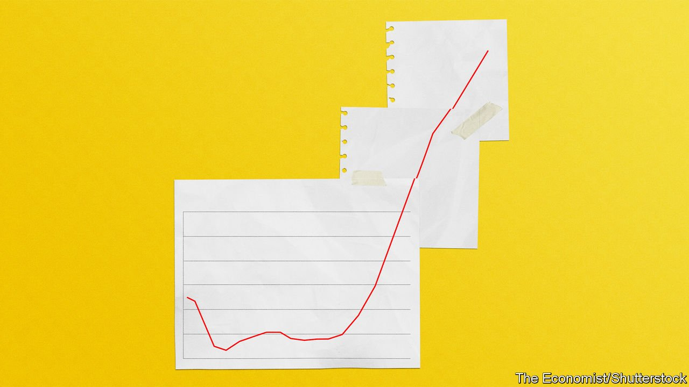
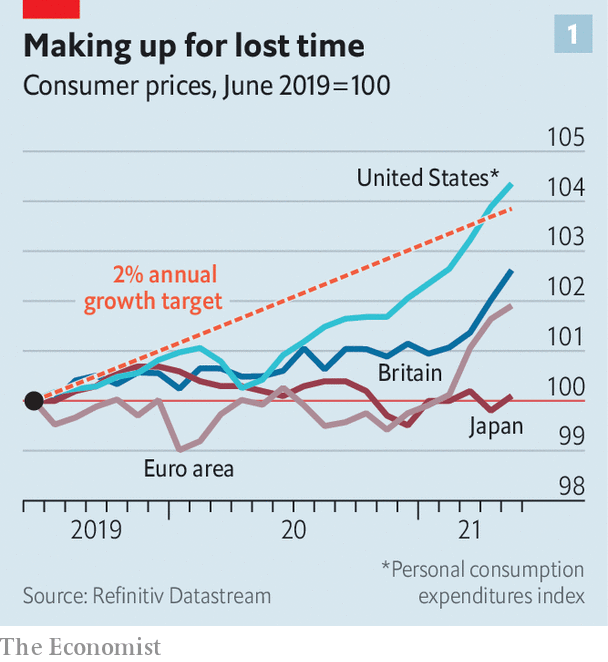
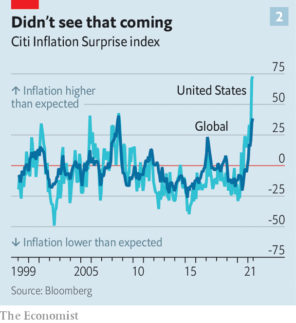
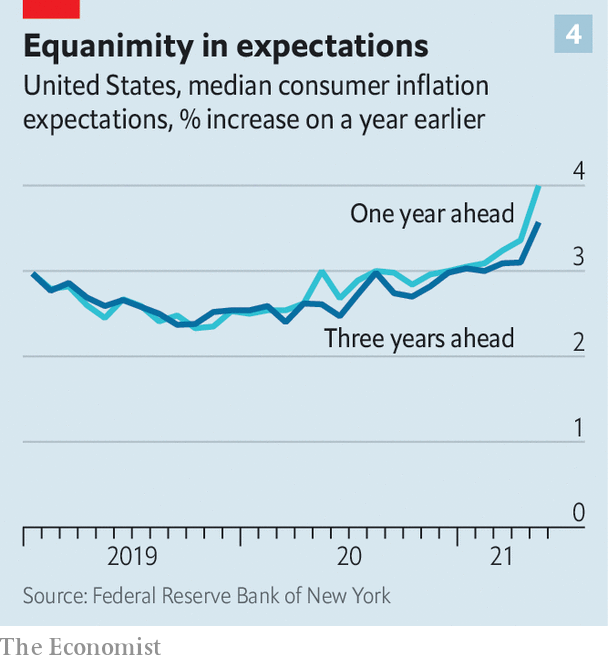

###### People can be pricey

# Surprising levels of inflation are increasingly being driven by wages, not goods 

##### Don’t panic. But keep a watchful eye 

 

> Jul 10th 2021 

: This article was updated since publication to incorporate the European Central Bank’s change to its target.

IN JANUARY AN inhabitant of a midwestern city—Cleveland, say—could buy a three-year-old Toyota Camry for about $18,000 and fill up its 60 litre petrol tank for about $28. By May, the car would have cost them 22% more and the 16 gallons of gas 27% more. As the American economy has risen from its pandemic slumber, the prices of durable goods and commodities have soared.

Not long ago economists tended to the view that the covid-19 pandemic would lead to a prolonged slump in the rich world. That view has not worn well. In February America’s Congressional Budget Office predicted that growth in America in 2021 would be 3.7%. On July 1st it doubled that forecast to 7.4%. Since May the Bank of England has revised up its estimate of British GDP in just the second quarter of the year by 1.5 percentage points.


With unexpected growth has come an unexpected spurt of inflation. A certain amount was baked in. The fact that prices—and in particular commodity prices—fell during the spring of 2020 meant that what are known as “base effects” would drive headline inflation up this summer: even if prices had been stable from March to June this year, the fall over the same months last year would see the year-on-year difference increase. But core prices—which exclude energy and food—were expected to stay pretty stable.

In February the median economic forecaster thought America’s core consumer prices would rise just 1.9% over 2021. That increase is already in the rear-view mirror. In the three months to May core inflation reached 8.3% on an annualised basis, the highest rate since the early 1980s. In June the Institute for Supply Management’s index of changes in the prices paid by American manufacturers registered its highest reading since 1979, a year in which consumer prices rose by 13.3%.

 


Inflation in other rich countries has been more modest (see chart 1). But it has still exceeded expectations (see chart 2). In the euro area headline inflation year-over-year has risen from 0.9% to 1.9% since May, touching the European Central Bank’s target of “below, but close to 2%”. Much of this is due to base effects; core consumer prices actually fell between February and May, as they did in Japan. Britain is—as in many things—an intermediate case. Headline inflation is roughly on target but core consumer prices have accelerated. This has caused some alarm. When leaving his job on June 30th Andy Haldane, the Bank of England’s chief economist, warned that British inflation, currently 2.1%, would be closer to 4% than 3% by the end of the year.

 


This is not just an issue for rich countries. A measure of aggregate inflation in emerging markets produced by Capital Economics, a consultancy, rose from 3.9% in April to 4.5% in May. Rising inflation has set off a cycle of monetary tightening. Since the start of June central banks in Brazil, Hungary, Mexico and Russia have raised rates.

A sustained rebound in inflation would be bad news for two reasons. First, inflation hurts. Life-satisfaction surveys carried out in the 1970s and 1980s found a one-percentage-point rise in inflation reduced average happiness about as much as a 0.6-percentage-point rise in the unemployment rate. If it catches workers by surprise it erodes their wages, hurting the lowest paid the most; if it catches central banks by surprise they may have to slow the economy, or even engineer a recession, to put the beast back in its cage.

Second, inflation has the potential to up-end asset markets. The sky-high prices of stocks, bonds, houses and even cryptocurrency rests on the assumption that interest rates will stay low for a long time. That assumption makes sense only if central banks do not feel forced to raise them to fight inflation. If prices rise too persistently, the financial edifice that has been built on years of low inflation could lose its foundations.

The factors pushing inflation higher are threefold. The first is a boom in demand for goods like cars, furniture and household appliances set off by consumers splurging on things that made lockdown homes nicer and life outdoors more enjoyable. The second is disruption in the global supply of some of those goods. A shortage of microchips, for example, is severely curtailing the supply of cars. A  does not help. Disruption in the global shipping industry and at ports exacerbates things in various markets. The third—probably the most important, and the one only now fully coming to be felt—is a rebound in the prices of services. Consumers are returning to restaurants, bars, hairdressers and other in-person businesses faster than workers are.

 


America is seeing higher inflation than anywhere else primarily because, having seen the largest economic stimulus, it saw the greatest durable-goods boom. According to the index of prices targeted by the Fed, cars, furniture and sporting gear were responsible for more than four-fifths of core-inflation overshoot in May (see chart 3). Europe’s supply chain faces the same issues as America’s, but with demand more modest, durable goods sensitive to the disruptions were only 1.5% more expensive in May than they were a year earlier, according to Morgan Stanley.

For how long will engorged demand come up against constrained supply? The experience of 2020 showed that supply chains could find a way around some issues—such as shortages of toilet roll and diagnostic tests—relatively quickly. The trouble is that microchip supply and shipping capacity are relatively slow to adjust: expanding capacity requires investment in fabs and ships. Firms report that they expect delivery times to be longer, not shorter, in six months’ time.

But though some of the problems will persist, the contribution of durable-goods shortages to inflation may have peaked. Inflation is the rate at which prices change, not a measure of how high they are. If prices stay high but stop rising—or even just slow the rate of their rise—inflation falls. If prices fall back again, as American lumber prices did by a spectacular 40% in June, base effects go into reverse, lowering headline inflation.

The increase in demand which drove up demand for durable goods in the first place is also dropping. This is not because people are running out of money. During the pandemic overall household spending went down, even though stimulus measures preserved or increased incomes. In America the resultant wedge of excess savings stands at around $2.5trn, or 12% of GDP. The equivalent in the euro area was 4.5% of GDP at the end of 2020. It is unlikely to have fallen much yet.

It is, though, being spent on different things. With services reopening, those consumers flush with cash face a choice between paying high prices for goods they have been able to buy throughout the pandemic and buying the kind of experiences of which many have been starved for almost two years. They choose the latter.

A new hope

In inflation terms, this shift may push economies out of the frying pan and into the fire. High demand for hotels, transport and restaurant meals means lots of companies need workers. And the workers are getting pricey.

Despite growing by nearly 350,000 jobs in June, America’s leisure and hospitality is still only seven-eighths as big as it was before the pandemic in employment terms. Workers for whom $2,000 in stimulus payments earlier this year and extended unemployment insurance made a big difference find themselves in a seller’s market. Wages in leisure and hospitality jobs are nearly 8% higher than in February last year; job openings are abundant. Restaurants and hotels tend to have low profit margins: where wages go, prices are likely to follow.

According to JPMorgan Chase, average services prices across the world are still below their pre-pandemic level. Closing only half that gap in the second half of this year would add a percentage point to average headline inflation. In some places, though, labour costs look like eliminating the gap completely, and then some. In America median workers require a 3% higher wage to accept a job than they did before the pandemic, according to a recent survey by the New York Fed. For low-wage workers the necessary wage has gone up 19%.

American economists have floated lots of possible explanations for the reluctance many people are showing towards jobs offered for pre-pandemic wages and under pre-pandemic working conditions. Some blame America’s unemployment insurance top-ups and think wages will stop rising when they expire in September (they have already been curtailed in some states). Others suggest that restaurant workers are unwilling to return to such jobs while the virus is still at large, or that school closures are leaving workers stuck without child care.

None of these explanations is fully satisfactory. Britain and Australia are also suffering worker shortages in some industries, despite not having generous unemployment benefits. It seems strange that young waiters, who could be vaccinated should they so choose, would see the restaurants to which consumers are happy to return as too risky to work in. A new paper by Jason Furman and Wilson Powell III of Harvard University and Melissa Kearney of the University of Maryland finds that additional joblessness among mothers of young children accounts for only a “negligible” share of America’s employment deficit, contrary to the conventional wisdom.

Some speculate on causes with which it is harder for economists to get to grips. The psychological caesura of the pandemic may have given people the time to wonder what sort of work they want to return to, provoking soul searching and curious forays into new territory. Presumably at some point such job-changers will return to work, if perhaps in other sectors. But when that might be is not clear. Indeed, with the exception of enhanced unemployment benefits none of the putative causal factors provides a strong sense of how long the situation will last.

 


Another price with plenty of room to run is rent. During the pandemic low interest rates and a demand for more space triggered an extraordinary house-price boom across the rich world: in April American homes were 14.6% more expensive than they had been a year earlier. Yet in America, the euro area and Britain rents remain beneath their pre-pandemic trend; in Australia rents have fallen throughout the pandemic. Renters are more likely than homeowners to have lost their job over the past year, and rents are highly cyclical, moving with the fortunes of the economy. But as economies and labour markets rebound, there might be some catching up and—if house prices are anything to go by—some overshooting yet to do. Rent accounts for one-fifth of core inflation in the index targeted by the Federal Reserve.

Wages, rents and the like would have to keep on increasing rapidly for high inflation to persist. This might happen if the experience of the pandemic has changed the givens of the economy in some deep way—say, by permanently increasing the rate of unemployment at which wages and prices start to accelerate. But a more likely route to persistently high inflation would be a cycle of self-fulfilling expectations.

So far, inflation expectations have not risen by anything like as much as inflation itself. Take financial markets. It is fashionable to pay close attention to investors’ inflation expectations as revealed by the difference in price between inflation-protected bonds and the normal kind. Expectations rose steadily after President Joe Biden’s election victory, which brought with it the prospect of more stimulus. Recently, however, they have fallen back to levels that are more or less consistent with the Federal Reserve’s inflation target.

In the euro area investors still expect the ECB to undershoot its inflation target over the next five years. In his warning on leaving the bank Mr Haldane pointed to a rise in long-term financial-market measures of expectations for Britain. But at 0.3 percentage points above the past decade’s average this is hardly the stuff of nightmares. As for everyday consumers, surveys purporting to reveal their expectations in the matter have found them to be increasing, but only modestly .

The phantom menace?

These “anchored” expectations give rich-world central banks some slack when it comes to ignoring temporary price surges. Changes in their attitude to inflation encourage them to make full use of it. Since August 2020 the Fed has been targeting an average inflation rate of 2% over the whole economic cycle. An overshoot now—the Fed expects inflation to be 3.4% at the end of the year—can make up for past or future shortfalls. The ECB expects inflation to be 2.6% at the end of the year. On July 8th it abandoned its target of “close to, but below, 2%”. Instead, it will henceforth aim for a “symmetric” target of 2% whereby “negative and positive deviations of inflation from the target are equally undesirable”. This will make overshooting the target more acceptable.

The combination of anchored expectations and changing attitudes explains why central banks, and especially the Fed, seem so far to be relatively relaxed about inflation, making it clear that they are cognisant of the risks but staying well short of precipitous action. Thus in June the Fed signalled that it might raise interest rates twice in 2023, sooner than previously expected; some of its rate-setters have floated the possibility of doing so next year. Monetary-policy makers are also lining up to say they are  the Fed’s purchases of assets this year.

 


It is possible that central banks are pushing their luck. In the past, rapidly rising inflation expectations have typically been a sign that things have already gone wrong, not a sign that they are about to. “Neither bond markets nor economists have a great track record at forecasting inflation,” concludes a recent analysis by Joseph Gagnon and Madi Sarsenbayev of the Peterson Institute for International Economics, a think-tank. The idea that expectations could become de-anchored is “not my biggest worry, but if it’s not on your worry list, you’re not thinking clearly about the issue,” Mr Furman said recently. (A senior economic adviser in Barack Obama’s White House, he says his biggest worry remains a recession, because though its likelihood is low its consequences would be dire.) Oxford Economics, a consultancy, sees a 10-15% chance of the American economy shifting into a “high-inflation regime” of price rises persistently above 5%.

And only rich-world central banks, on the whole, have the luxury of securely anchored inflation expectations. Emerging markets, which are also suffering the acceleration of global commodity and goods prices, must be more careful about letting the genie out of the bottle. They must also pay keen attention to American inflation. As the Federal Reserve tightens monetary policy, it puts downward pressure on emerging markets’ currencies, making it more expensive for them to import goods and creating another source of local inflation. Emerging-market currencies have fallen by an average of 1.5% since the Fed’s comparatively hawkish meeting in June.

This is at a time when emerging markets’ economies are on the whole less healthy than the rich world’s because of their lower vaccination rates. The trade-off they face between helping growth and containing inflation will be painful. Yet though some central banks are raising interest rates, the situation is not acute. Both Russia and South Africa have recently floated the idea of tightening their inflation targets (currently 4% and 3-6%, respectively). That would be absurd amid rampant upward pressure on prices.

Inflation is always worth taking seriously, not least because the belief that central banks will do so acts as a check in and of itself. If the Federal Reserve spends a few years trying to hit its 2% inflation target from modestly above it little harm is done. But this inflation carries an extra message. For most of the 2010s rich-world policymakers could not understand why inflation was so low, and feared that it was beyond their power to raise it. It is possible that, even now, the euro area and Japan may remain stuck in a low-inflation trap.

America has demonstrated that a remarkable combination of fiscal and monetary stimulus can cause prices to accelerate even when interest rates are stuck at rock-bottom. That knowledge may prove useful to others and in times to come. The challenge now is to make sure that the price paid for it in terms of spiralling prices does not rise too high. ■

Dig deeper

 (July 2021)

 (July 2021)

