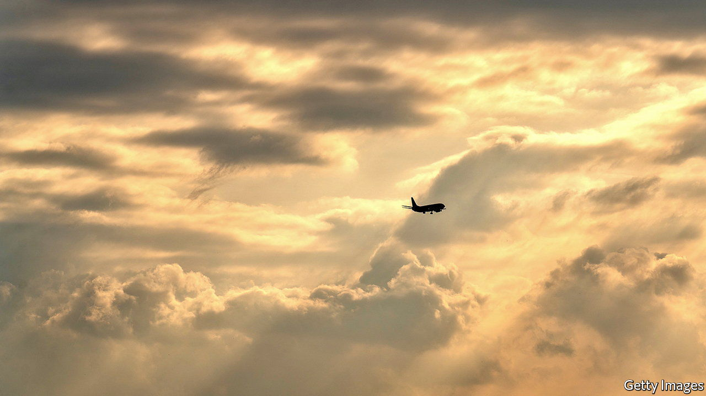
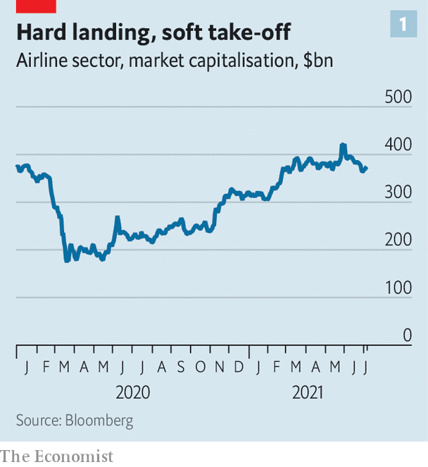
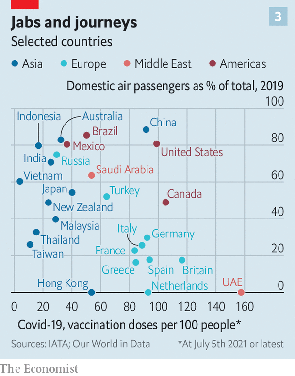

###### Dark skies and silver linings

# Which airlines will soar after the pandemic? 

##### Uneven recovery will boost big carriers in America and China, and cheap and cheerful ones in Europe 

 

> Jul 6th 2021 

THE PANDEMIC, with its lockdowns and travel bans, has clobbered the world’s airlines. Revenues per passenger-kilometre, the industry’s common measure of performance, plummeted by 66% in 2020, compared with 2019. The International Air Transport Association (IATA), a trade body, expects them to remain 57% below pre-pandemic levels this year. Although the world’s listed airlines have collectively just about recovered from the $200bn covid-induced stockmarket rout (see chart 1), forecasters reckon that air travel will take until 2024 to return to 2019 levels. The companies’ total annual losses may hit $48bn in 2021, on top of $126bn in 2020. Many have been torching cash as fast as their aeroplanes burn jet fuel. Plenty survived only thanks to government bail-outs.

 


The industry-wide picture conceals disparities, however. Some airlines are struggling despite having cut costs, slashed fleets and shored up balance-sheets with commercial loans. Others are brimming with confidence. Big American and Chinese ones with large, increasingly virus-free domestic markets will return to profitability first. Frugal low-cost carriers that went into the pandemic in the black are close behind. By contrast, airlines that depend on lucrative long-haul routes may struggle if, as seems almost inevitable,  for at least some flights. Regional operators in places still ravaged by covid-19, such as India or Latin America, look precarious. And the airspace between those losers and the industry’s winners is widening.

Diverging fortunes are nothing new in the airline business. Most carriers make for a lousy investment (see chart 2). IATA reckons that only around 30 of the 70 or so airlines for which data are available earned more than their cost of capital between 2008 and 2018. To keep flying, airlines need “strong balance-sheets or a parent with deep pockets,” says Rob Morris of Cirium, an aviation-data firm.

 


Despite a degree of deregulation in the past 50 years, at the end of 2019 governments still controlled or had big minority stakes in 29 of the world’s 100-odd listed airlines, according to the OECD, a club of industrialised countries. States prop up loss-making national carriers, including privatised ones, which they view as vital infrastructure and a source of patriotic pride. In announcing Japan’s latest bail-out, the authorities talked of 240,000 jobs at stake and emphasised the role airlines play in connecting far-flung parts of the archipelagic country.

Paternalistic governments have dug deep into their pockets during the pandemic. Between its onset and March this year public handouts to aviation exceeded $225bn globally, IATA calculates. This largesse helps explain why fewer carriers entered bankruptcy worldwide in calamitous 2020 (43 of them) than in 2018 (56) or 2019 (46), according to Cirium.

Even if cash infusions tide some airlines over, though, they are no cure-all. On the contrary, they may prove poisonous. As Mr Morris of Cirium politely puts it, state support leads to “inappropriate cost bases”. One careworn observer remarks that Air France-KLM, a Franco-Dutch entity, has been “paid by the government not to restructure”. France wants to save as many jobs as possible and the Netherlands to ensure that Schiphol in Amsterdam remains a big connecting airport. Neither objective has much to do with returns.

 


Moreover, bail-outs do not guarantee long-term success even in combination with a healthy pre-pandemic balance-sheet. Dubai’s Emirates enjoyed years of profits, as well as generous backing from its owner (a sheikhdom). So did Singapore Airlines (which is listed but controlled by the city-state’s government) and Cathay Pacific (Hong Kong’s publicly traded flag-carrier). Like many of their less lucrative counterparts with large international networks, including Air France-KLM, British Airways or Germany’s Lufthansa, they all “rely on the whole world reopening”, observes John Grant of OAG, another aviation-data firm. That will not happen until much more of the globe is vaccinated (see chart 3). And as much as executives dislike endless video calls, most despise constant flying even more.

Amid the uncertainty, . The first is the full-service network airline which, like beaten-up rivals, offers long- and short-haul routes but which also, crucially, caters to a huge domestic market. The second group comprises nimble and cash-generative low-cost carriers that fly on a multitude of regional routes.

The rebound in domestic flying favours American and Chinese airlines. Last year China, where covid-19 emerged but was suppressed more successfully than in the West, overtook America as the world’s biggest domestic market by capacity. Flights within China are back to levels from 2019, reckons Citigroup, a bank.

In America, internal flights make up 60% of air travel, compared with around 10% in Europe, the Middle East and Africa, estimates Oliver Wyman, a consultancy. The country still lags a little behind China but air travel in the run-up to the Fourth of July weekend surpassed pre-pandemic levels. In Europe, by contrast, fragmented as the continent is by national borders, the number of short-haul flights is still 55% below what is was before covid-19 hit.

Westerly tailwinds

Scott Kirby, boss of United Airlines Holdings, has warned that the American carrier needs about 65% of pre-pandemic demand for business and international long-haul trips merely to break even. Still, that looks achievable for United and its domestic rivals such as American Airlines, Delta Air Lines and Southwest (which pioneered no-frills flying in the 1960s but has turned into something like a domestic network airline, minus the international long-haul).

American, for example, earns around 70% of revenues from domestic passengers, whereas full-service carriers elsewhere might rely on the big seats at the front of intercontinental flights for half their revenues (and up to 75% of profits). It helps that years of consolidation waved through by light-touch regulators have created an oligopoly where the four big airlines ferry 80% of passengers.

The Chinese market is similarly carved up between a few big carriers—Air China, China Southern and China Eastern. As a result, their revenue per passenger-kilometre is twice what it is in nearby South-East Asia, where competition is fiercer. With Chinese domestic travel more or less back to normal, and their costly geopolitical obligations to expand loss-making international routes put on ice because of covid-19, the trio are in a better shape than ever before.

The domestic rebound and growing confidence have helped American and Chinese airlines raise cash and avoid protracted state support. Of the big Chinese ones only China Eastern required a substantial bail-out. The American firms got a huge bail-out but are exiting it quickly. In March American Airlines tapped the market for $10bn in debt, most of which went on repaying government loans. A month later United raised $9bn with a similar goal.

Importantly, the American companies have avoided the need to sell equity stakes to Uncle Sam. Combined with strong domestic cashflows, an early exit from government programmes gives the American and Chinese carriers a competitive advantage, says Andrew Charlton of Aviation Advocacy, a consultancy. In Europe, meanwhile, France has increased its stake in Air France-KLM to nearly 30%, Germany has taken a 20% stake in Lufthansa and the ever-hopeless Alitalia is now fully state-owned. Even as the three European firms continue to retrench, while dealing with growing state involvement, United Airlines has just placed an order for 270 new jets, its biggest ever. Delta and Southwest have also been buying aircraft.

The return of short-haul international travel will revive the fortunes of the second group of winners: low-cost carriers in highly vaccinated places, where borders are gradually reopening and quarantine rules are being relaxed. European companies in particular stand to benefit from pent-up demand for holidays and visits to families and friends. More than eight in ten passengers flying with Ryanair, an Irish no-frills airline, and Wizz Air, a Hungarian one, are leisure-seekers, compared with no more than seven in ten for Lufthansa and Air France-KLM.

The lack of a European oligopoly, and deep pandemic-induced cuts to the short-haul networks of legacy carriers, have left room for thrifty challengers to expand. Bernstein, a broker, expects Ryanair and Wizz Air, which have little debt and lots of cash to spend on new planes, to outfly European rivals in the next few years. So do investors. Both Ryanair and Wizz Air are worth more than before the pandemic.

Some of the likely winners may stumble. Delta and United have some way to go before they regain their pre-pandemic market capitalisations. A few other victors may emerge. One improbable candidate, according to Bernstein, is the unloved British Airways. Its parent company, IAG, , retire older and thirstier aircraft, delay deliveries of new planes and return leased aircraft with lots of unwanted premium seats. It is possible that network companies with passable finances and a good record, like Singapore Airlines, could eventually fly high again once international travel resumes. On July 5th a consortium of investors bet that long-haul flying would revive in time, by offering to pay $17bn for Sydney Airport, Australia’s gateway to the world, not too far below its stockmarket value in late 2019.

Challenger carriers could spring a surprise in America, where the three thriftiest ones—Allegiant, Frontier and Spirit—have doubled their market share to 10% in the past five years and together lost less than $1bn in 2020, compared with $45bn for American carriers all told, according to Keith McMullan of Aviation Strategy, a consultancy. JetBlue, another American low-cost airline, plans to introduce transatlantic flights on long-range narrow-body jets that are far cheaper to operate than wide-bodies that typically ply such routes.

Despite the fog of uncertainty, some upstarts are rolling out of the hangar. Breeze, which flies between smaller American cities overlooked by other carriers, and Avelo, which brings tourists to California, are taking advantage of cheap aircraft, plentiful pilots and available slots at once-crowded airports. Catching up with high-flying American and Chinese oligopolists, or with the cheap and cheerful European firms, is not impossible. But it will take skilful piloting. ■

Dig deeper

All our stories relating to the pandemic and the vaccines can be found on our . You can also find trackers showing ,  and the virus’s spread across  and .

A version of this article was published online on July 6th 2021

