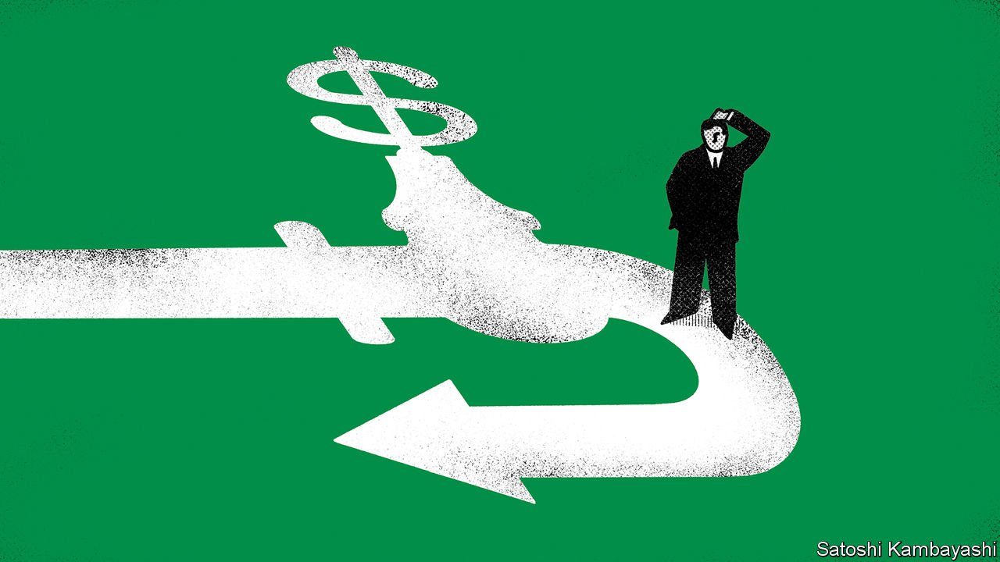
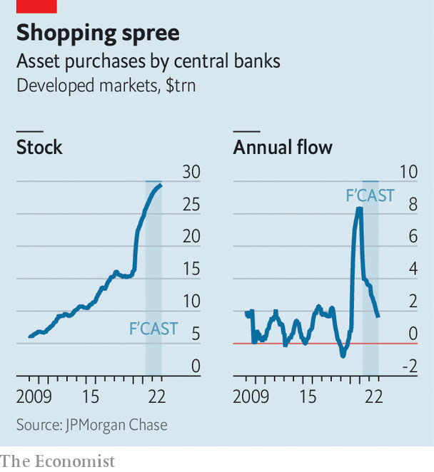

###### The queue to quit QE

# Central banks face a daunting task: tapering without the tantrum 

##### Can they stop their bond-buying and avoid upending markets? 

 

> Jul 8th 2021 

This article has been updated to reflect the Reserve Bank of Australia's decision to taper its bond-buying in September.

THE DEBATE over the effect on markets and the global economy of quantitative easing (QE), the purchase of bonds with newly created money, is almost akin to a culture war. To its critics unrestrained QE during the pandemic has covertly financed governments while inflating asset prices and boosting inequality. To its fans QE is an essential tool in which economists have justified and growing confidence. This high-stakes debate is about to enter a new phase. Rich-world central banks’ balance-sheets will have grown by $11.7trn during 2020-21, projects JPMorgan Chase, a bank (see chart 1). By the end of this year their combined size will be $28trn—about three-quarters of the market capitalisation of the S&amp; P 500 index of stocks today. But central bankers are about to turn this mega-tanker of stimulus around.

 


The justifications for QE have almost dissipated. At the start of the pandemic, central banks bought bonds to calm panicky markets amid a flight to safety and a dash for cash. Then it became clear that the pandemic would cause a huge economic slump that would send inflation plummeting; QE was needed to stimulate the economy. Today, however, markets are jubilant and .


In America it looks increasingly weird that the Federal Reserve is the biggest buyer of Treasuries, as it was in the first quarter of 2021. The economy is powering ahead. In June it added a heady 850,000 jobs, according to figures released on July 2nd. On Wall Street cash is so abundant that over $750bn gets parked at the New York Fed’s reverse-repo facility most nights, mopping up some of the liquidity injected by QE. On June 30th it absorbed nearly $1trn. The Fed’s purchases of mortgage-backed securities, given America’s red-hot housing market, now look bizarre.

Some central banks have already begun to scale back their purchases. The Bank of Canada began curtailing the pace of its bond-buying in April. The Reserve Bank of Australia said on July 6th that it would begin tapering its purchases in September. The Bank of England is approaching its £895bn ($1.2trn) asset-purchase target and looks likely to stop QE once that is reached; Andrew Bailey, its governor, has mused about offloading assets before raising interest rates, contrary to the normal sequencing. In May the Reserve Bank of New Zealand said it would not make all of the NZ$100bn ($70bn) asset purchases it had planned to. And the European Central Bank is debating how to wind down its pandemic-related scheme.

By comparison the Fed has been reticent. Last month Jerome Powell, the Fed’s chair, said that the central bank is “talking about talking about” tapering its purchases of assets. Minutes of the meeting preceding his comments, released on July 7th, revealed that officials thought it “important to be well-positioned” to taper. Most economists expect an announcement by the end of the year. The Fed’s careful approach might reflect lingering memories of 2013, when it last warned of tapering to come. Bonds sold off sharply, the dollar soared and emerging markets suffered capital outflows in what is now known as the “taper tantrum”. Even Mr Powell’s announcement in June was accompanied by a mini-tantrum of sorts. Prompted by higher inflation, officials also indicated that they expected to raise interest rates twice by the end of 2023, sooner than they had previously signalled. The hawkish turn sent emerging-market currencies tumbling.


QE is swathed in so much mystical uncertainty that working out the impact of unwinding it is no easy feat. But a careful examination of central banks’ past experience of asset purchases yields clues for what to expect. It also contains lessons for how central banks might be able to extricate themselves from their bond-buying gracefully this time, before the negative side-effects of their enormous balance-sheets start to be felt acutely.

Begin with the effects of changing course. Everyone agrees that central banks’ asset purchases reduce long-term bond yields. But there is enormous uncertainty as to how much they underpin markets today. Last year Ben Bernanke, the Fed’s chairman at the time of the taper tantrum, suggested that in America in 2014 every $500bn of QE reduced ten-year Treasury yields by 0.2 percentage points. By that rule of thumb, adjusted for inflation, the Fed’s total securities holdings of $7.5trn today are lowering yields by nearly three percentage points (though Mr Bernanke suggested, somewhat arbitrarily, that the overall effect of QE might be capped at 1.2 percentage points).

Alternatively, the median estimate of a survey of 24 studies conducted in 2016 by Joseph Gagnon of the Peterson Institute for International Economics suggests that asset purchases worth 10% of GDP reduced ten-year government bond yields by about half a percentage point. That suggests that QE today is suppressing long-term rates by just under two percentage points in America, Britain and the euro area—although Mr Gagnon argues that when yields approach zero, as they have in Europe and Japan, QE reaches its limits. A bigger bond market may also reduce the size of the effect. The Bank of Japan owns government debt worth a staggering 97% of GDP, but Mr Gagnon finds the effects of QE have historically been more muted, perhaps because Japan’s total public debt is more than two-and-a-half times that figure.

These numbers, and the experience of the taper tantrum, make the reversal of QE seem like something that will upend financial markets. Sky-high asset prices today reflect the assumption that long-term interest rates will stay low for a long time. “We know we need to be very careful in communicating about asset purchases,” Mr Powell acknowledged earlier this year. Yet the lessons from the taper tantrum are subtler than they seem—and may even provide some cause for comfort.

When the toys go out of the pram

The tantrum of 2013 is associated with Mr Bernanke raising the subject of slowing the Fed’s pace of asset purchases. But asset prices fell because investors brought forward the date at which they expected the Fed to raise overnight interest rates, the traditional lever of monetary policy. The episode supports the “signalling” theory of QE, which says that central banks’ balance-sheets influence long-term bond yields not directly, as rules of thumb suggest, but by acting as a marker for future interest rates. The implication is that you can reverse QE without much fuss if you sever the perceived link between asset purchases and interest-rate decisions.

 


Some past episodes of tapering seem to observe this rule. Indeed, the Fed has already achieved a big tapering during the covid-19 crisis. As the severity of the pandemic became clear and markets panicked in spring 2020, the Fed hoovered up almost $1.5trn of Treasuries in just two months before dramatically slowing its purchases, which eventually settled at around $80bn a month. But there was no expectation that interest rates would soon rise and bond yields seemed unaffected. In a speech Gertjan Vlieghe of the Bank of England, a proponent of the signalling theory, cited this experience, which was mirrored in Britain, as evidence that there is little mechanical link between bond yields and QE.

The Fed also seemed to achieve such a separation the last time it shrank its balance-sheet significantly, in 2018 and 2019. It let assets mature without reinvesting the proceeds, rather than by selling anything—with no discernible effect on bond yields. “The point around signalling and intent is a very salient feature of how QE operates,” says a trader at a big Wall Street bank. Since the end of March ten-year Treasury yields have drifted down, even as tapering talk has become louder.

Perhaps, then, central banks can pull off a graceful exit. The question is whether rising inflation and booming markets will make them impatient to reverse course more abruptly. Some, particularly in Britain, are also wary of three potential undesirable effects of central banks’ balance-sheets being too large for too long.

The first concern, which has troubled Mr Bailey, is about preserving ammunition. A popular view is that QE is highly effective at calming markets during crises when it is deployed quickly and at scale, but has smaller effects in more normal times. The danger of prolonging an enormous market presence in good times is that you run out of room to act with force during emergencies. Central bankers usually scorn this logic when it is used to argue for higher interest rates, because harming the economy today to rescue it later is to put the cart before the horse. But if QE works best in a crisis then withdrawing it in normal times should not be so painful. Not doing so might mean a gradual ratcheting up, during each crisis, of the share of government debt that central banks own.

The second worry is the unseemly tangle of monetary and fiscal policy that QE creates. During the pandemic central banks have routinely faced the accusation that QE is meant to fund governments; in January a survey by the Financial Times of the 18 biggest investors in Britain’s gilt market found that the “overwhelming majority” thought the purpose of the Bank of England’s bond-buying was to finance the government’s emergency spending, rather than to support the economy.

But although lower bond yields help the government’s finances, QE does not extinguish the government’s financing costs. It just shifts them to central banks, whose profits and losses end up back with the taxpayer. The central-bank reserves created to buy bonds carry a floating rate of interest, making them analogous to short-term government borrowing. Over the past decade, issuing short-term liabilities to buy long-term debt has been a profitable strategy. Between 2011 and 2020 the Fed sent over $800bn in profits to the Treasury; the Bank of England’s asset-purchase facility transferred £109bn to British taxpayers.

If interest rates rose, however, central banks’ enormous balance-sheets could become lossmaking. That could have sizeable consequences for the public finances: in November 2020 Britain’s Office for Budget Responsibility estimated that the country’s debt-service costs had become twice as sensitive to short-term interest rates as they were at the start of the year, as a result of the combination of QE and increased debt. Every one-percentage-point increase in short-term interest rates will raise the annual cost of servicing debt by 0.5% of GDP by 2025-26. In large rich countries 15–45% of public debt is “in effect overnight”, calculates the Bank for International Settlements. Some economists also worry that central banks could see their independence compromised were they to require cash injections from governments.

The final factor is appearances. The prominence of central banks’ holdings of public debt has helped create a widespread impression that governments can spend with abandon. It has had weird effects, such as sending measures of the broad money supply through the roof, contributing to fears of inflation. Politicians , wanting to use QE to further goals such as reducing inequality or fighting climate change. During times of economic crisis central bankers have to lead from the front. As normality returns, their focus should be on keeping a lower profile. ■

Dig deeper

 (July 2021)

 (July 2021)

A version of this article was published online on July 4th 2021

