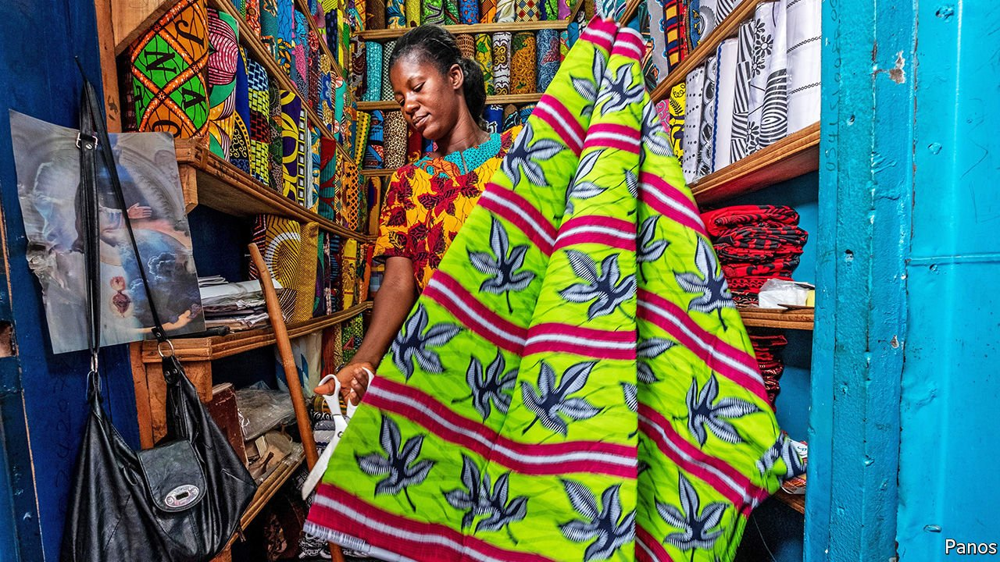

###### Links in the chain

# In Africa, foreign firms are often disconnected from local ones 

##### Strengthening linkages could spur development 

 

> Jul 10th 2021 

IN 2016 DANIEL KINUTHIA started a small business in Kenya making shoe uppers for the local subsidiary of Bata, a multinational footwear company. He was short of finance and equipment, and his contract with Bata ended when covid-19 hit. But he says supplying Bata and visiting its factory taught him “what happens, how the shoe is marketed, the kind of shoe that can be sold”. Now he dreams of using those skills to build a factory of his own.

Many African governments are keen to attract foreign investment. But its impact hinges on what Albert Hirschman, a post-war economist, called “linkages”. By supplying or buying from multinationals, local firms like Mr Kinuthia’s can learn about markets and technology. Such linkages are all too rare in Africa, however. Many multinationals ship in their inputs and export what they produce. That brings jobs and dollars, but does not spur development.


A recent study by John Rand of the University of Copenhagen and others finds that linkages are scarcer in Africa than in developing Asia. The multinationals they surveyed in Kenya imported two-thirds of their intermediate inputs, for instance, whereas those in Vietnam imported just a quarter. And local linkages transferred less technology than expected. Firms learned as much by trading across oceans as they did from foreign firms in their backyard.

Extractive industries in particular tend to operate as enclaves. Mining concessions often come with import-duty waivers, says Lukas Bekker, a supply-chain expert who has helped set up mines in three African countries. That makes it cheaper to import equipment than to use local contractors. And buying local can be risky. A finance manager with 20 years’ experience in African mining says he prefers to keep procurement offshore, having uncovered “frauds and kickbacks” between staff and local suppliers in the past.

Capacity takes time to build. In Uganda, which has long been preparing to pump oil, a survey in 2012 found that only 200 trucks in a local fleet of 2,500 were up to scratch. “We had to transform our business,” says Jeff Baitwa, who spent $20m buying equipment to upgrade his haulage company for oil contracts. Sometimes the technical gap is too wide. “I’m told the pipeline has what they call ‘seamless pipes’,” says Stuart Mwesigwa, a manager at Uganda’s largest steel company. “No one in east Africa is manufacturing that!”

The problem goes beyond mining. International supermarkets often truck in goods from distribution hubs—in South Africa, for example—rather than sourcing in the places where they operate. Much of Africa’s coffee, cashew and cocoa leaves the continent in packaging made abroad. Garment-makers stitch together imported fabrics with imported zips and buttons.

Governments’ attempts to nurture linkages show just how hard they are to create. Some are trying to set up clusters of knowledge in industrial parks. Raghav Pattar, an Indian, came to Hawassa Industrial Park in Ethiopia as the manager of a Chinese apparel factory. From there it was a short step to his current job as chief executive of Nasa Garment, the first Ethiopian-owned company there. These kinds of moves help skills and knowhow spread. But most Ethiopian firms “are not coming to the industrial park”, says Mr Pattar. They struggle to get the loans and expertise that foreign firms can acquire abroad. In many countries the entrepreneurs who gain most from foreign investment are often those with existing connections, such as those of European or Asian descent.

Governments are also trying to foster links through “local content” rules, which require multinationals to procure locally to win licences. The focus needs to be on suppliers that add value, notes Judith Fessehaie of the International Trade Centre, a development agency, who has studied such policies in the southern African mining sectors, so that contracts do not go to importers with nothing more than “a briefcase and a desk”. But the risk is that tough restrictions put foreign firms off setting up in a country altogether.

Some hope that the market might create incentives to source locally, as consumers become more interested in the origins of the products they buy. “Our objective is to grow the Ghana ecosystem,” says Keren Pybus of Ethical Apparel Africa, a British garment-sourcing company that has invested in a factory in Ghana. Ms Pybus imports fabric but wants one day to buy it locally. Foreign-owned brewers are switching from imported barley to homegrown grains, marketing beer-drinking as a patriotic act. But unless suppliers have the funds, capacity and expertise to take advantage of foreign linkages, such efforts will amount to small beer. ■

