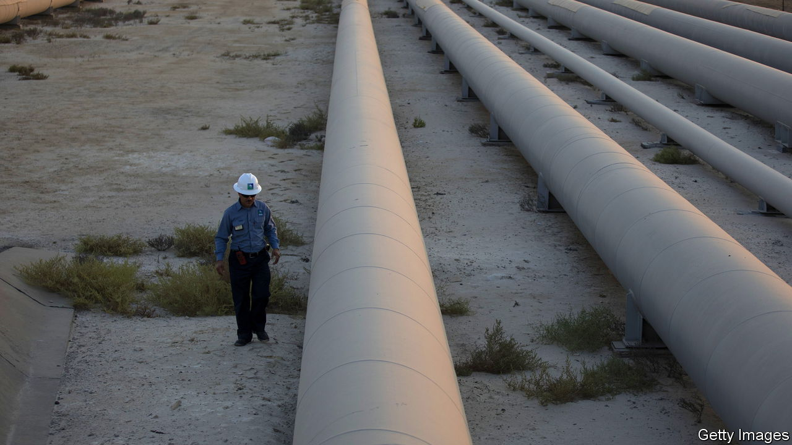
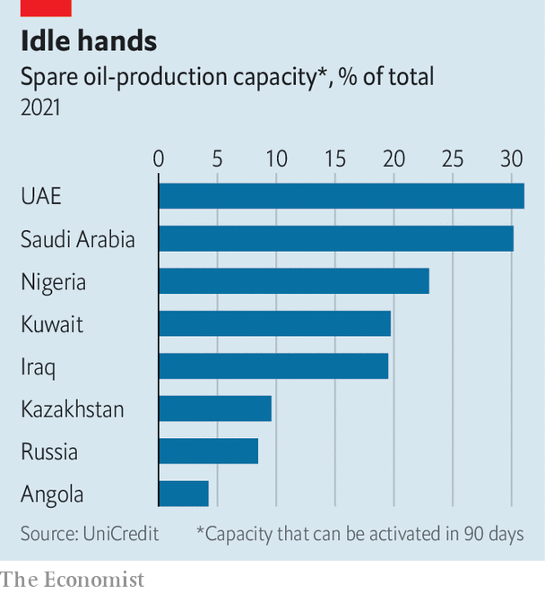

###### Division over the spoils

# The Saudi-Emirati rift within OPEC is a sign of things to come 

##### As demand eventually dwindles, some oil producers will be keener than others to turn reserves into cash 

 

> Jul 7th 2021 

IT IS RARE for spats about oil supply to break out between Saudi Arabia and the United Arab Emirates (UAE). The countries’ views on output usually align. Traders and analysts regard them, along with Kuwait, as the core of the Organisation of the Petroleum Exporting Countries (OPEC). So eyebrows were raised in early July when Suhail Al Mazrouei, the UAE’s energy minister, told reporters that OPEC’s quotas were “totally unfair”. A further surprise came on July 5th when meetings between the cartel and its allies (notably Russia), together known as OPEC+, were abandoned because of the row. The price of the benchmark Brent crude rose above $77 a barrel for the first time in more than two years, before dropping back below $75; that of American crude briefly hit a six-year high.

OPEC+ introduced swingeing production cuts last spring as covid-19 began to spread, the demand for fuel tanked and the oil price collapsed to below $30 per barrel. More recently the cartel has been carefully increasing supply as demand has revived and oil prices have recovered. The cancelled meeting had been convened with the goal of agreeing on further increases to output after July. At the same time the Saudis and others were also seeking to extend the current regime for assigning cuts to members’ production.


But the UAE wants the quotas, which are based on countries’ oil-producing potential in October 2018, to be revised. Its supply capacity has grown by almost a fifth since then, thanks to heavy investment. A third of its production is now sitting idle—a greater share than in any other OPEC+ country (see chart).

 


Other members, in particular Saudi Arabia, are reluctant to see production rise too much, however. That is partly because giving way on quotas could mean that countries such as Russia start to make similar demands. But it could also reflect the Saudis’ desire to avoid overproduction at a time when non-OPEC producers may expand supply, too.

The usual suspects would have been America’s shale producers, who in the past have often increased output when oil prices rise. This time may be different, though. The industry is trying to , promising to keep a tight rein on oil output, restrain investment and return cash to shareholders.

Iran is a more likely source of new supply. The country’s negotiators are trying to strike a deal with America that would lift economic sanctions in return for limits on its nuclear ambitions. If they succeed, Iran could add around 1m barrels a day to the market by the end of the year; it could also sell the 200m barrels it currently has in storage. Chris Midgley of S&amp;P Global Platts, a data firm, points out that Saudi officials do not want a replay of 2018, when America’s decision not to reimpose oil sanctions on Iran took them by surprise and sent oil prices lurching downwards.

What, then, to expect from the cartel and its allies? There are three scenarios. One is that countries start producing whatever they want, a price war ensues, and oil prices tumble. Analysts reckon that this is the least likely outcome. Energy ministers still bear the scars of the ill-timed price war of March 2020, when Russia and Saudi Arabia failed to agree on production cuts. The market was flooded with oil just before demand suffered its covid-induced collapse.

Another possibility is that a new deal fails to be struck, and that countries stick to their current quotas. That would mean the extra post-July production increases that the market had been expecting do not materialise. Coupled with a summer uptick in demand from holidaymakers as they fly or drive to their destinations, that would push prices up, perhaps over $80 a barrel. The most likely outcome from the row, however, is a compromise. One possibility is that the UAE and some other countries are allowed a temporary increase in output and the thorny issue of quota revision is kicked down the road.

Even if a deal is struck, however, the spat may portend further disagreements—and more price volatility. OPEC+ members are using divergent strategies when it comes to the energy transition and the oil markets, argues Francesco Martoccia of Citigroup, a bank. Faced with dwindling demand in the long term, some producers, such as the UAE, want to boost supply and monetise petroleum reserves earlier. Others, such as Saudi Arabia, want to restrict production to keep prices high. Such divisions will become even clearer as the shift towards a greener economy accelerates. OPEC’s latest tiff won’t be its last. ■

A version of this article was published online on July 7th 2021

