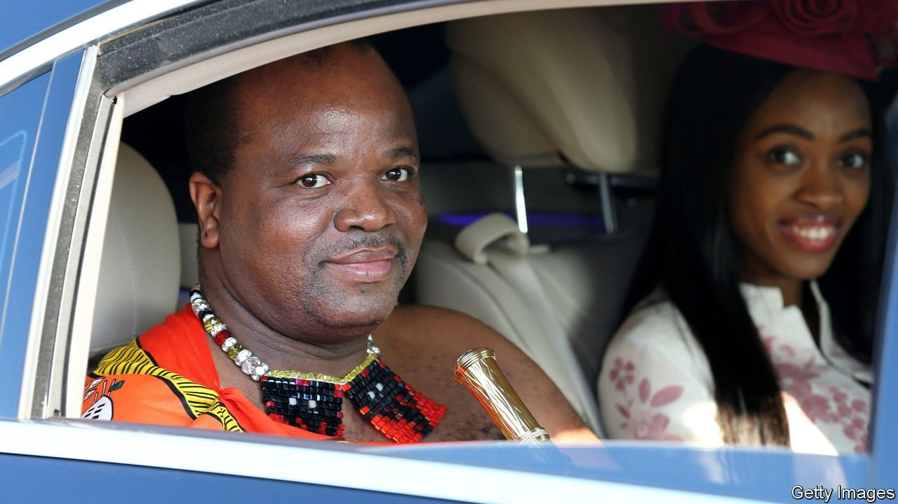

###### The king’s reply

# King Mswati III, Africa’s last absolute monarch, cracks down 

##### Why protesters are fighting for democracy in Eswatini 

 

> Jul 7th 2021 

THABANI NKOMONYE was last seen alive on May 8th. A few days later the body of the 25-year-old law student was found in a field near Manzini in Eswatini. The police say he died in a car crash. Friends and family say the police killed him.

Mr Nkomonye’s death has sparked protests across the country of 1.2m people. On June 29th, after demonstrations intensified, the government announced a dusk-to-dawn curfew and shut off the internet. Swazi journalists say that doctors have confirmed at least 50 deaths at the hands of security forces. The government says that 27 people have died and that its forces were defending themselves and private property against “rioters and foreign agents”.


In many ways the protests are like those elsewhere in Africa. “There are no jobs and opportunities for young people,” says Xolani Maseko, the president of the union of students. More than 46% of 15- to 24-year-olds are unemployed, the third-highest rate in the world. What distinguishes Eswatini is the protests’ target, King Mswati III, Africa’s last absolute monarch.

That he rules at all is a historical curiosity. Britain, the colonial power, left in 1968, perfunctorily bequeathing a Westminster-style system. Five years later the then king, Sobhuza II, revoked the constitution and declared “supreme power”. After Sobhuza died in 1982 elders of the ruling Dlamini clan picked as heir his 14-year-old illegitimate son, whom they hoped to control. The future King Mswati III was brought into the royal kraal, says a confidant, and told, “From now on you call your mother ‘Queen Mother’.” She had been a cleaner for one of Sobhuza’s 65 wives, according to a report published in 2013 by Freedom House, an American think-tank. The boy-king was sent to boarding school in England, returning to sit on the throne in 1986.

Though analysts speculate about how much the king himself calls the shots, the monarchy certainly operates unchecked. Mswati is immune from prosecution. Political parties are banned. Opposition activists are jailed. Journalists are intimidated; on July 4th reporters from New Frame, a South African publication, were taken to a police station and allegedly tortured with plastic bags over their heads. The king (pictured on next page) appoints the prime minister and other key office-holders.

Most Swazis are poor but the king’s fortune, which in 2014 Forbes magazine estimated was “at least” $50m, was sufficient to buy a fleet of Rolls-Royces. That does not include Tibiyo, a trust ostensibly held by the monarchy on behalf of the people, but which critics say benefits the royals. It controls tracts of land and, according to Freedom House, has stakes in sugar, manufacturing, property and other firms.

The king has defenders. “Every morning I’m grateful to wake up and see that the king is still on the throne,” says Andre le Roux, a fourth-generation (white) Swazi who runs a timber firm, Montigny, and the main business lobby. His worry is not the monarch, who he says ensures stability, but an “enterprise-throttling” civil service.

Neal Rijkenberg, the founder of Montigny, who was appointed finance minister in 2018, says the country is “surprisingly democratic”. For example, the king must get parliament to approve his budget and must use his own money to pay for posh cars, he argues. What about the 340m lilangeni ($24m) annual stipend? That pays for tourist-pleasing cultural events. And appointing a princess to the cabinet? “There are many children he hasn’t given jobs to.”

Mr Rijkenberg’s appointment, alongside others in a “cabinet of CEOs”, was perhaps a sign of the king’s fears. Manqoba Khumalo, the commerce minister, was poached from Coca-Cola. “It’s like when your mother asks you to do something, but times a thousand,” he says. The king is worried about youth unemployment, he adds. “He didn’t articulate it as a political threat but he probably sees it that way.”

Opponents argue that the king can never be a reformer. “He makes it impossible to run a state professionally, ethically and efficiently,” says Wandile Dludlu of the banned opposition party, PUDEMO. “There is no clear distinction between private and public resources.” Sibongile Mazibuko, another activist, argues that whereas the killing of George Floyd in America was “a white knee on a black neck, here it is a black knee on a black neck.”

“Because it is out of the spotlight, Eswatini gets away with a lot,” says a former diplomat. There are just eight missions in the country. After South Africa, on which Eswatini depends economically, the most important may be Taiwan. Mswati’s government is the last in Africa with which it has diplomatic relations. That has resulted in an upside-down situation in which Taiwan lavishes aid to maintain an autocratic status quo while accusing China of being on the side of pro-democracy activists.

The crackdown may quell protests for a while. But it seems that the king’s popularity is waning. In 2015, according to Afrobarometer, a pollster, 79% of Swazis said they trusted him. Earlier this year the share was 50%. Large majorities said they supported multi-party democracy and wanted to choose their leader, suggesting a preference for, at least, a constitutional monarchy. And the longer his regime silences Swazis, the more likely it is that they will decide they do not need a king at all.■

Correction (July 8th 2021): Owing to a captioning error, this article was originally published with an incorrect photograph.

A version of this article was published online on July 7th 2021

