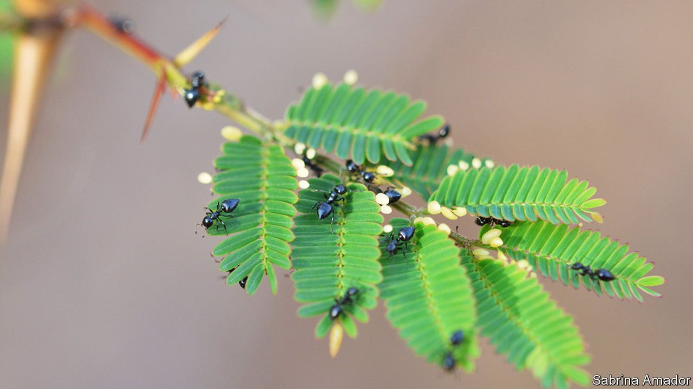

###### Symbiosis

# Ants, acacias and shameless bribery 

##### Lazy ants get bigger rewards 

 

> Jul 7th 2021 

AESOP’S FABLES are supposed to illustrate a moral point. If he had lived in Central America rather than Greece, though, he might have thrown in the towel at writing one entitled “The Ant and the Acacia Tree”. For, as Sabrina Amador-Vargas and Finote Gijsman of the Smithsonian Tropical Research Institute, in Panama, have discovered, the moral of this particular tale is that laziness pays.

Acacias are a widespread group, but one member in particular, Vachellia collinsii, is famous for its symbiotic relationship with ants. The ants attack herbivorous insects which eat the tree’s leaves, remove encroaching vegetation, and also protect it from disease by distributing antibiotics synthesised by bacteria living on their legs. In return, the tree rewards ants with food in the form of protein-rich Beltian bodies (the white objects in the picture above) and sugar-rich nectaries, and with secure housing inside hollow thorns that have evolved specifically for the purpose.


A cosy arrangement, then. But, like all bargains, one that is subject to negotiation. One of the best known ant symbionts of acacias is Pseudomyrmex spinicola. Members of this species do everything expected of them and help the plants to thrive. Crematogaster crinosa, by contrast, are less desirable tenants. They are lazy defenders against herbivores, fail to clear encroaching vegetation and are not known to spread antibiotics. Given the different services these species provide, Dr Amador-Vargas and Ms Gijsman wondered whether the plants paid them different wages. And, as they write in the Science of Nature, they found that they did. But not in a way that Aesop would have approved of.

For three months, the researchers monitored specimens of V. collinsii at two sites, one of which supported both types of ant and the other only P. spinicola. They paid particular attention to the trees’ thorns, Beltian bodies and nectaries, but also collected evidence of leaves having been chewed by herbivores. For comparison, they looked at acacias lacking ant colonies.

The quality and quantity of accommodation provided was, they discovered, the same in all circumstances. Even when ants were absent, acacias grew similar numbers of hollow thorns. The food rewards on offer, however, varied a lot.

In particular, trees with ants sported 75% more nectaries than those without. This came as no surprise. But the plants also treated the two types of tenant differently. Though the distribution of Beltian bodies remained unchanged, acacias supporting colonies of P. spinicola only produced nectaries along the bases of their leaves. Those supporting C. crinosa did this too, but also sported such structures at the tips of their leaves, encouraging otherwise recalcitrant workers of that species to traverse the leaves to reach an extra reward. That brings these ants into contact with pests they might not otherwise have encountered, driving those pests away. But from an anthropomorphic point of view it hardly seems fair on the industrious workers of P. spinicola, which need no such bribe to achieve the same goal. ■

A version of this article was published online on July 7th 2021

