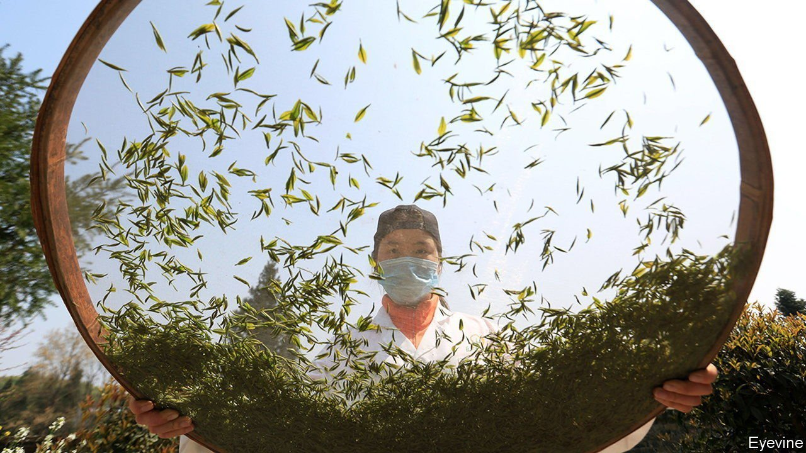

###### How tea gets its flavour

# Micro-organisms play a bigger part in tea-making than was realised 

##### That may lead to new, bespoke varieties 

 

> Jul 8th 2021 

TEA IS FAMILIAR around the world. People drink more than 2bn cups of it each and every day. Even so, it can pull surprises, as Ali Inayat Mallano and Jeffrey Bennetzen of Anhui Agricultural University, in China, have just shown.

Tea producers long assumed that the flavours of the most widely drunk varieties of this beverage, so-called black teas like Darjeeling, Assam and English Breakfast, were a consequence of some of the chemicals in tea leaves being oxidised while those leaves were being dried. Dr Mallano and Dr Bennetzen suspected, however, that, like the flavours of more expensive and rarefied “dark” teas such as kombucha, Pu-erh and anhua, black-tea flavours are at least partly a product of fermentation. This would mean they could be manipulated by tweaking the mix of micro-organisms doing the fermenting.


To test their hypothesis they obtained some leaves from the Dongzhi tea plantation in Anhui province. As they explain in the Journal of Agricultural and Food Chemistry, they then sampled the microbes thereon before sterilising half of the leaves in mild bleach for five minutes. After that (having washed the sterilised leaves thoroughly, to get rid of the bleach) they processed both the sterilised and the unsterilised leaves in the normal way. In other words, they withered, rolled, oxidised and dried them. They then tested them all for microbes once more. They also tested the result of all this treatment in a more time-honoured manner, by brewing numerous cups of tea.

If oxidation were the main cause of chemical change in black-tea leaves as they were processed, the sterilisation would have made little difference either to the chemistry or the taste of the final product. But this was not the case. Black tea brewed from unsterilised leaves had, as per normal, lots of catechins and theanine, both of which made it flavourful. Tea made from sterilised leaves did not, and its taste suffered as a consequence. Black tea, then, seems to get its flavour in the same way that dark tea does.

The next job, which Dr Mallano and Dr Bennetzen are now engaged in, is to identify the bugs involved. Once they have done that, tweaking the microbial mixture to produce novel flavours should become possible. And that is good news for tea snobs everywhere. ■

A version of this article was published online on July 5th 2021

