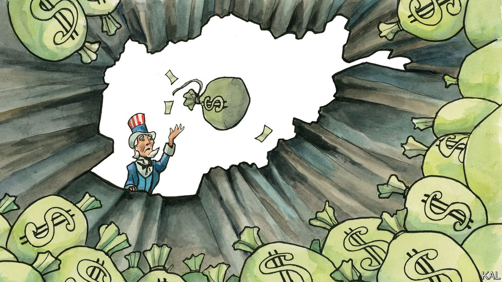

###### Lexington

# America’s trillion-dollar Afghan fiasco typifies its foreign policy 

##### The mission was sustained by mistakes that America seems destined to repeat 

 

> Jul 10th 2021 

FIVE YEARS ago the US embassy in Kabul unveiled an $800m refit. With 1,500 desks and 800 beds within its fortress walls, it was a third bigger than America’s next biggest embassy, in Baghdad. Meanwhile Barack Obama’s special representative to Afghanistan, Laurel Miller, had a troubled conscience.

Her State Department talking-points insisted she should speak of America’s “enduring commitment to Afghanistan”. But Ms Miller reckoned the trillion-dollar American effort was on borrowed time. “The phrase was dishonest enough to make me wince,” she recalls. “I didn’t think the strategic rationale for the mission or political commitment to it would endure.” She avoided the term.


That might have seemed odd in Kabul, in the shadow of America’s concrete citadel. But it was fairly obvious in Washington. Mr Obama, having dispatched 47,000 additional troops to Afghanistan early in his presidency, had lost faith in the mission. A steep reduction in casualties—the year the embassy relaunched saw one combat death—meant Congress and the media largely ignored it. And the foreign-policy establishment had never paid it the attention its claim on American blood and treasure warranted.

Where the wars in Vietnam and (to a lesser degree) Iraq inspired generations of area specialists, America’s small cast of Afghanistan experts has to this day changed little since 2001. Having spent a fair bit of time in the country during the first decade of the American mission, though very little in the second, your columnist is sometimes mistaken for an expert himself. It shows how low the bar to Afghanistan expertise has been set.

This mismatch between America’s vast investment in Afghanistan and the scant attention paid to it in Washington might seem paradoxical. In fact it helps explain how the slow-rolling debacle of America in Afghanistan came to pass.

From the start, the American effort was not merely ill-informed about Afghanistan; it was only partly about Afghanistan. After bombing the Taliban from power, George W. Bush’s administration was advised to reach an accommodation with the group. It posed no direct threat to America. And though unpopular in Kabul, the mullahs represented a large population in southern Afghanistan who found the Taliban’s northern rival—and America’s proxy—repugnant. Yet the administration considered any distinction between terrorists and their abettors incompatible with its expansive vision for the war on terror. It therefore ruled the Taliban irreconcilable. America has spent almost two decades being punished for that mistake.

The insurgency it gave rise to ensured that America’s stabilisation effort was dominated by generals, for whom force is the answer to most setbacks, and local politics a distraction. Yet the insurgency, because based in neighbouring Pakistan, was unbeatable. The result has been waves of terrible violence that have cost tens of thousands of Afghan lives and left many of the country’s people craving order from any hand. This was the circumstance in which the joyless mullahs arose in the 1990s; it is why rural district after district is now falling to them as easily as they did then.

The scholar Robert Kagan has suggested that America’s history of large foreign-policy blunders is connected to its isolationist sentiments. To overcome them, American presidents embrace unrealistically grandiose schemes, he suggests; and at first blush Afghanistan looks like evidence for that. In pursuit of a Utopian ideal—to eradicate terrorism—America sought to produce an unprecedented Afghan state while fighting an unwinnable war.

Yet the war’s context has changed. Public opinion has played little part in it, because for most Americans it has been invisible. In 1968 America had half a million disgruntled conscripts and volunteers in Vietnam. At the height of the Obama surge it had 98,000 professional soldiers in Afghanistan—too few to fill the biggest college football stadiums—and suffered modest casualties. In a country of 330m people—a tiny minority of whom have any connection to the armed forces—the war has scarcely registered.

This gave Mr Bush’s successors freedom to try to fix his mistakes. But Mr Obama and Mr Trump doubled down on them, by initially bowing to the generals’ demand for more troops and more fighting. They did so partly for political reasons. Mr Obama had talked up the war’s importance so much on the campaign trail that he felt compelled to give it a fresh push. Mr Trump wanted to make Mr Obama look weak. But it was also, in both cases, for want of a more compelling alternative suggestion.

National-security hawks remained largely opposed to the only conceivable way to end the conflict, negotiations with the Taliban. Few in the foreign-policy intelligentsia, which had come to consider Afghanistan a strategic byway, challenged that view. Mr Obama ended up passing the war on more or less as he had inherited it, with little conviction that it could end well. Mr Trump, to his credit, launched peace talks with the Taliban, but only after signalling his intention to withdraw America’s remaining troops, dooming the talks from the start. This suggested that America no longer cared who controlled Afghanistan—a position that Joe Biden, by proceeding with the withdrawal, has underlined. What a way to spend $2trn.

Back to Gandamak

It might at least be hoped that the lessons of this debacle will be learned. The main one is so obvious: an over-militarised foreign policy that embraces unrealistic objectives is liable to fail. Yet, as Mr Kagan and many others have shown, this appears to be more a feature of American foreign policy than a bug. And indeed the light—almost imperceptible—mark Afghanistan has made on the Washington establishment suggests it may be forgotten especially quickly. Ms Miller predicts that Afghanistan will soon barely be mentioned in America’s foreign-policy circles. Her forecasts have a solid record.■

For more coverage of Joe Biden’s presidency, visit our dedicated 

