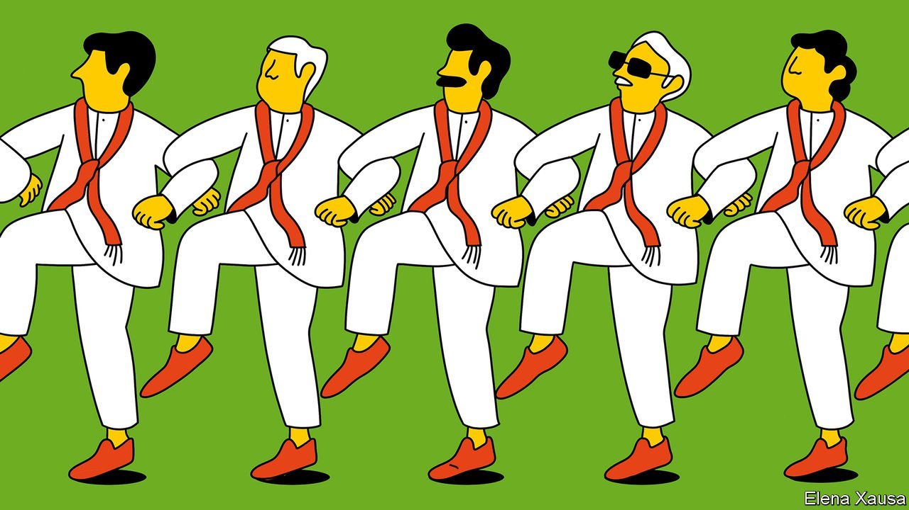

###### Banyan

# Sri Lanka’s Rajapaksa dynasty is not as secure as it appears 

##### The family that runs everything is running out of cash 

 

> Jul 15th 2021 

SINCE WINNING the presidency in a landslide nearly two years ago, Gotabaya Rajapaksa has worried not that he has too many relatives in government, but that he has too few. One of the 72-year-old’s elder brothers, Mahinda, himself president for ten years until a surprise election defeat in 2015, is prime minister. Another, Chamal, is minister for irrigation. Chamal’s son, Shasheendra, is minister of state for “paddy and grains, organic food, vegetables, fruits, chillies, onions and potatoes, seed production and high-tech agriculture”. Mahinda’s son, Namal, is minister for youth and sports. And state minister for digital technology and enterprise development. And everything else, to judge by his hyperactive Twitter feed.

But there is always room for one more Rajapaksa, 69-year-old Basil above all. “Gota” and Mahinda acknowledge him as the brains and organiser-in-chief of the family. He devised the electoral strategy behind its return to power, founding a new party, the Sri Lanka Podujana Peramuna (SLPP), which used digital wizardry to rally chauvinists from the ethnic majority, the Sinhalese—all while in prison on a corruption charge stemming from his time as economy minister (his detractors called him “Mr 10%”). On July 8th he was back in the cabinet.


Basil’s return to government required both a constitutional amendment to allow dual nationals to hold senior government positions (he has an American passport) and the resignation of a docile member of Parliament to free a seat for him. He faces a budget and current-account mess caused by poor policy under Gota and Mahinda, from whom he inherits the finance portfolio, and exacerbated by the pandemic.

On coming to power, his older brothers slashed taxes as a stimulus. Tax receipts fell by a quarter and the budget deficit climbed to 14% of GDP. Two-thirds of government revenue now goes on interest payments. A downgrade by credit-rating agencies late last year shut Sri Lanka off from international capital markets. The Sri Lankan rupee is sliding. Foreign debt is being serviced from the central bank’s reserves. These, warns Deshal de Mel of Verité Research, a think-tank in Colombo, the capital, are now down to less than three months’ worth of imports. Default is becoming more likely.

The obvious solution is to apply to the IMF for an assistance programme to help restore confidence among external creditors. Such a move would not sit easily with Gota’s talk of “prosperity and splendour”, however. An easier first step will be to seek more help and forbearance from a major creditor, China. The central bank recently minted gold coins to celebrate the Chinese Communist Party’s 100th birthday.

In following their next moves, however, never fail to bear in mind what is in it for the Rajapaksas themselves. The next parliamentary and presidential elections are a way off. Basil presumably calculates that economic recovery by then will return them to power. But there are complications.

One has to do with Mahinda, who is rumoured to be suffering from ill health. Basil is his obvious replacement as prime minister. Yet it is from Mahinda’s folksy charisma that the family’s aura derives. When he goes, so does a big part of the Rajapaksa appeal.

The obvious family response would be to tighten its hold on power yet further. The tendencies are there. Gota, who as defence secretary prosecuted the end of Sri Lanka’s brutal civil war in 2009, retains the defence and intelligence portfolios. By temperament a martinet, he has stuffed his administration with ex- and current brass. During Mahinda’s presidency the security services were all-powerful, and critics were intimidated and on occasion wound up dead.

The complication here is getting Sri Lankans to play along. These days, Gota’s irascibility inspires more scorn than fear. Farmers decry Gota’s ill-considered push for organic farming free of imported fertiliser. Others call for justice for the civil war’s victims. Activists who recently took to the streets against the expansion of a military-backed university that is exempt from national oversight were bundled away for supposedly breaking coronavirus restrictions and given 14 days’ enforced quarantine. In response, the country’s teachers have gone on strike. Even SLPP members grumble that the Rajapaksa tribe is taking too much power, leaving too little for the hangers-on. Sri Lankans have a history of hoofing overweening governments out. That makes the Rajapaksas’ suffocating hold on power look like a weakness.

