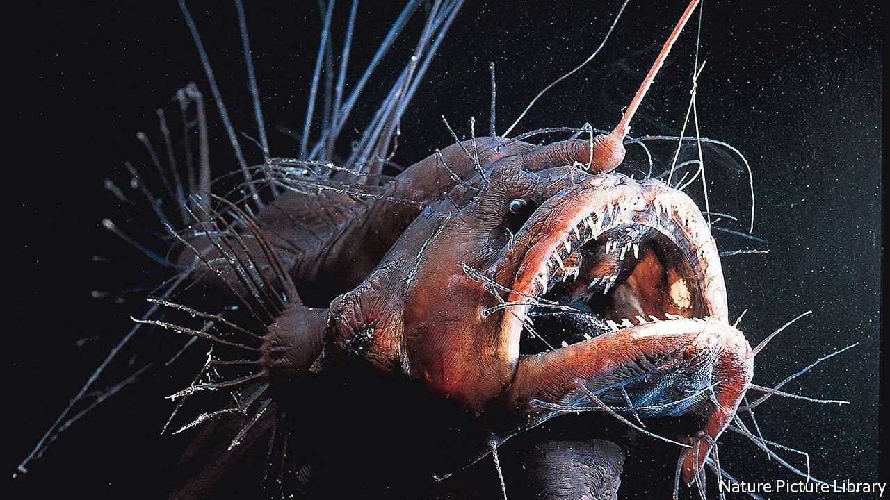

###### Deep seas

# A marine biologist dives to where blue gives way to black 

##### Helen Scales finds wonders, and threats, on the ocean floor 

 

> Jul 17th 2021 

The Brilliant Abyss. By Helen Scales. Atlantic Monthly Press; 304 pages; $27. Bloomsbury Sigma; £16.99

MANY VISITORS only skim the surface of the ocean—swimming from the beach or slicing through whitecaps on a sailing boat. In “The Brilliant Abyss”, Helen Scales, a marine biologist whose previous books explored the shallower reaches of the sea, dives deep and revealingly into the realm below 660 feet where sunlit blue begins to give way to black.


As Ms Scales notes, it is often said that more is known of the Moon’s surface, exposed to anyone with a telescope, than about the geography of the deep-sea floor, which a dark cloak of water obscures. It is a rugged, complex and shifting terrain—subject to earthquakes precipitated by the movement of tectonic plates, and punctuated by seamounts (mountains formed by volcanic activity) and hydrothermal vents that emit sulphurous, scalding fluids.

In these underwater extremes of dark and cold, and the boiling waters disgorged by vents, life survives and even thrives. It includes sea cucumbers that slough off their illuminated skin to distract predators, yeti crabs as hairy as their name suggests, fish masked in ultra-black skin that makes them all but invisible, and a sponge that looks like a glass of milk frozen in mid-spill. As well as its role as a climate regulator and carbon sink, the deep, in its vibrant profusion, prompts reflections on the possibility of life on other planets.

Less beguiling things lurk down there too. Plastic bags and packaging have been spotted by submersibles in the seven-mile-deep Mariana Trench. Nuclear waste, chemicals and oil spills, such as the one from the Deepwater Horizon rig in 2010, have turned sections of sea floor into poisonous dumps. Exploitation adds to the blight. The orange roughy, a white-fleshed fish that congregates around seamounts (also known, less appetisingly, as a slimehead) has been dangerously overfished.

An experimental push to harvest sea-floor nodules laced with manganese, nickel, cobalt and other metals is another threat. The potential damage to the seabed from remotely operated machines is analogous, Ms Scales argues, to the most toxic mining on dry land. But the revenues could be huge. An analysis by the Massachusetts Institute of Technology calculated that a single seabed mine could net $1bn a year.

And an ecological case for the initiative can be made. “I get very uncomfortable when people describe us as deep-sea miners,” says Gerard Barron of DeepGreen Metals, a deep-sea mining company targeting the metals used in electric-car batteries. “We want to help the world transition away from fossil fuels.” Because the long-term impact is unknown, Ms Scales is sceptical; her argument is compelling, even if her explanation of car batteries is a slog. Yet another marine biologist doubts that mining would be forestalled “even if we found unicorns on the sea floor”.

Early European cartographers often used sea serpents to mark uncharted depths. Hic sunt dracones—Here be dragons—reads the inscription flagging an unfathomable stretch of water on a globe made in 1510. But the most threatening sea monster of all may be man. ■

