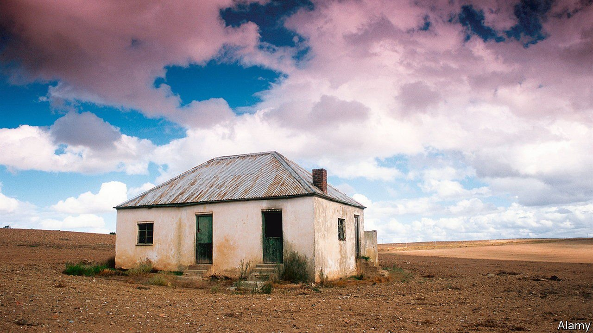

###### South African fiction

# A matriarch’s bequest haunts Damon Galgut’s new novel 

##### “The Promise” follows a white South African family from the 1980s to the recent past 

 

> Jul 17th 2021 

The Promise. By Damon Galgut. Chatto &amp; Windus; £16.99

THE PULL of a house and an inheritance is an enduring preoccupation of fiction in English. Think, for example, of Evelyn Waugh’s “Brideshead Revisited” or “Howards End” by E.M. Forster. In his ninth novel, “The Promise”, Damon Galgut, whose previous book was about Forster, reworks this venerable theme in the gripping, profound tale of an unhappy white South African family.


The Swarts live on a small farm on the outskirts of Pretoria—“useless ground, full of stones, you can do nothing with it. But it belongs to our family, nobody else, and there’s power in that.” The story opens in 1986 on the day of Ma’s funeral. The three Swart children, Anton, Astrid and Amor, are all there. Pa, the dead woman’s husband, is resentful that his wife of decades wanted to lie for all eternity in the Jewish cemetery of her birth family rather than alongside him. Meanwhile Amor is insisting that she overheard her dying mother extract a promise from Pa that the Swarts’ black maid, Salome, would be given the deeds to her cottage (actually more of a shack) and the land on which it sits.

This promise, which most of the family try to ignore despite Amor’s best efforts, hangs over the rest of the book. “Sometimes a chance is just a waste of time,” Anton tells her, complaining that Salome’s son has squandered the education that their father paid for. “Yes, she says. But a promise is a promise.”

The four sections each focus on one member of the Swart family as they approach death. Pa is buried on the inspiring day in 1995 when South Africa won the rugby World Cup and Nelson Mandela presented the trophy to the team’s white captain. By the last part it is 2018; Jacob Zuma is resigning from office and South Africans are increasingly dismayed by the direction their country is taking. If, at the beginning, apartheid-era laws meant Salome was not allowed to own the land on which her cottage stands, by the end the country has been transformed, and new threats to her claim have emerged.

Mr Galgut’s arresting style makes this tale of tragedy and betrayal more than the dirge it might have become in other hands. The story is told in the third person but skips to other voices, and from present tense to past, often in the same paragraph, with the occasional aside addressed directly to the reader. Writing of Astrid, the Swarts’ bulimic elder daughter, a social climber who is having an affair with her husband’s black business partner, the author says: “Her new [Catholic] faith, which she experiences as a kind of waterproof garment she’s buttoned down over herself, doesn’t stop her acting on her fears and desires, but it provides a way of washing them off afterwards.”

The novel evolves into a damning commentary on South Africa’s many broken promises; the denouement will make readers feel desolate. Yet Mr Galgut’s wry, waspish prose will make them laugh, too, even as it leaves them hooked. ■

