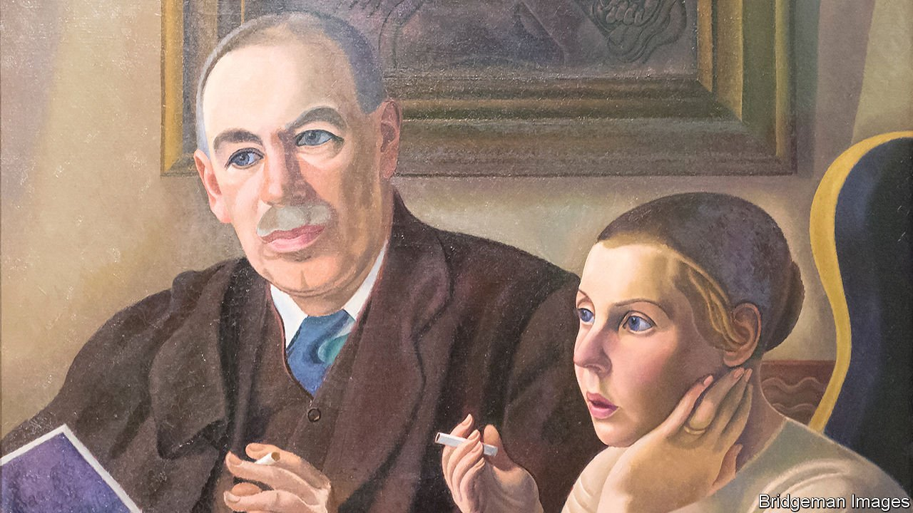

###### A marriage of art and economics

# The love song of J. Maynard Keynes 

##### An intense, improbable romance comes thrillingly to life 

 

> Jul 17th 2021 

HE WAS A renowned English economist with a history of affairs with men. She was a Russian ballerina whose former paramours included a Polish count and Igor Stravinsky. Yet when John Maynard Keynes went, night after night, to watch Lydia Lopokova perform with the Ballets Russes in London in 1921, they fell ecstatically in love. It was, Keynes wrote, “a dreadful business”; he was “almost beyond rescue”.

Extracts from the letters in which their pas de deux played out were performed on July 9th by Helena Bonham Carter and Tobias Menzies, both recently of “The Crown”. The venue was Charleston, the farmhouse in Sussex that was home to the painters Vanessa Bell and Duncan Grant, which they turned into a floor-to-ceiling work of art. It became a retreat for other members of the Bloomsbury Group, including Keynes (once Grant’s lover). Now a museum, Charleston is hosting a season of outdoor events; it asked Holly Dawson, an in-house researcher, to shape the letters into a collage of the couple’s life together.


Lopokova’s writing, reckons Ms Dawson, “comes straight from her bones” and today “goes straight to our bones”. But a century ago, the Bloomsbury set were frightfully snobbish about her. Bell advised Keynes that she would make “a very expensive wife” and was “altogether to be preferred as a mistress”. Virginia Woolf thought she had “the soul of a squirrel”. Their disapproval was useless. “I kiss you and re-kiss you and pro-kiss you,” Keynes declared, conjugating his desire. “I gobble you”, Lopokova wrote, “I re-gobble you” and “gobble you from head to foot”.

It wasn’t all “foxy licks”, though. The piece charts the relationship from infatuation to dependence, around private obstacles (she was already married), across separations (she away on tour, he at summits) and through the national trauma of the second world war (and, in 1941, Woolf’s suicide). Lopokova dreamed “that you and I were soldiers and when the bullet went through me I did not die”. She accompanied Keynes to the Bretton Woods conference and swam naked in a fishpond.

Intimacy and power-broking are interwoven in Ms Dawson’s artful arrangement. Power also ebbs and swirls between the couple, as it can in long marriages. Keynes was eminent and brilliant; Lopokova spoke what he called “Lydian English”, sprinkled with malapropisms. Yet he needed her, not only to support his work and later his infirmity, but for her creativity and capacity for joy. “Try to forget shares markets fortunes”, she told him in 1937, “because it must crumple the muscles of your heart.”

A former ballerina and student at the London School of Economics, Ms Dawson was an ideal person to craft their story. In clipped upper-crust diction, Mr Menzies impersonated Keynes as halting wooer and weary statesman. Ms Bonham Carter’s Russian accent and comic timing were delicious. On a bright, blustery evening the courtyard at Charleston, close to its statue-strewn walled garden, was the perfect spot for their funny, moving recital (a one-off, but you can stream it online).

Across the fields lies Tilton, the house that became Keynes’s and Lopokova’s own country home. There, after he died in 1946, she lived out the grief that is the last phase of love’s cycle. “Peoples of today do not know how great many things were lovely yesterday,” she lamented. “But today is today and yesterday is history.” ■

“Lydia &amp; Maynard: Love Letters” is available to stream at Charleston.org.uk until the end of 2021

