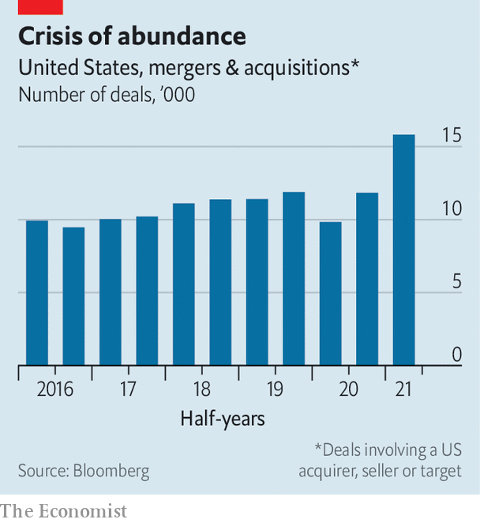

###### White shoes are made for earnin’

# America’s elite law firms are booming 

##### A frenzy of corporate dealmaking and looming regulation add up to a legal-services bonanza 

 

> Jul 15th 2021 

A LAWYER IN his early 30s pauses outside an elegant clothing shop in New York’s Tribeca district. It is the first time he has been out in 30 days, he says, turning away from the shuttered establishment. Covid-19 is only part of the reason for his isolation. Unlike many main-street businesses that have not survived the lockdowns, his employer has been swamping him with work of late. And it is not alone. America’s elite law firms are having a banner year. Associates, often toiling from home, have melded with their laptops. Senior partners, holed up in their second homes in the Hamptons, barely have time to enjoy the beach. The pandemic has pushed huge numbers of companies to raise capital, merge, buy rivals or be acquired by them.

Nearly 16,000 deals involving at least one American party have been announced in the first six months of this year, roughly half as many again as in the same periods in 2016-20 (see chart). Many involved novel legal structures such as special-purpose acquisition companies (SPACs), which list on a stock exchange in order to reverse-merge with a promising startup. On top of that, lockdowns have introduced fresh legal wrinkles (Does an infectious disease count as force majeure? How to conduct due diligence on a deal by Zoom?). Some law firms are so busy that they are declining assignments, in violation of an unwritten rule never to do so which, in the industry, is as revered as the constitution.


According to American Lawyer, an industry journal, total revenues at the 100 biggest firms rose by 7% last year, to $111bn. At the same time, expenses such as travel and entertaining clients all but vanished. As a result, average profit margins increased, from 40% to 43%. Profits per equity partner rose by over 13%, to an all-time high of nearly $2.2m. These went up at all but six of the top 100 firms. At the most lucrative ones, such as Davis Polk, Kirkland &amp; Ellis or Sullivan &amp; Cromwell, they exceeded $5m. Each equity partner at Wachtell, Lipton, Rosen &amp; Katz, the richest of the lot, raked in $7.5m, up from $6.3m in 2019 (and, housebound, had to spend less of it to maintain a certain sartorial standard, captured in the term “white shoe” that still refers to New York’s elite firms).

 


The billable-hour bonanza has left firms with more money to lure new recruits. That is just as well. With the supply of legal professionals limited by elite law schools’ refusal to admit many more students, firms are engaged in a fierce battle for talent. Last month Milbank, another big firm, raised its starting salaries for new associates from the industry standard of $190,000 to $200,000. A day later Davis Polk offered freshman lawyers $202,500. Partners at other firms say they matched Davis Polk within 24 hours, not wanting to be thought second-tier. Most big firms are awarding special spring bonuses to associates who have billed enough hours (typically 60 a week or more)—which plenty have done in these febrile times. The money, says the head of one big firm, is a reward for hard work. It is also, he acknowledges, an effort to stop desertions.

Poaching is rampant at all levels of these organisations. McDermott Will &amp; Emery, a fast-growing firm from Chicago, hired six new outside partners in May alone. Even firms famous for staff loyalty, such as Cravath, Swaine &amp; Moore or Wachtell, have lost lawyers to rivals. A senior partner at a large firm says he begins his day by opening emails from recruiters inquiring about his availability. He then peruses career announcements in legal periodicals. For the first time in 20 years Major, Lindsey &amp; Africa, a large legal recruitment firm, is looking in Australia and Canada for associates with dealmaking experience to place at New York firms.

Not all elite American firms have prospered in the pandemic. The current conditions have favoured partnerships with expertise in complex transactions, such as Wachtell or Davis Polk. Some generalists have done less well. Profits per partner at Baker McKenzie, a Chicago-based giant, declined by nearly 10% in 2020. The dealmaking specialists could suffer if the merger-and-acquisition boom peters out. That is already happening to the SPAC craze, which provided lawyers with oodles of work in late 2020 and early 2021. And as America reopens, those covid-crimped expense accounts could begin to swell again, squeezing margins.

Managing partners are therefore thinking about what comes next. Mayer Brown is expanding its restructuring and bankruptcy practice, perhaps in anticipation of an end to government stimulus programmes that have kept many businesses afloat. Many others are beefing up their antitrust and regulatory practices as President Joe Biden and his Democratic Party in Congress threaten to regulate big business and go after dominant companies, from Silicon Valley to Wall Street. The white shoes will not soon suffer a shortage of well-heeled clients. ■

A version of this article was published online on July 13th 2021

