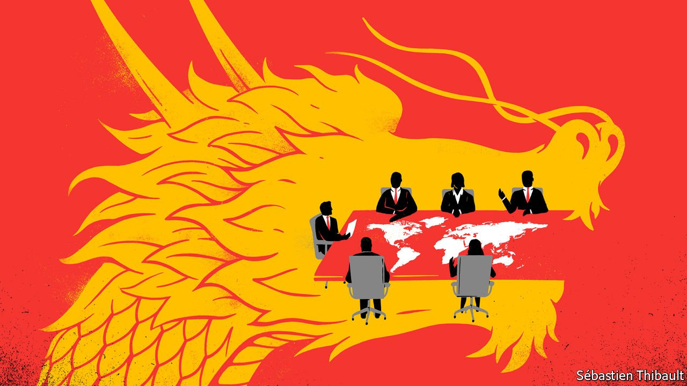
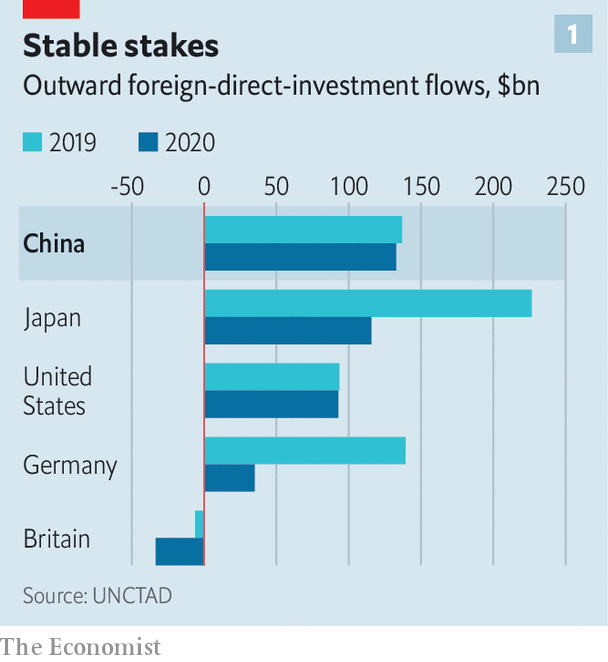

###### Subtle globalisers

# China Inc’s new inconspicuous expansion 

##### Chinese companies are adapting to a more hostile global climate—and thriving 

 

> Jul 17th 2021 

DEEPGLINT, A CHINESE facial-recognition firm, was one of 14 companies slapped with American sanctions on July 9th for alleged links to human-rights abuses in China’s far-western region of Xinjiang. It is also a globally recognised leader in its field and has raised money from Sequoia Capital and other big American investment firms. DeepGlint’s founders, who graduated from Stanford and Brown universities in America, must now discuss with their foreign backers the prospect of decoupling from the Western commercial sphere. Many Chinese companies have been forced to hold similar talks.

China Inc appears to be on the back foot. In America President Joe Biden has picked up where Donald Trump left off, placing restrictions on Chinese companies. Last year Congress passed a bill that may eventually force Chinese firms to delist from American stock exchanges, which would affect nearly $2trn in market value. Huawei, banned from America, has struggled to sell its 5G telecoms kit elsewhere in the West. ByteDance was nearly forced to divest from its prized short-video app, TikTok, over American fears that the Chinese regime could access global users’ personal data. Tencent, another internet giant, is said to be haggling with American regulators worried about its 40% stake in Epic Games, the developer of Fortnite.


Around the world Chinese companies are, fairly or not, viewed as instruments of the Communist Party. Britain’s prime minister, Boris Johnson, said on July 7th that the government would probe the Chinese acquisition of Newport Wafer Fab, the country’s largest chipmaker, on national-security grounds. Australia’s defence department could tear up a 99-year lease with a private Chinese company for a big port. Completed outbound acquisitions by Chinese firms shrivelled from some $200bn in 2016 to $36bn in 2020. Cross-border lending, mostly to poor countries, by some of China’s state banks has stopped growing.

It is not the first time that a wave of Chinese corporate expansion has met a frosty reception. When commodity giants such as CNOOC, an oil firm, began buying foreign reserves, and rivals, in the 1990s, it stoked fears of resource colonialism. In the 2010s Chinese industrial groups’ aggressive pursuit of Western rivals from chemicals (ChemChina’s takeover of Syngenta) to cars (Geely’s of Volvo) reminded some anxious rich-world governments of Japan’s corporate conquests in the 1980s. At the same time, Chinese acquisitions of trophy assets such as the Waldorf Astoria hotel (by Anbang, a conglomerate) allowed other Westerners to dismiss China Inc as unserious or dodgy (a suspicion confirmed by the subsequent collapse of Anbang and a few similar groups after charges of fraud).

Now, just as innovative Chinese tech firms have captivated Wall Street, China’s increasingly authoritarian regime is itself reining in its global champions. President Xi Jinping appears bent on disconnecting them from Western capital markets and controlling their data. Tencent and Alibaba, an e-commerce behemoth, have between them lost $340bn in market value since the crackdown began late last year. Days after its $67bn New York flotation, Didi found its ride-hailing app banned by Chinese data regulators. ByteDance has scotched plans to go public in New York.

Speak softly and carry a small cheque

All this looks like a treacherous climate for Chinese companies. Look closer, though, and a new generation of firms is not just adapting to it but thriving. Many have spent years expanding global operations and now make as much money outside China as they do within. Some are pursuing smaller investments under the radar. And, inverting a decades-old trend of copying Western intellectual property (IP), a few have become tech powerhouses in their own right, selling advanced products to the world.

 


The scale of China Inc is formidable. China was the largest investor in the world in 2020. Foreign direct investment (FDI) from Chinese firms hit $133bn, down only slightly from 2019 despite the headwinds (see chart 1). The country has some 3,400 multinationals, almost as many as America and western Europe combined, reckons Bain, a consultancy. Around 360 big listed Chinese groups report foreign revenues. These amounted to around $700bn in 2020, compared with 250 large firms earning a total of $400bn in 2012, according to data from Bloomberg (see chart 2). In 2020 Chinese venture capitalists ploughed an estimated $3.2bn into American startups in 249 deals, the second-biggest year on record by value, calculates Rhodium Group, a research firm. Analysts at CB Insights say that Chinese investors’ participation in American venture deals last quarter was the highest since at least 2016.

 


The Chinese presence is deep as well as broad. Last year more than 100 of the listed firms earned at least 30% of revenues outside China; 27 earned 70% or more. All told, China’s top ten foreign earners booked $350bn or so in overseas sales. This total has grown by 10% a year on average since 2005, Bain says, twice as fast as the equivalent figure in America, Europe or Japan. Tencent’s foreign sales have risen at an annual rate of 40% for nearly a decade, and now make up 7% of its huge top line.

The first plank of China Inc’s new global strategy is astute localisation. In the past most Chinese FDI consisted of asset purchases. Last year, by contrast, a lot was reinvested earnings from operations abroad. Hisense, a maker of consumer electronics, wants to treble its overseas sales, from $7.9bn in 2020 to $23.5bn in 2025, half its projected total, says Candy Pang, its head of marketing. That would leave a lot of money to spend on foreign factories, research and development, and marketing (it is sponsoring the 2022 football World Cup in Qatar, among other sports events).

Chinese firms have also retained their subsidiaries’ foreign leadership. Despite recently merging with another state-backed giant, ChemChina has allowed its foreign assets to operate as global companies. Pirelli, which it bought in 2015 for €7.1bn ($7.6bn), still makes tyres in Italy. Syngenta, for which it paid $43bn a year later, maintains a Swiss headquarters, a mostly foreign executive team, and a nine-person board with only two Chinese state officials. Similarly, Geely has allowed foreigners to run Volvo, and Haier, an appliance-maker, kept most of GE Appliances’ top brass after acquiring the American firm. “You can belong to China without having a Chinese-dominated board,” says an executive at one Chinese multinational.

The second pillar of China Inc’s new globalisation strategy is to shun mega-deals in favour of smaller ones. The speculative wave of outbound investments between 2015 and 2017 swallowed up $425bn in assets and raised plenty of eyebrows among foreign and Chinese regulators alike. By contrast, of the 235 outbound transactions so far this year only three were valued at more than $1bn.

The master of mini-dealmaking is Tencent. It has made at least 85 cross-border investments since the start of 2019, according to Refinitiv, a data provider. Many of these are small stakes taken as part of a larger consortium of investors that includes prominent non-Chinese private-equity groups. This year, for example, Tencent bought a 4% stake in Rakuten, a Japanese internet group, for about $600m—small change for a giant worth nearly $700bn. It has also continued to invest in America, with at least 12 deals over the past two-and-a-half years, including the purchase of a $150m stake in Reddit, an American online platform which hosts popular discussion forums.

Chinese companies are making their global presence felt in one last way. Rather than swooping into foreign countries to buy up technology, or copying Western IP, they are going out to sell their own, says Bagrin Angelov of CICC, a Beijing-based investment bank. Because  require them to own some of the core IP, companies such as BYD, CATL, Gangfeng and SVolt raced to develop it. Having done so, they are now targeting export markets. BYD and SVolt are setting up factories in Europe. So is CATL, which in December also announced plans to build a $5bn one in Indonesia.

BeiDou, China’s state-owned answer to America’s GPS satellite-navigation system, was used by more than 100 countries in 2020, according to EY, a consultancy. Chinese telecommunications services cover more than 170 countries with a population of 3bn people. Regardless of American sanctions, Huawei remains a popular choice for 5G networks even in parts of Europe. Horizon Robotics, which develops self-driving systems, counts Germany’s Volkswagen and Bosch among its partners.

And new Chinese stars are rising all the time. Few fashionistas probably realise than Shein, a fast-fashion darling beloved of the hip TikTok set, is Chinese. The company boasts the top shopping app in 50 countries—including America, where it was downloaded on more iPhones than Amazon in June. OneConnect, a financial-technology platform owned by Ping An, a big insurer, is selling a number of digital-banking products developed for China to banks and other firms across Asia and beyond. It recently designed an artificial-intelligence fraud-prevention system for a Sri Lankan lender.

These subtle corporate conquerors could still be stymied—by the heavy hand of China’s Communist rulers or America and its allies, which are bound to keep an ever beadier eye on Chinese commercial incursions. The go-getting Chinese multinationals would then need to adapt once again. They have shown themselves to be more than capable of doing so. ■

