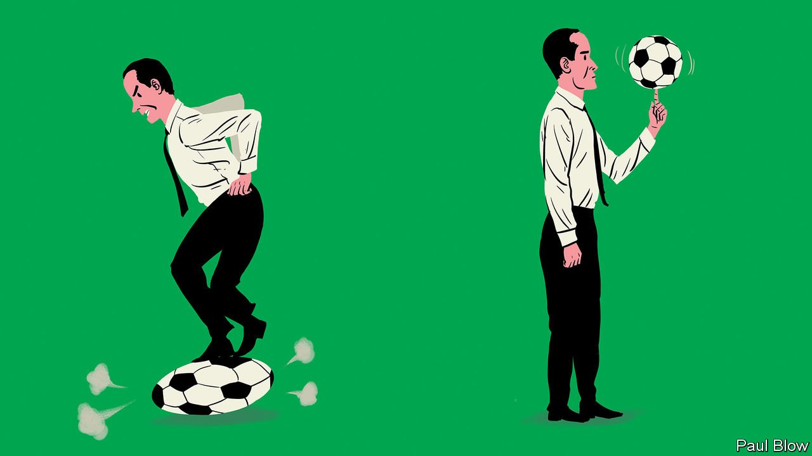

###### Bartleby

# The management lessons from football 

##### Roberto Mancini and Gareth Southgate embody contrasting styles of leadership 

 

> Jul 15th 2021 

SQUINT DURING the final of the European football championships and it was possible to imagine that two corporate executives were at work on the touchline. One was the sharply dressed Roberto Mancini, manager of Italy, who was often shown angrily gesticulating at his team. His rival Gareth Southgate, the England manager, was also dressed in a suit but had a much calmer demeanour, often pausing to consult his colleagues.

The two represent different styles of football management. Mr Mancini has a domineering approach, akin to that of Sir Alex Ferguson, the former manager of Manchester United, who was famous for getting so close to his players that a tirade became known as the “hairdryer treatment”. Mr Southgate is a more emollient and inclusive character. During the tournament he took the time to praise the efforts of some of the reserve members of the squad who never made it on to the pitch. Like many a modern executive, Mr Southgate was promoted from within, managing the England under-21 squad before becoming coach of the senior team. The result was that he had a strong and lasting connection with many of the players.


In corporate terms, one could see Mr Mancini as akin to Jack Welch, the legendarily hard-boiled former head of General Electric, or the hard-charging boss of a private-equity group. In contrast, the style of Mr Southgate resembles that of the new, socially conscious breed of corporate manager. He supported his players when they “took the knee” to protest against racism and wrote a letter to England fans, stating that it was the duty of players “to continue to interact with the public on matters such as equality, inclusivity and racial injustice, while using the power of their voices to help put debates on the table, raise awareness and educate”. It is easy to imagine those sentiments coming from the mouth of Paul Polman, who as boss of Unilever championed a sustainable business model for the consumer-goods giant. This does not mean that Mr Southgate lacks a ruthless streak. One of his first acts as manager was to drop Wayne Rooney, England’s ageing talisman, and he has suspended some of his stars for misbehaviour.

 makes it tempting to argue that this proves the greater virtues of a more aggressive style of management pursued by Mr Mancini. After all, the final represented the 34th consecutive game under his leadership in which Italy had avoided defeat. This was a complete turnaround after the squad failed to qualify for the 2018 World Cup under Mr Mancini’s predecessor. Italy started the tournament with a lower world ranking than England, which also enjoyed home advantage for the match.

But the final was exceptionally close. The teams were level after normal time and extra time; had one of England’s penalties hit the inside of the post instead of the outside, the outcome might have been different. Mr Southgate also deserves credit for getting England into a , having earlier guided them to a World Cup semi-final in 2018. Under his predecessor, the team was knocked out of the 2016 European championships by Iceland, a footballing minnow. In a time of polarisation, Mr Southgate is widely admired for his politeness and modesty.

And Mr Mancini’s aggressiveness has led to problems in the past. A year after guiding Manchester City to an English Premier League title in 2012, he was sacked over concerns about his habit of harshly criticising his players in public and being “aloof and icy” with backroom staff. One player texted a journalist “Can we put the champagne on ice yet?” on rumours of the manager’s departure. After leaving City, he had three unsuccessful stints in club management before taking the Italian job in 2018.

In the corporate world, the fashion has moved more towards the Southgate style of management. In football as in business, aggressive management can work for a while. But it only succeeds if it is accompanied by other qualities.

What unites Messrs Mancini and Southgate is their meticulous attention to detail. And any manager, in football or business, is only as good as the team at their disposal. If either Mr Mancini or Mr Southgate had been in charge of a team from a smaller nation with fewer resources, they would not have made it to the final. As Warren Buffett wisely remarked, “When a management with a reputation for brilliance tackles a business with a reputation for bad economics, it is the reputation of the business that remains intact.”

A version of this article was published online on July 14th 2021

