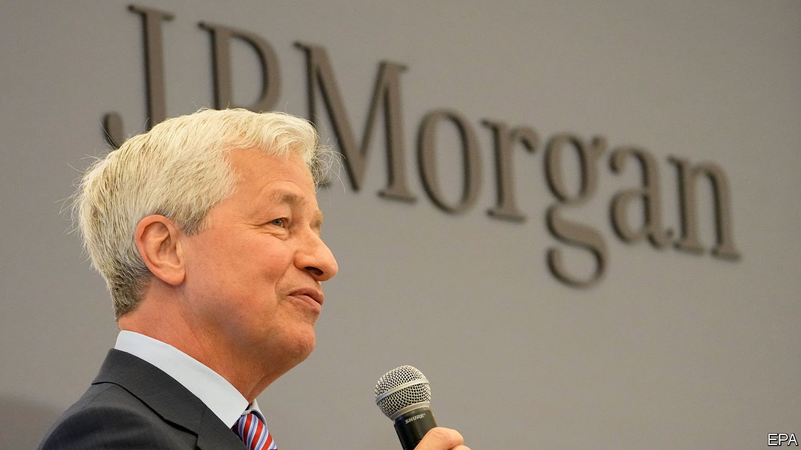

###### Fat and happy

# Banks on Wall Street report bumper second-quarter profits 

##### Bankers are confident the good times will last. Investors are less sure 

 

> Jul 15th 2021 

BANK BOSSES were full of good cheer as they reported their second-quarter earnings on July 13th and 14th. “The consumer...their house value is up, their stocks are up, their incomes are up, their savings are up...they’re raring to go,” said Jamie Dimon, the boss of JPMorgan Chase, when analysts asked about the risk that economic growth might slow in the coming months. David Solomon, the chief executive of Goldman Sachs, sounded upbeat when asked if an executive order from the White House seeking to increase competition among businesses might cool feverish dealmaking activity: “I’m encouraged by the fact that our backlog levels remain extremely high...A lot of that feels like it will be sustained.” Jane Fraser, the boss of Citigroup, expressed a similar sentiment, telling analysts “we have a fabulous pipeline.”

For an entire year now America’s banks have enjoyed a profits bonanza. Investment banks, which issue equity and debt for companies and make markets in stocks and bonds, have reaped bumper profits as trading activity has boomed. Retail banks took an early hit as they wrote down loan values for expected losses in early 2020. But they have since been able to gradually revise loan values back up, first as stimulus helped customers stay afloat and then as the economy began to reopen.


Banks’ earnings in the second quarter of this year fit the recent trend well. Total profits at five big firms—Bank of America, Citigroup, Goldman, JPMorgan and Wells Fargo—came to a meaty $39bn, five times their level in the second quarter of last year, and around 40% higher than average quarterly profits in 2018 and 2019 (see chart). JPMorgan released a handsome $3bn of loan-loss provisions as profits, and Bank of America added back $2.2bn. After a hectic first quarter, trading activity slowed at Citi, Goldman and JPMorgan. But frenetic dealmaking meant that investment-banking revenues grew robustly; fees at JPMorgan, for instance, rose by 25% on the year. (Morgan Stanley, another big bank, was due to report on July 15th after The Economist went to press.)

 


Early in the pandemic, bank bosses had downplayed their windfalls. Retail bankers emphasised the uncertainty around loan repayment. Most bosses were aware that any boon from bumper trading earnings was likely to be undone by loan losses as millions of workers were laid off. They also warned that their investment-banking revenues were certain to “normalise” soon, as unusually high trading, issuance and deal activity slowed down.

This quarter, however, bosses threw caution to the winds. The health of the American consumer is apparent in their credit-card habits, said Brian Moynihan, the boss of Bank of America. Repayments remain unusually high—customers are not accruing debt—even as they report mammoth growth in spending, up by 40% year-on-year and 22% on the first half of 2019. As for investment banking, Mr Solomon pointed to the pandemic-led acceleration in companies’ digital strategies as a potentially lasting driver of their lucrative mergers and acquisitions business.

Whether that rosy confidence is well-placed or not remains to be seen. High prices and supply bottlenecks could slow the economic recovery. Many banks said their own costs, especially wages, were creeping up. Several stimulus schemes, including generous unemployment benefits and moratoriums on evictions and foreclosures, are due to unwind in the second half of 2021; without them, Americans’ finances may start to look less solid.

Nor has the pandemic been all about tailwinds for banks’ profits. Lower interest rates, slashed to zero by the Federal Reserve to support the economy, are dragging down the income they make on interest. Bank of America’s net interest income, for example, fell from $10.8bn in the second quarter of 2020 to $10.2bn in the same period this year.

If moves in share prices are anything to go by, then investors are less bullish about banks’ futures than executives appear to be. Although profits at both JPMorgan and Goldman beat expectations, their share prices still closed nearly 2% lower on the day they reported results (they have since regained some of those losses). For the past year bankers have mostly been pleasantly surprised by the strength of their businesses. That may soon change. ■

A version of this article was published online on July 14th 2021

