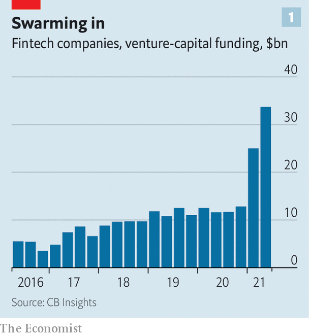
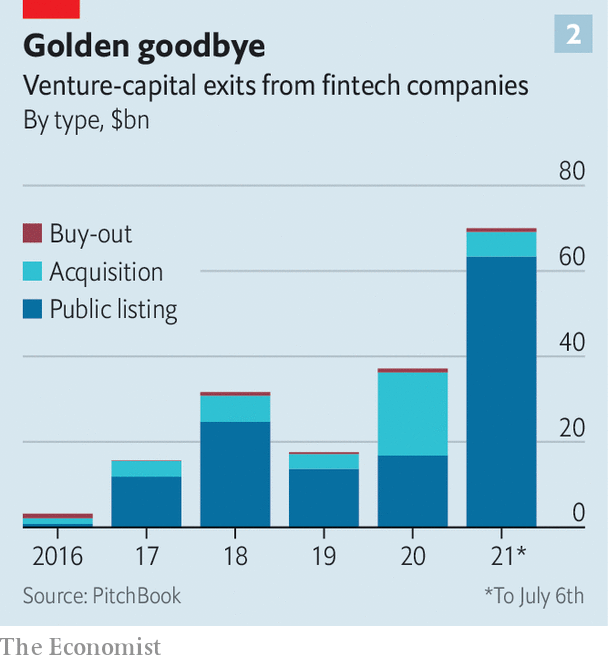

###### The funding frenzy

# Investment in fintech booms as upstarts go mainstream 

##### Firms’ expansion plans and investors’ search for returns bring a blizzard of deals and listings 

 

> Jul 15th 2021 

AN AIR OF hype habitually surrounds the founders of startups and their venture-capital backers: everyone is an evangelist for their latest project. But even allowing for that zeal, something astonishing is going on in fintech. Much more money is pouring into it than usual. In the second quarter of the year alone it attracted $34bn in venture-capital funding, a record, reckons CB Insights, a data provider (see chart 1). One in every five dollars invested by venture capital this year has gone into fintech.

Deals are also proceeding at a frenetic pace. PitchBook, another data provider, reckons that venture-capital firms have sold $70bn in stakes in fintech startups so far this year, nearly twice as much as in all of 2020, itself a bumper year (see chart 2). That included 32 listings. Fintechs took part in 372 mergers in the first quarter, including 21 of $1bn or more.


 


In the past few weeks alone Visa, a credit-card firm, has paid €1.8bn ($2.1bn) for Tink, a Swedish payments platform. JPMorgan Chase, America’s largest bank, has said it will buy OpenInvest, which provides sustainable-investment tools—its third fintech acquisition in six months. Upstarts, such as Raisin and Deposit Solutions, two German platforms that link banks with savers, are merging. Some are going public. On July 7th a listing in London valued Wise, a money-transfer firm, at nearly £9bn ($12.2bn). Recent or planned multi-billion initial public offerings (IPOs) include that of Marqeta (a debit-card firm), Robinhood (a no-fee broker) and SoFi (an online lender).

 


This blizzard of activity reflects demand from investors as they hunt for returns and as the digital surge in finance takes off. But it also reveals something more profound. Once the insurgents of finance, fintech firms are becoming part of the establishment.

The current investment boom has several novel features beyond its scale. For a start, it is increasingly focused on the biggest firms, says Xavier Bindel of JPMorgan. Smaller me-toos and startups with business models that have struggled during the pandemic are no longer in favour. The first quarter of 2021 saw the most funding rounds ever for private fintech startups valued above $100m; the median round raised $10m, a quarter more than in the same period last year.

The location of activity has changed, too. Five years ago the fintech story centred on America and China. Today, Europe is catching up. A funding round in June valued Klarna, a Swedish “buy now, pay later” startup, at $46bn, making it the second-most-valuable private fintech firm in the West. Only July 15th Revolut, a London-based neobank, said it had raised $800m, valuing it at $33bn. Firms in Latin America and Asia, and led by Stanford-educated or Silicon-Valley-trained founders in particular, have become magnets for investors. Nubank, Brazil’s biggest digital-only bank, for instance, is worth $30bn.

The craze also extends beyond payments. A surge in savings in rich countries in the past year has boosted “wealth-tech” startups, such as online brokers and investment advisers. Insurance-tech firms received $1.8bn through 82 deals globally in the first quarter of this year. Lending has proved trickier to disrupt—perhaps owing to regulators’ firmer grip on this area of finance—except when it crosses over into payments, as illustrated by the rise of Klarna and its rivals.

This broadening out points to one explanation for the explosion in funding: the huge growth in the market for fintech offerings during the pandemic. Consumers and companies adjusted with rapidity and ease to the closure of bank branches and shops and the resulting digitisation of commerce and finance. Many of their new habits are likely to stick.

Factors specific to fintech are also behind the big bang. Most of today’s fintech stars are not overnight successes, but were set up in the early 2010s. Since then their user numbers have swollen to the many millions and they are approaching profitability. They have become big enough to appear on the radar screens of late-stage venture-capital and private-equity firms, such as America-based TCV (which has backed Trade Republic, a German variant of Robinhood), Japan’s SoftBank (a recent investor in Klarna) and Sweden’s EQT (which backed Mollie, a Dutch payments firm, last month).

Moreover, some institutional investors—such as asset managers (BlackRock), sovereign-wealth funds (Singapore’s GIC) and pension funds (Canada’s Pension Plan Investment Board)—have made a lot of money by snapping up shares in big tech firms in recent years. These are now trying to gain an edge by investing in promising startups before they go public.

The huge cheques from these investors come just as fintech firms are hoping to write the next chapter. Most startups were created to “unbundle” finance: to carve out niches where they could offer a better service than the banks. Now, however, most successful firms are rebundling, adding new products in a bid to become platforms. Acquisitions provide a handy shortcut; their high valuations mean the big firms can often snap up smaller ones on the cheap by swapping equity.

Stripe, the most valuable private fintech firm in the West, is a good example of the sector’s coming of age. It was set up a decade ago to help firms accept payments online. Now worth $95bn, it also offers services ranging from tax compliance to fraud prevention. That breadth was partly achieved through acquisitions; since October it has bought three other firms.

A similar logic animates credit-card giants, which are trying to hedge against innovations in online payments; and the banks, which see fintech as a way to plug gaps in their digital offerings, cut costs, and diversify away from lending. Goldman Sachs and JPMorgan are bringing lots of smaller acquisitions under the umbrella of new, versatile consumer apps. As a consequence, the distinction between fintech and traditional banking could eventually blur, predicts Nik Milanovic of Google Pay, the tech firm’s payments arm.

Swipe right

All this splurging and merging also carries risks. One is that the hefty prices paid for fintechs prove unjustified. Visa is buying Tink at a price that is 60 times the startup’s annual revenue; Wise is valued at around 20 times its revenues and 285 times its profits. Banks in particular may find out about promising fintech firms only once they are too expensive.

Another risk is that competition and innovation are stifled. Founders of startups that have been acquired often leave at the end of their “vesting” period—the minimum amount of time they must stick around before they can sell their shares, usually one to three years. The culture that allowed a firm to thrive could then wither. Fintechs bought by banks in particular could struggle: after a deal, cultures can clash; customers often leave. Most neobanks acquired by old ones, such as Simple (bought by BBVA, a Spanish bank), have been either shut down or sold.

Nevertheless, one thing seems clear. Fintechs are inexorably gaining critical mass: their value has risen to $1.1trn, equivalent to 10% of the value of the global banking and payments industry, and up from 4% in 2018. Prices may be stretched today and some firms may flop, but in the long run it seems likely that this share will only rise further. ■

A version of this article was published online on July 12th 2021

