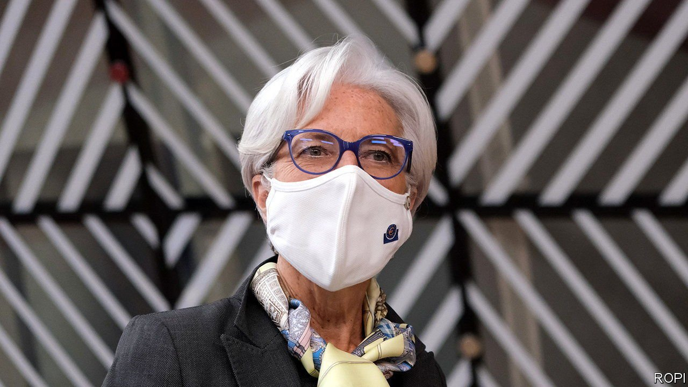
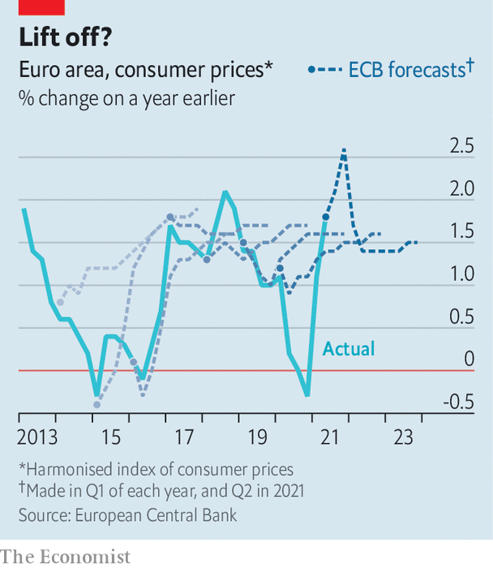

###### Promises, promises

# What does the ECB’s new target mean in practice? 

##### The bank will now aim for inflation of 2%, rather than “close to, but below, 2%.” 

 

> Jul 17th 2021 

FOR MOST of its 23 years of life the European Central Bank (ECB) had the fuzzy inflation target of “below, but close to, 2%”. No one knew what precisely that meant, but the consensus among economists was that the bank was aiming for inflation in the region of 1.7-1.9%. In any case stubbornly low inflation rendered the question almost academic. Average annual inflation in the euro area since 2013 has been just 0.9% compared with 1.9% in America, even though interest rates are below zero and the ECB has hoovered up government and corporate bonds for years in an attempt to gin up the economy.

The bank’s struggle to attain its target has prompted some soul-searching. Last year Christine Lagarde, its president, launched a review of its strategy, which held “listening” events and pored over academic papers. Its conclusions were announced on July 8th. The bank plans eventually to incorporate the impact of climate change in its models and, potentially, to reflect climate considerations in its asset purchases. It also intends to pay attention to the cost of owning a house when it studies inflation (in contrast to practice in other rich countries, this is not included in the euro area’s measure of consumer prices). And it unveiled a new symmetric inflation target, of 2%.


The greater clarity around the target is welcome, and might ward off concerns that the ECB will raise interest rates before an economic recovery takes firm hold, as it did in 2008 and 2011. Ms Lagarde noted on July 8th that the change won unanimous support from the bank’s 25-strong governing council. But working out what it means for the ECB’s monetary policy may prove more contentious.

 


For a start, the strategy seems to mean different things to different ratesetters. Jens Weidmann, the hawkish head of the Bundesbank and a member of the ECB’s governing council, took pains to point out that although inflation might deviate from the target temporarily, the ECB would not aim to exceed it. That is in contrast to America’s Federal Reserve, which also recently revised its target. It plans to aim for inflation of 2% on average, tolerating a period of overshooting in order to make up for past shortfalls. But Olli Rehn, the doveish governor of Finland’s central bank, said on July 9th that he expected the ECB’s response to a shock to be quite similar to that of the Fed.

The different views might explain why, although Ms Lagarde promised that the bank’s next monetary-policy meeting on July 22nd would clarify what the new target means for policy, few analysts are expecting big changes. (The ECB is currently buying €80bn, or $95bn, in government and corporate bonds a month.) Economists at Barclays, a bank, reckon that the review should have no effect on the near-term path for monetary policy, and that the ECB would continue to support the euro area by buying bonds. Analysts at Morgan Stanley, another bank, predict that the ECB might bring forward an announcement to phase out its pandemic-related asset-purchase scheme, but beef up an older purchase programme instead.

Without big changes, it is hard to see how the ECB can do a better job of hitting its target. In June a range of economic forecasters, including those at the central bank, projected inflation to be in the region of 1.4-1.5% in 2023. If it is to successfully convince investors and households that it means business, then the bank will have to explain why, when it does not expect even to meet its old target, it should suddenly be able to hit its new one. ■

