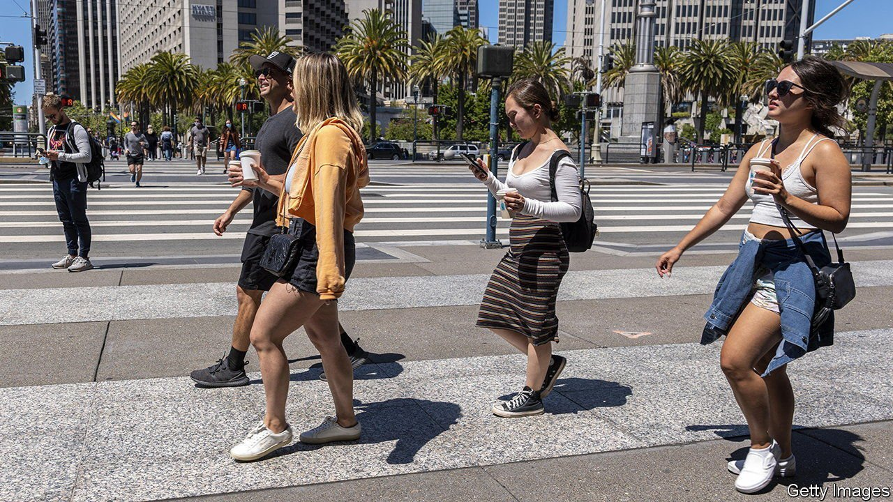

###### Every little helps

# What the IMF’s plan to disburse $650bn in special drawing rights means for poor countries 

##### Its generosity depends on what rich countries do with their allocations 

 

> Jul 17th 2021 

THE IMF has not exactly stood on the sidelines during the covid-19 pandemic. Since the onset of the crisis, it has extended loans worth about $130bn to 85 countries and provided debt-service relief to some poor economies. Yet given the severity of the pandemic and the IMF’s ample balance-sheet—its lending capacity was boosted to a cool $1trn after the global financial crisis—you might have expected more. On July 8th the fund took what looks like a big step in the right direction, by deciding to create $650bn in new foreign-exchange reserves. How generous is it really?

The plan does not involve direct lending to countries, nor draw on the IMF’s balance-sheet. It instead entails the creation and allocation of “special drawing rights” (SDRs), a quasi-currency created in the 1960s in an effort to boost the supply of high-quality reserve assets such as dollars and gold. SDRs are valued against a basket of several major currencies and can be swapped for those currencies if the need arises. There are no conditions attached to the use of such funds, and the associated interest rate is minimal. Governments pay 0.05% on the SDRs they use, with no deadline by which the funds must be repaid.


Such allocations are a familiar crisis-fighting tool; in 2009 the IMF agreed on a distribution of $250bn. An allocation during the pandemic might have come sooner were it not for early opposition from America, which wields sufficient voting power to block such measures. President Joe Biden’s administration, however, now backs an allocation. (The $650bn, conveniently, is just shy of the amount that requires approval from America’s fractious legislature.) The fund’s board of governors will vote on the disbursement on August 2nd. If, as expected, it is approved, the SDRs will be doled out later that month.

Whether countries draw on it or not, the extra reserve cushion should lift market confidence and reduce the risk that a draining away of foreign exchange leads to balance-of-payments crises. (The fund estimates that over the next five years, the global economy is likely to face a shortage of reserve assets of $1.1trn-1.9trn.) Additional reserves may come in especially handy if a rip-roaring economic recovery leads to higher interest rates in America. That could precipitate an outflow of money and weaken currencies across poor countries, leading to straitened financial circumstances and higher import prices. The new allocation will give governments more room to use their hard-currency reserves to import food or vaccines.

Yet the huge headline figure sounds more generous than it really is. The new SDRs will be distributed broadly in proportion to the funding countries provide to the IMF—meaning that the rich world will receive more than half the allotment. Low-income countries will receive a mere 3.2% of the total, equivalent to $21bn, or roughly 4% of their combined output before the pandemic. That does not seem enough, considering that these places face new variants without ample vaccines and cannot borrow as easily as richer ones.

In order to redress the imbalance between allocation and need, rich countries with little use for more reserves are working out ways to donate some of their new SDRs. Contributions of about $15bn in existing SDR holdings have already helped expand an IMF facility offering no-interest loans to poor countries over the past year. A larger facility, funded by SDR donations of as much as $100bn, may be announced in August. This is intended to boost poor countries’ health systems, support economic recovery and help them prepare for climate change.

The financial contortions behind SDRs invite criticism. Republicans in America’s Congress, for instance, fret that the allocation offers little help to poor nations while giving a windfall to rivals like China and Russia. In fact such places are unlikely to make much use of their SDRs. More targeted aid would probably face political hurdles of its own. A roundabout, opaque means of support may not be ideal; but it is probably the best the fund can do. ■

