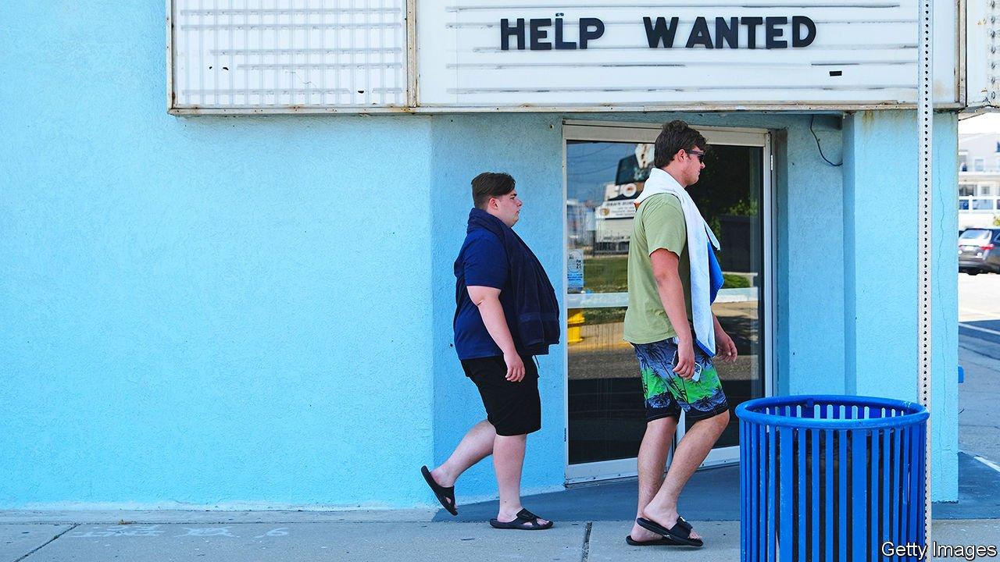
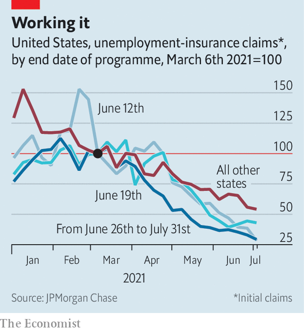

###### Make it pay

# Will cutting unemployment benefits in America ease labour shortages? 

##### The evidence so far is muddy, and points to at most a small effect 

 

> Jul 17th 2021 

AS AMERICA REOPENS for business, labour shortages continue to worsen. Firms are advertising over 9m vacancies, the highest on record. Bosses complain they are unable to find people to serve drinks, staff tills or drive trucks. So in an attempt to eliminate the shortages, half of states are ending a $300 weekly top-up to unemployment insurance (UI), in place since January, as well as other pandemic-related UI programmes. Is this change having the desired effect?

It depends whom you ask. On June 27th the Wall Street Journal ran an article on Missouri, a state that abolished the supplement on June 12th, claiming that people were flying off the unemployment rolls. The very same day the New York Times ran an article also on Missouri, which drew almost exactly the opposite conclusion. The reality is somewhere in between these polarised extremes. Making benefits less generous may help America’s jobs market a little—but other factors do more to explain labour shortages.


Removing the $300 weekly top-up certainly makes living off welfare less comfortable. At that level 40% of people are earning more than they were in their previous jobs. It is hard to say right now, however, whether imposing tougher conditions translates into more vigorous job searches. The first four states to abolish the supplement did so too late for the effect, if any, to show up in the latest jobs report, released on July 2nd. In the meantime economists must use high-frequency data, such as online job postings and weekly figures on claims for UI, which are less reliable.

 


These suggest that a stingier UI makes a difference. Both analysts at Morgan Stanley, a bank, and economists at the St Louis Federal Reserve find that continuous claims for UI have fallen the most in “early-ending” states. Other research finds similar trends in new claims for UI. But there is enough going on to muddy the picture: Daniel Zhao of Glassdoor, a job-search website, adds a note of caution, pointing out that new claims were already dropping faster in reforming states.

It will not be until the August jobs report, released in September, that wonks will have a better idea of what is really going on at the state level. It seems likely, though, that overall employment in America will by then be somewhat higher than it would have been without the cut to UI. A survey from Indeed, a job-search website, suggests that a tenth of unemployed people “not urgently” looking for work feel this way because of UI payments.

What is clear, however, is that there are other important reasons why so many workers seem job-shy. Across America the growth in the number of vacancies continued to rise in June and early July, according to Indeed. That suggests that workers are unlikely to be battering down the door to get an interview just because their benefit top-ups have ended.

People’s care responsibilities are one big impediment to returning to work (in-person schooling is only set to resume in the autumn). A pile of “excess” household savings accumulated during the pandemic, amounting to more than $2trn in total, has made it easier for many Americans to withstand a spell of unemployment, say until they find the perfect job. Others are depending on the salary of a spouse or partner. Moreover, fear of catching covid-19 is still apparently holding many people back. Who would choose to be a chef, when research suggests that practically no other occupation poses a higher risk of dying from covid-19? Until that threat abates, expect labour shortages to continue. ■

