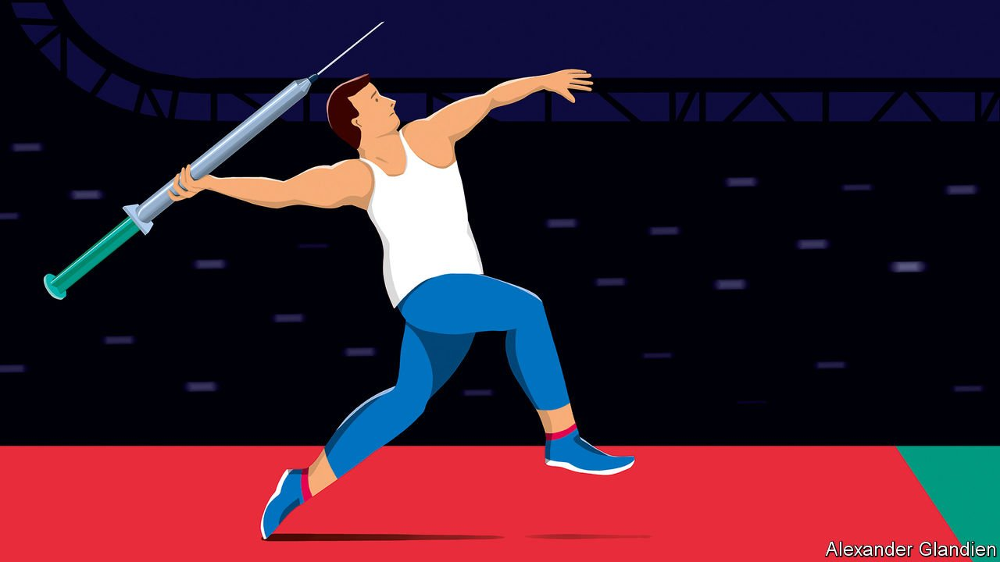
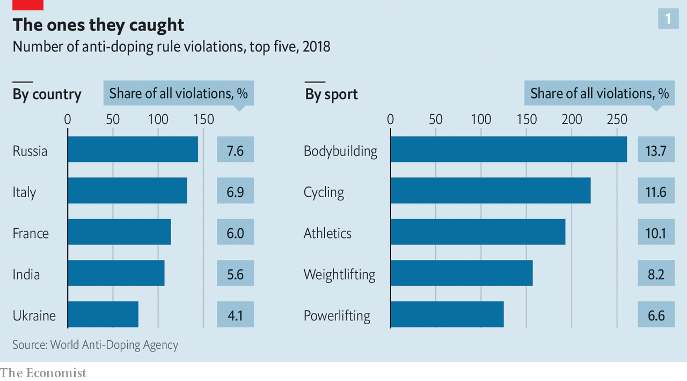
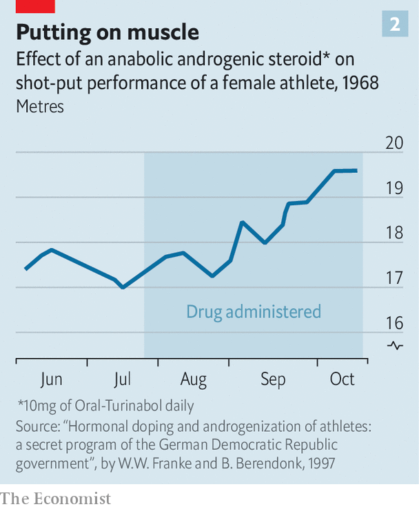
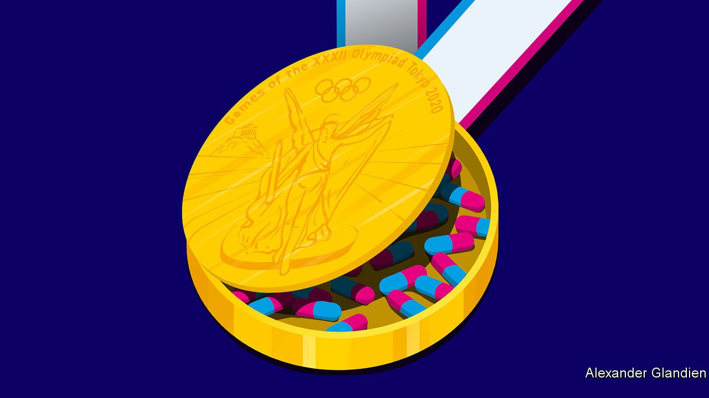

###### Sport and drugs

# Sport is still rife with doping 

##### Between 10% and 40% of athletes in Tokyo might be cheating 

 

> Jul 14th 2021 

AS OLYMPICS GO, the 2020 games, scheduled to start in Tokyo on July 23rd, are shaping up to be among the strangest in the competition’s history. Because of covid-19, even their name is out of date, for they are taking place a year late. And contagion-prevention means most stadiums will be empty of spectators, so events will take place in funereal silence.

The 2020 games will be unusual in another way, too. They will be the first summer games since 1984’s—which were boycotted by the Soviet Union—at which Russia will not be present, at least officially. Though some of its athletes will participate as individuals, under the flag of the Russian Olympic Committee, the national team has been banned in the aftermath of one of the biggest doping scandals in the history of sport. Between 2011 and 2015, and possibly for longer, Russia systematically doped hundreds of athletes. It roped in its spy agencies to subvert the anti-doping tests overseen by the World Anti-Doping Agency (WADA), then fabricated data as part of an attempt to get back into the authorities’ good books. A controversial court ruling last year reduced Russia’s initial four-year ban to two, which will expire in 2022.


Stung by a scandal that took place under their noses, officials insist this year’s games will be the best-policed ever. The International Olympic Committee says testing in the run-up to them will be the most extensive yet conducted. Sebastian Coe, president of Word Athletics, the international governing body of athletes, has warned that it will be harder than ever to get away with doping.

“Harder than ever” is, however, a long way from “impossible”. Though new technology and increasingly strict rules have indeed made doping trickier than in the past, thousands of the 11,000-odd athletes at the Tokyo games could nonetheless be cheating. Steroids, erythropoietin (EPO) and newer, less familiar performance-enhancing drugs (PEDs) will have bulked their muscles, enriched their blood and allowed them to train harder than unenhanced humans would find possible. New drugs, clever tactics and institutional indifference or corruption could meanwhile help them outwit testers.

Covid-19 may have made things worse, says Ross Tucker, a South African sports scientist. Since the effects of PEDs last much longer than the drugs stay in an athlete’s body, elite competitors are subject to testing even when they are not competing. But travel bans and lockdowns have disrupted that system. Between covid-19, the fallout from Russia and a steady drip of other doping cases, every performance in Tokyo—even those by clean athletes—will take place under a faint but ineradicable cloud of suspicion. As Kyle Chalmers, an Australian swimmer who won the 100 metres freestyle at the 2016 summer Olympics in Brazil, put it last year, “I can probably not trust half the guys I’m competing against.”

Breakfast of champions

No one knows how many athletes still dope. But a glance at the headlines suggests it is far from rare. In 2019 Nike, a sportswear company, closed down its much-publicised Oregon Project, a training camp for elite runners, after Alberto Salazar, the head coach there, was given a four-year ban for doping. (Mr Salazar is appealing.) Kenya is famous for the dominance of its middle- and long-distance runners. These days that reputation is looking tarnished. The Athletics Integrity Unit, which polices anti-doping in athletics, lists 68 Kenyan runners currently banned from competing, including Wilson Kipsang, a former Olympic medallist and world-record holder. Several other Olympic champions will miss the Tokyo games for drugs violations, including Sun Yang, a Chinese swimmer, and Brianna Rollins-McNeal, an American hurdler. Nor is it just athletes who are punished. In March Richard Freeman, a former doctor to Britain’s all-conquering 2012 Olympic cycling team, was struck off by regulators for obtaining steroids in 2011 (Dr Freeman is appealing).

 


When it comes to hard numbers, official statistics provide a lower bound to what is happening. In 2018, the most recent year for which there are data, 0.6% of the 263,519 blood and urine samples analysed by WADA-affiliated laboratories led to sanctions. Doping was more common in some sports—and some countries—than others (see chart 1). But WADA’s numbers reflect only those who get caught. David Howman, once WADA’s chief operating officer, says he thinks the real figure in elite sports might be more than one in ten—which would imply that over 90% of dopers were getting away with it. By and large, he says, only the “dopey dopers” get caught.

Other estimates suggest even higher numbers. A paper published in 2011 examined the prevalence of “blood doping”, a catch-all term for ways to increase the capacity of blood to ferry oxygen to muscles. The researchers analysed samples from more than 2,700 athletes and concluded that 14% were probably guilty (though the tests fell short of explicit proof). That average concealed wide variations. Some countries had prevalence rates as high as 48%, though the researchers diplomatically refused to name the alleged offenders.

Another study, published in 2018, simply asked more than 2,000 athletes whether they were doping. The data were collected in 2011 at two big competitions—the World Championships in Athletics and the Pan-Arab Games. To encourage honest responses, the researchers used what is called the randomised-response technique. This guarantees individual answers will remain anonymous and untraceable. They concluded that 43.6% of the athletes surveyed had doped in the past year. Translated to Tokyo, that would imply around 4,800 drug-boosted competitors—roughly in line with Mr Chalmers’ fears.

But all these estimates are just that: estimates. “My gut feeling, from having worked with many Olympic-level athletes, is that the randomised-response numbers are too high,” says Yorck Olaf Schumacher, who helped develop the Athlete Biological Passport (ABP), a widely used anti-doping test that tracks blood readings, looking for suspicious changes. Some athletes may not have understood the question properly, he says, or may have confused legitimate dietary supplements with doping.

Athletes dope because drugs offer big advantages—potentially so big that un-doped rivals have no hope of matching them. WADA, the rules of which bind many sports, maintains a list of hundreds of banned substances. They range from obscure chemicals with names like IGF-1 LR3 and AOD-9604 to insulin (to boost muscle size), amphetamines (for their stimulating effects) and even diuretics (used to mask the presence of other drugs). The clandestine nature of doping means that, for most drugs, there is little hard evidence for their effect on performance. Athletes are forced to rely instead on locker-room rumours and “street knowledge”, says Chris Cooper, a sports scientist at the University of Essex, much of which will probably be exaggerated. But for some of the best-known drugs, science—and history—can give a sense of the advantages on offer.

Better gaming through chemistry

The best-known PEDs are anabolic androgenic steroids (AAS), which are close chemical cousins of testosterone, the chief male sex hormone. Athletes take them to increase the size and strength of their muscles, and for their purported ability to enhance recovery after exercise, which allows people to train harder than would otherwise be possible. Though ethical issues make studies tricky to do, steroids’ strength-enhancing effects have been confirmed by several research projects.

 


The most thorough trials on their effects on sport were conducted in East Germany, which ran a state-sponsored doping programme that began in the 1960s. After the fall of the Berlin Wall, data collected by this project became available to independent scientists, and were written up in 1997 in a paper published in Clinical Chemistry. One early test subject, a female shot-putter known only as “1/68”, improved her best performance from 18 metres to almost 20 metres—close to the world record at the time—within 11 weeks of beginning a cycle of Turinabol, a synthetic AAS developed in 1961 (see chart 2). AAS proved particularly potent in women, presumably because they start with lower levels of testosterone than men and therefore have more scope for enhancement. A report delivered in 1977 to the Stasi, East Germany’s secret police, reported improvements in female athletes’ performances of up to five metres in the shot put, 20 metres in the discus, five seconds in the 400-metre sprint and ten seconds in the 1,500 metres.

After anabolic steroids, the best-known doping drug is probably EPO, a natural substance which stimulates production of red blood cells. An artificial version was developed in the late 1980s to treat anaemia. It (and its chemical cousins) quickly became rampant in endurance sports such as running and cycling. Red blood cells transport oxygen around the body, and the supply of oxygen to an athlete's muscles is an important limiting factor in endurance exercise. So boosting red-blood-cell counts can allow superhuman efforts.

Like steroids, EPO’s effects can be striking. Studies on it are less comprehensive, but one (albeit not conducted on elite athletes) suggested improvements in maximum rate of oxygen consumption of 12%, and a 54% increase in the time it took participants to be exhausted by hard exercise. Dr Schumacher reckons improvements of the performances of top-flight athletes on a bike or a running track are more likely to be in the single digits. But if that sounds modest, it should not. A 5% improvement would be enough to knock more than six minutes off a top marathon-runner’s time.

History offers another lens. The “heroic age” of doping, when testing was poor and abuse often blatant, lasted from the 1970s to the early 2000s. Sprinters competed with eyes yellowed from steroid abuse. Female athletes sported strikingly masculine physiques. Cyclists made seemingly rocket-assisted climbs up steep Alpine passes. Sport is littered with “fossil” records from that era. Of 16 pertinent women’s track-and-field events, for example, the world records in eight have stood since the 1980s.

 


Eye-popping performance alone does not prove records were set by doped athletes. But it does cast doubt. Florence Griffith Joyner’s 100-metre-sprint time of 10.49 seconds was set in 1988. In three decades no other woman has matched it—leading some observers to think it may have been helped by steroids. The current fastest woman in the world, Shelly-Ann Fraser-Pryce, from Jamaica, has managed just 10.63 seconds—and that with assistance from special, high-tech shoes.

A list of the ten fastest climbs up Alpe d’Huez, a mountain often part of the Tour de France (see chart 3), includes only one rider, Miguel Indurain, who has had a clean career. The others have all, at some stage, been convicted of, or admitted to, doping.

The hundred-metre arms race

Better technology and stricter rules have made egregious doping harder. In Tokyo, samples will be analysed by sophisticated chromatography to look for drugs or their metabolites. Biological passports will be scrutinised for indirect evidence of blood doping, which may reveal itself as suspicious changes in any of a dozen variables, including levels of haemoglobin (the oxygen-carrying molecule that gives blood its red colour), red-blood-cell count, and the proportion of those cells which are immature. Outside competitions, “whereabouts” rules mean elite athletes must keep anti-doping authorities apprised of their movements, to permit unannounced tests.

But record performances are not necessary for victory. Simply being better than your opponents on the day is enough. For that reason, subtler chemical assistance is still worth pursuing. One option is to experiment with new drugs. Sometimes, these are created deliberately to dodge the tests. In 2003 a syringe was posted anonymously to American anti-doping officials. It contained a new AAS nicknamed “The Clear”, for which no test existed. This had been developed by a chemist called Patrick Arnold and supplied to athletes including Marion Jones, an American sprinter with a string of Olympic medals to her name, who admitted using it.

Most new drugs, though, are created by the pharmaceutical industry. Selective androgen receptor modulators (SARMs) are experimental drugs intended to provide similar benefits to AAS, but with fewer side-effects. Researchers hope they will help treat muscle-wasting diseases. But SARMs have attracted sporting interest too. Oliver Catlin runs the Banned Substances Control Group, an American firm which tests sports supplements for forbidden drugs. He points out that although more than a dozen SARMs are in development, tests exist for only a few of them, and only at the most advanced laboratories.

The pipeline of new drugs is unlikely to run dry, says Dr Cooper, for the human body contains hundreds of processes and chemical targets that might be tweaked to boost sporting performance. There is often more than one biochemical way to achieve the desired effect. Rather than beefing up an athlete’s muscles, another new class of drugs, myostatin inhibitors, slow the routine breakdown of muscle tissue, offering an alternative way of increasing strength. Cyclists, meanwhile, are rumoured to have been experimenting with a drug called AICAR, hoping it will help them lose weight while holding on to muscle mass. As with EPO, says Dr Tucker, the idea is to improve the all-important power-to-weight ratio—but by tinkering with the “weight” side of the equation instead of the “power” side.

Those who prefer to stick with the old favourites can simply try using less. “Micro-dosing”—taking regular small doses instead of occasional big ones—ensures a drug will clear the body faster, making an athlete less likely to fail a test. New ways of administering old drugs help too. In a book published last year Grigory Rodchenkov, a chemist who ran the laboratory in Moscow that was at the centre of the Russian doping scandal, recounts how he developed “Duchess”, a whisky-based cocktail that included the steroids trenbolone, oxyandrolone and methenolone. The idea was that absorption directly through the tissues of the mouth would produce fewer telltale metabolites than injections or pills, and thus cut the risk of detection.

Lower-tech strategies can work, too. One is to get a therapeutic use exemption (TUE)—a doctor’s note saying you need a drug for medical reasons. WADA insists that TUEs are granted only after rigorous checks. A paper from 2020 found no evidence that athletes with TUEs were more likely to win than others. But doubts persist. In 2018 Britain’s Parliament accused Team Sky, a cycling team, of using TUEs to help supply PEDs to riders. (They deny it.)

 


Living at high altitude is popular, since lower oxygen levels there boost red-blood-cell counts in a natural way—which, in contradistinction to chemical means, is permitted. It also makes it harder to interpret ABP results, leaving room for chemical enhancement as well. Remote places, moreover, are harder for out-of-competition testers to reach.

Another option is to get advanced warning of out-of-competition testing from corrupt or sympathetic officials. Asbel Kiprop is a Kenyan runner banned in 2019 for failing an EPO test. He told the AIU he had often been warned of supposedly unannounced tests. Tip-offs give athletes time to dilute their blood, or to wait for micro-dosed drugs to clear their bodies. If all else fails, they can simply hide in a cupboard when the testers come knocking. If elite athletes go AWOL too often, they can be sanctioned. But as a fail-safe, it can be a useful tactic. “The principle”, says Dr Tucker, “is never take a test you won't pass.”

Team America: world police

WADA's task, meanwhile, is made harder by the fact that, unlike dopers, it must operate in the open, leaving its methods vulnerable to attack. One way to interpret official limits for some substances, says an observer, is as a sanctioned value up to which athletes can push. Natural variation between people means the allowable limits for some substances must be reasonably generous, leaving room for athletes to boost them artificially.

Such variations, says Dr Tucker, are one reason why the ABP, which tracks changes in an athlete’s physiology over time, is difficult to apply to steroid doping. Natural levels of steroid hormones vary widely between people. Even within an individual they can fluctuate sharply, depending on stress, sleep deprivation and the like. And because a doping ban can be fatal to an athlete’s career, anti-dopers must err on the side of caution. WADA’s processes are tuned to minimise the number of false positives, in which innocent athletes are wrongly accused. That means they will generate plenty of false negatives, in which the guilty are incorrectly cleared.

Money and national pride complicate things further. Though WADA oversees the anti-doping system for many sports, it relies on national authorities to do most of the legwork. “Many countries have really improved their approach to anti-doping over the past few years,” says Dr Catlin. “But not everyone has the resources to do that.” In 2013 Renee Anne Shirley, a former boss of the Jamaica Anti-Doping Commission, said a lack of resources meant her organisation had conducted only a single out-of-competition test in the months before the 2012 London Olympics, at which Jamaican athletes won a dozen medals. WADA itself is not exactly flush with cash. Its budget for 2021 is $40m—less than some individual athletes earn in a year.

Lack of will is also a problem. Sport brings national glory, which can make questioning success risky. After her admission, Ms Shirley was branded a “traitor”. State-sponsored doping programmes in East Germany, China and Russia were all aimed at winning political prestige. Sport brings in a great deal of cash, too. WARC, an advertising firm, reckons the worldwide sports-sponsorship market was worth $48bn in 2020. All that money makes it possible to buy off officials. Last year Lamine Diack, Lord Coe’s predecessor as the head of World Athletics (then known as the International Association of Athletics Federations) was given a four-year prison sentence for taking bribes to hush up positive doping tests, as were five other officials. (Mr Diack is appealing.)

Ultimately, countries and companies pay both for top-level sport and for the anti-doping system which polices it. This means that, even when they are not actively working to subvert the system, as Russia or Mr Diack did, they do not always have strong incentives to ask hard questions. Mr Salazar had been a divisive figure in athletics long before Nike eventually closed the Oregon Project. WADA itself gets half of its money from governments and half from sporting bodies, raising questions about how truly independent it can ever be.

That is a view shared by America’s government. Fed up with what it sees as a limp response to the Russian scandal, in December it passed a law known as the Rodchenkov Act. This tries to assert American criminal jurisdiction over any sports event involving American athletes or companies, anywhere in the world. It gives American prosecutors the ability to impose ten-year prison sentences and $1m fines on those found to have aided doping (though it does not apply to individual athletes).

Travis Tygart, head of the United States Anti-Doping Agency, described the Rodchenkov Act as a “game-changer”. That is hard to argue with. It will drive a coach and horses through existing arrangements. WADA worries the act’s extraterritorial ambitions mean two sets of rules could apply to doping cases, and that confusion and resistance from other countries might “shatter” the international anti-doping system. (It also notes, pointedly, that the act’s penalties do not apply to parochial American sports such as baseball, which have had their own share of doping scandals.) The Tokyo games are one of the first big international competitions to be held with the act in force. Lord Coe may or may not be right to say, in the wake of the Russian scandal, that getting away with doping will be harder than ever. But the fight against it has rarely been so bad-tempered.■

