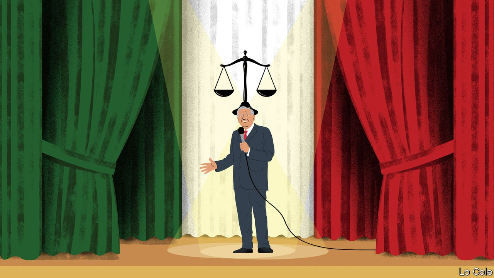

###### Bello

# Mexico’s president sets up a show trial of his predecessors 

##### On August 1st Mexicans will vote in a national referendum over whether to put five ex-presidents on trial 

 

> Jul 15th 2021 

IT IS A question that might have been devised by Cantinflas, a comic actor who turned the Mexican taste for circumlocution into an absurdist art form. “Are you in agreement or not that appropriate actions in accordance with the constitutional and legal framework be carried out in order to undertake actions of clarification of political decisions taken in the past by political actors, aimed at guaranteeing justice and the rights of the possible victims?” This is what President Andrés Manuel López Obrador wants Mexicans to decide in a national referendum on August 1st. Decoded, what it means is, should he be authorised to orchestrate a kind of unofficial show trial of his five most recent predecessors and their subordinates?

Mr López Obrador (or AMLO, for short), has always insisted that he became president in order to draw a line under 30 years of what he calls “neoliberal”, corrupt government. He holds those five presidents responsible, variously, for corruption, the concentration of wealth, electoral fraud and a failed drug war that begot yet more violence. Shortly after his landslide victory in 2018 he began to talk about holding a referendum over whether to put the ex-presidents on trial.


To resort to a popular vote to decide whether or not to prosecute someone is a travesty of the rule of law. The Supreme Court, whose president boasts of an “affectionate” relationship with AMLO, narrowly ruled that the referendum was constitutional but softened the question to its current convoluted form. What makes the exercise even more surreal is that the president says he won’t vote, because he is not “vengeful” and doesn’t want to dwell on the past. If “the people” decide otherwise, however, he will act on their wishes.

This referendum serves several of the president’s purposes. He is fond of consultative votes. They support his claim to take more notice of the people than his predecessors did. He has used them to provide backing for decisions he wanted to take anyway, such as the cancellation of a half-built new airport in Mexico City.

This one will have binding force if 40% of the electorate take part and a majority votes in favour. If that happens, some think the government will set up a kind of truth commission into the recent past. But turnout may fall short. The opposition is boycotting the vote. The independent electoral authority, which complains that the government is starving it of funds, says it will install only a third of the number of polling stations it used in a mid-term election last month.

The vote also confirms that, in fighting corruption, AMLO prefers theatre, which he can direct, over substance. Mexicans are fed up with graft; the government of Enrique Peña Nieto of 2012-18 was notoriously corrupt. AMLO made ending corruption a central plank of his campaign. Nevertheless, “corruption in Mexico is in robust good health,” says María Amparo Casar of Mexicans Against Corruption and Impunity (MCCI), a watchdog. “There is talk against corruption but there is no anti-corruption policy.”

Rather, there has been regression. Although public contracts are supposed to be tendered, as Mr López Obrador promised to do, his government has awarded them by fiat in 81% of cases, more than the 79% under Mr Peña Nieto, according to Ms Casar. The office of the special prosecutor for corruption cases has had its funding and staffing cut. The fight against corruption has become a political tool. Last year Spain extradited Emilio Lozoya, a former head of Pemex, the state oil company, who is wanted for taking bribes from Odebrecht, a Brazilian construction firm. He has not been jailed and has become a protected witness, incriminating enemies of the government. AMLO hounds anti-corruption campaigners: he has criticised MCCI dozens of times in his morning press conferences, and the tax authorities have subjected it to punitive audits.

The president claimed victory in last month’s election because his party gained ten state governorships. But it lost its majority in the lower house of Congress (it can still eke one out with allies) and suffered a humiliating defeat in Mexico City. Though he remains popular, Mr López Obrador is no longer invincible. Many Mexicans continue to think he is on their side. But they are suffering from the pandemic, the government’s mishandling of it and the related economic slump, as well as unabated violent crime. To distract attention from policy failures, their president needs all the Cantinflan spectacles of political theatre that he can muster.

