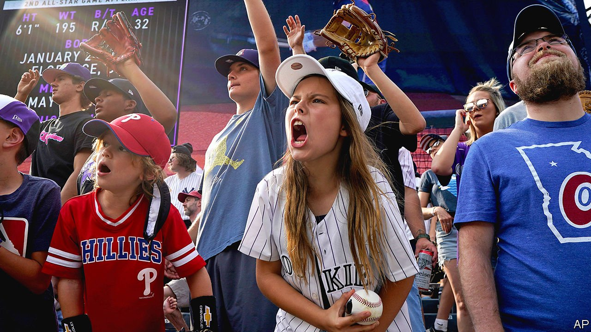

###### Pastime

# Baseball risks irrelevance if it doesn’t adapt 

##### The sport’s focus on its history makes changing the game and its culture difficult 

 

> Jul 15th 2021 

STANDING BEHIND left field during Major League Baseball’s (MLB) annual Home Run Derby is much like loitering in the middle of a mosh pit at a death-metal concert. Balls, bodies and beers are flying. If a dinger is hit in that direction, the mass of fans becomes a tangle of limbs until someone emerges from the bottom of a pile, bruised but triumphant, home-run ball in hand. But enthusiasm for the derby, the All-Star Game and MLB’s electric young players belies the fact that the sport is facing a series of challenges that put the future of the national pastime in question.

The past year has been a turbulent one for sports, but especially for baseball. The league has cracked-down on the use of “sticky stuff”, tacky substances pitchers used to help them grip the ball and throw harder. A star pitcher from the Los Angeles Dodgers is being investigated for sexual assault, reminding fans of the prevalence of assault-related suspensions among MLB stars. Rob Manfred, MLB’s commissioner, says the league suffered operating losses of $3bn in 2020 because of covid-19.


All these problems—even the covid-related ones—seem manageable compared with the existential threat that is young people’s lack of interest in the sport. A Morning Consult poll from 2020 found that only 32% of Gen Z Americans said they were “casual” or “avid” MLB fans, compared with 50% of all adults. That is the biggest gap among all sports considered. In fact, younger Americans are more interested in e-sports than baseball. The league has taken notice, and is testing ways to shorten games (which average over three hours) and pump up the action.

But many fans assume a defensive posture when it comes to rule changes or adopting new technology to make the game more entertaining. “Baseball has this extremely conservative culture”, says Jacob Pomrenke, of the Society for American Baseball Research. “The idea that baseball was somehow better in the past is one we should throw by the wayside. The golden era of baseball is now.” That is easier said than done. Historical sluggers still loom large in fans’ consciousness, and there is a sense that the game played today should be the same game that was played by Babe Ruth or Jackie Robinson. But that would suggest that baseball has never changed, an idea that baseball historians scoff at.

Even if fans come round to the idea that the sport needs to adapt to grow, labour troubles threaten to get in the way. The collective-bargaining agreement that governs schedules, salaries and safety precautions is set to expire on December 1st. The relationship between players and owners is already acrimonious, thanks to last year’s bitter negotiations over the shortened season. If the sides cannot agree terms, a strike or a lockout looms. And if it is hard to get young fans enthused about the sport, it will be near-impossible to do it when there is no baseball being played at all. ■

A version of this article was published online on July 14th 2021

