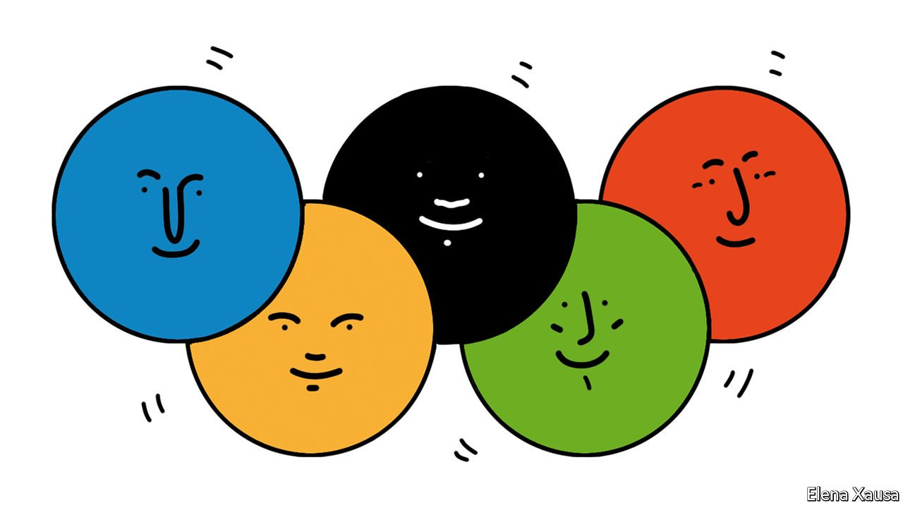

###### The changing face of Japan

# Mixed-race athletes reflect broader developments in Japanese society 

##### Their country’s diversity is becoming harder to ignore 

 

> Jul 24th 2021 

AS THE SON of a Japanese mother and Beninese father, Hachimura Rui stood out from his classmates in Toyama, a small town some six hours’ drive from Tokyo. Other children taunted him, he once recalled to The Undefeated, a sports website: “You’re black, go away.” But his talent on the basketball court helped him gain respect. Now a star in America’s NBA, Mr Hachimura will carry the flag for Team Japan when the Olympics open on July 23rd.

Mr Hachimura’s selection as a flag-bearer reflects how attitudes about race and identity are in flux in a country where the idea of racial homogeneity has long held sway. He belongs to a cohort of prominent mixed-race athletes who are forcing Japan to reckon with its diversity—from the Haitian-Japanese tennis champion Osaka Naomi to the Ghanaian-Japanese sprinter Sani Brown Abdul Hakim and the Iranian-Japanese baseball star, Darvish Yu. “They are becoming the role models that they themselves didn’t have,” says Miyazaki Tetsuro, a Belgian-Japanese photographer who documents other hafu (half), as mixed-race people in Japan are often called.


The notion that Japan is a racially homogeneous nation has always been a myth. The Japanese originated from many parts of Asia; Japan is home to Ainu, Okinawans (both hailing from islands that were once distinct from Japan) and Koreans, among others. Japan’s empire was a multi-ethnic society (albeit one where ethnic Japanese topped the hierarchy). But the myth of homogeneity found eager acolytes, both among Japanese seeking a post-imperial identity and among outsiders seeking explanations for Japan’s economic miracle. An entire genre of literature emerged around it: Nihonjinron, theories about the Japanese. Such ideas “excised the multicultural past and elided the existence of minority populations,” argues Michael Weiner, the editor of “Japan’s Minorities: The Illusion of Homogeneity”. Conservatives cling to them to this day.

The story of one pure people leaves little room for hafu. To be considered truly Japanese tends to mean having two Japanese parents, speaking Japanese fluently, and “acting Japanese”. “Most of us have this constant feeling of not being Japanese enough,” says Mr Miyazaki. Hafu are often perceived as foreigners, despite holding Japanese passports. Ms Osaka’s grandfather disowned her mother when she first revealed she was seeing a foreign man.

To this day, racism remains a big problem. That is why the celebration of champion athletes can smack of hypocrisy. Mr Hachimura has said he receives hateful messages on social media “almost every day”. Nissin, a noodle-maker, lightened Ms Osaka’s skin and hair in a commercial. (After a backlash, the company took down the ad.) Some on the right still question whether the two are truly Japanese. The situation is even tougher for those without powerful forehands or smooth jump shots. Mixed-race children face brutal bullying; some schools still have rules requiring students to dye or straighten their hair if it does not conform to the straight, black Japanese norm. Discrimination on the basis of race in hiring and housing is widespread. Japanese law lacks the teeth to prevent it, laments Shimoji Lawrence Yoshitaka, a sociologist who studies hafu. Minorities have few representatives in Japanese politics.

Yet Japan’s more diverse reality is harder to ignore, not least because of stars like Mr Hachimura. It helps that the new generation of athletes is not shy about airing its experiences. “Hearing such voices talking openly about discrimination makes people realise they aren’t alone,” says Mr Shimoji.

There are also more foreigners in Japan than at any time in its post-war history. A stealth immigration campaign to make up for Japan's shrinking population has seen the numbers of foreigners living there grow from some 2m a decade ago to nearly 3m today. That amounts to just 2% of the overall population, but the share is much higher among city-dwellers and the young: at least 10% of 20-somethings in Tokyo are foreign-born. (Japan does not collect statistics on the ethnic background of its citizens, only their nationality.)

The stigma around marrying foreigners is fading: in 1993, 30% of Japanese approved of international marriages, while 34% disapproved; by 2013, the last year for which data are available, 56% approved and 20% did not. One in every 50 babies is now born to a mixed couple, up from one in every 135 in the late 1980s. As Mr Hachimura and his peers show, their potential is enormous.

