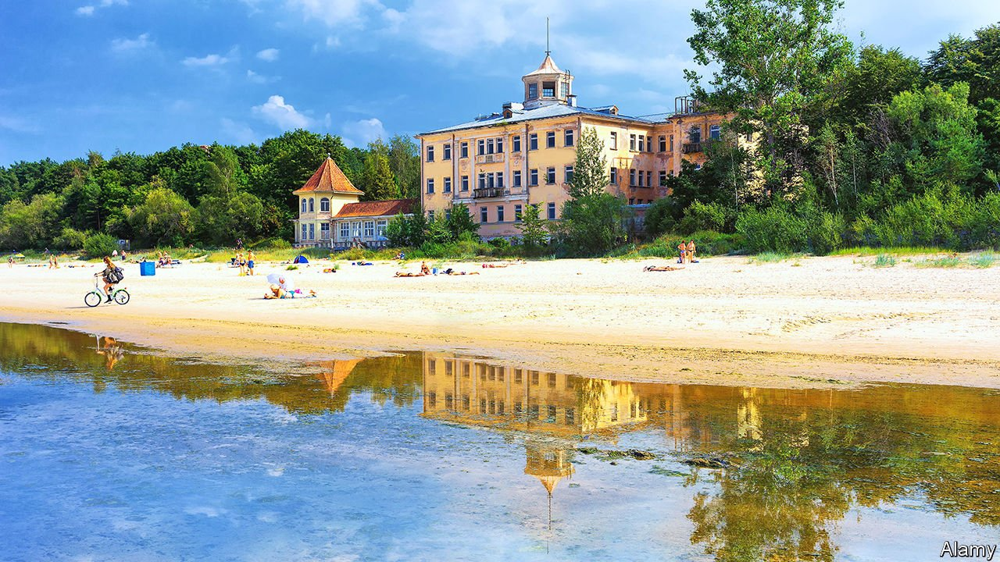

###### Travel writing

# A Baltic travelogue unearths a forgotten past 

##### But “The Glass Wall” neglects the present day 

 

> Jul 24th 2021 

The Glass Wall. By Max Egremont. Picador; 320 pages; £25. To be published in America by Farrar, Straus and Giroux in September; $30

THE BALTIC states of Estonia, Latvia and Lithuania once seemed to have disappeared as utterly as Atlantis. The collapse of the Soviet Union put them back on the map. As Max Egremont writes in his elegiac account of ties between the past and present, “the 1990s brought a chance at last to discover a world that you thought had been closed for ever. History and memory took on a new bright dimension, as if a window had been suddenly wiped clean.”


In fact locals remember the Soviet past all too clearly. But the author’s voyage of discovery in these supposedly unknown lands sails over such quibbles. The book is confidently written, featuring reportage interwoven with his own and other writers’ literary and genealogical insights.

“Max Egremont” is a deceptively simple pen-name. In his other life the author is John Max Henry Scawen Wyndham, the 7th Baron Leconfield and the 2nd Baron Egremont; he lives in Petworth House, one of the stateliest homes in Britain. This may explain, but does not excuse, his overemphasis on the region’s long-departed aristocracy, the Baltic German barons who for two centuries ran Estonia and Latvia as provinces of the Russian empire. The names, dates and places can at times read like a kaleidoscopic version of the “Almanach de Gotha”, a handbook of European nobility. A more ruthless editor would have pruned this material, allowing the central themes to emerge more clearly.

One of these is a paradox of the pre-1918 era, when German baronial families fostered the development of cultures that they had previously oppressed. Another is the lasting scars of armed conflict. The upheavals of the first world war were followed by polygonal fighting between parties including Red and White Russians, revanchist Germans and independence-hungry locals (heftily helped by Britain). The author also writes sympathetically about the trauma of the second world war, when the Baltic states were smashed between Nazi hammer and Soviet anvil, with dreadful consequences for everyone, but particularly the Jewish population.

In places, he hits his stride. His description of the former tsarist naval port of Liepaja is exemplary, bringing together a grand historical narrative, local details, accounts of lives shaped and shattered, and architectural and literary insights. But more often the tone is hurried, sloppy and patronising. He visits an important Estonian war memorial but guesses (wrongly) at the significance of the inscription. Why not ask someone? He cites, but misquotes, the opening line of “Pan Tadeusz”, the most famous Polish poem, which refers to Lithuania. Historical and geographical asides are strewn with errors.

That reflects the biggest flaw: a blithe orientalism. Hardly anyone these days would write about former European colonies in Africa through the eyes of nostalgic imperial administrators or their hangers-on. Mr Egremont quotes Elizabeth Rigby, an Englishwoman who in 1838 visited what is now Estonia to catch up with her Baltic German in-laws. Her account of these benighted lands features observations about Estonians’ “servile obedience and cunning evasion”; they were “as improvident as the Irishman, without his wit—and phlegmatic as the German, without his industry”.

Those deplorables were not illiterate and landless because of the weather. They had recently emerged from what elsewhere in the world is called slavery. The enforcers and beneficiaries of that system were those grand families with their splendid manor houses and cultivated tastes.

All this might be more forgivable if the author paid more attention to the modern Baltic states. Atlantis has re-emerged. What is it like? Though pen portraits of individuals abound, the overall picture, buzzing with cultural and technological innovation, gets a cursory couple of sentences at the end of the book, with a characteristically whimsical pay-off about the mysteries of migrating storks.

These are real places. They deserve more than to be the backdrop to someone else’s story, however evocatively told. ■

