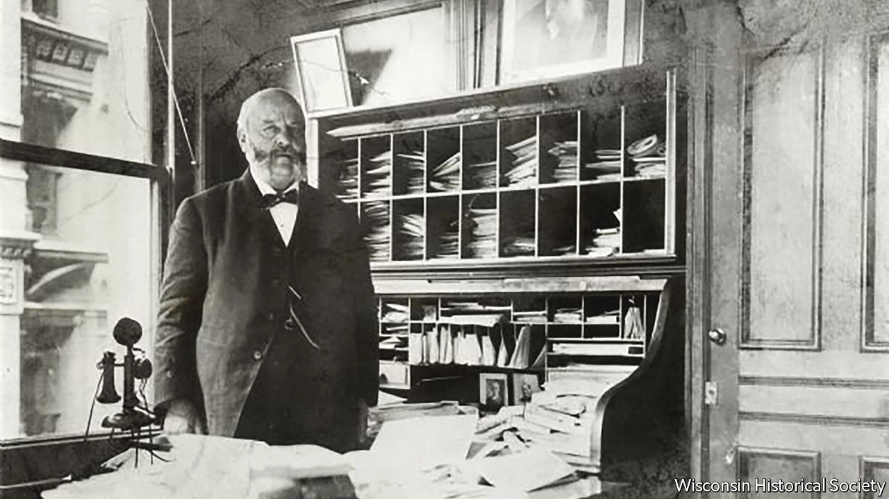

###### Sex and censorship

# A resonant tussle between “sex radicals” and a 19th-century censor 

##### Remembering “The Man Who Hated Women”—and the women who resisted 

 

> Jul 24th 2021 

The Man Who Hated Women. By Amy Sohn. Farrar, Straus and Giroux; 400 pages; $30

MOST PEOPLE who come to New York see a world bristling with opportunity. When Anthony Comstock arrived in 1867, all he saw was smut. He was shocked by the streetwalking, gambling, saloons and brothels, and by the peddlers openly hawking dirty pictures and “rubber goods” (sex toys and condoms). A pious Congregationalist, brought up in Connecticut to believe women were pure and saintly, he was horrified by the proliferation of manuals on contraception and better sex, and scandalised by newspaper advertisements for products that promised miscarriages.


As Amy Sohn writes in her colourful new book, “The Man Who Hated Women”, Comstock put his righteous indignation to use. He harnessed the state’s obscenity law to personally seize offensive books, assist in arrests and shut down saloons, often while brandishing a revolver. Having pushed and prayed for the federal ban on the distribution of “obscene, lewd or lascivious” material of 1873, Comstock used his position as a special agent in the US Post Office to crack down on anyone who promoted sex for purposes other than procreation. Petty and vindictive, he often resorted to deception and reportedly boasted of the number of people he had driven to suicide. Many of his victims were impoverished and uneducated.

“As one of the most powerful and single-minded men of his time, Comstock dealt a near-century-long blow to women’s health,” Ms Sohn writes. In his efforts to protect women, he arrested many of the midwives and homeopaths who provided essential reproductive care. His federal advocacy spawned various “little Comstock laws” across the states, which often made it a crime to own advice on preventing conception. In 17 states and Washington, DC, a doctor could not discuss ways to avoid pregnancy with a patient. Only in 1965 did the Supreme Court rule that married women could receive contraception from their doctors. Single women were granted that right in 1972.

But it is not quite right to say Comstock hated women, at least not all of them. He revered his mother, who died in childbirth when he was young, and loved his wife, a prim, tiny woman he called “Wifey”. He just didn’t trust women to think for themselves. His rise coincided with a “rich period of radical publishing”, when activists increasingly argued that marriages should be based on love and respect, with a fair division of labour and pleasurable, consensual, recreational sex. Inspired by the abolition movement, these renegades called for the American woman to be—in the words of Victoria Woodhull, a suffragist, stockbroker, publisher and presidential candidate—“emancipated from the sexual slavery maintained over her by man”.

Ms Sohn devotes much of her book to the lives of some “sex radicals” who riled Comstock with their big ideas about marital harmony and bodily autonomy. Besides Woodhull, she includes Emma Goldman, an anarchist and labour organiser, Margaret Sanger, a birth-control activist, Ann Lohman, a “notorious” abortionist known as “Madame Restell”, and Ida Craddock, a sexologist whose thoughts on mutual sexual pleasure were somewhat complicated by her claim that her lover was a ghost. Comstock hounded them all.

A bestselling novelist, Ms Sohn makes clear the depth of her research for her first non-fiction book, occasionally overdoing the details (once, on a date, Craddock had “a satisfying dinner of spring chicken”). She sometimes veers into hyperbole and, at the close, casts off her historian’s mantle to give a feminist pep-talk. Yet she is right to highlight the work these women did to define reproductive liberty as an American right, which paved the way for the birth-control pill and Roe v Wade. Comstock has faded into obscurity, but many of the ideas about love, sex and marriage that he resisted are still being debated today. ■

