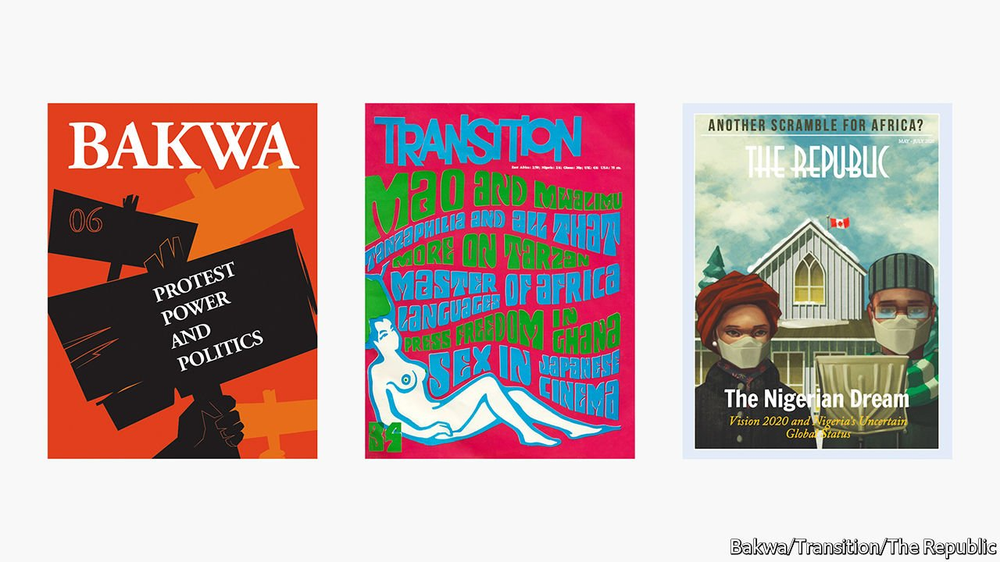

###### Open letters

# Intellectual magazines are flourishing in Africa 

##### The internet has made cultural and political commentary easier—and freer 

 

> Jul 24th 2021 

LAST OCTOBER young Nigerians took to the streets to protest against police brutality. At first “none of the traditional media companies were covering it,” recalls Wale Lawal. A few years earlier he had started the Republic, a quarterly magazine of ideas and analysis, and now his readers wanted to discuss the movement that was swelling around them. So he and his team in Lagos ran a series of online pieces on the protests, later collected in a special print edition. This kind of in-depth coverage of under-reported stories was “exactly what we were set up to do”.

Mr Lawal says he hopes the Republic will one day become “a New York Times for Africa”. But in temperament it is more like the protest movement itself—youthful, tech-savvy and decentralised, its freelance writers touching on topics as diverse as modern slavery or the sexism of Fela Kuti, a revered musician. The publication is an example of the new intellectual spaces that have opened up in Africa over the past decade, from long-form journalism to literary magazines, in an efflorescence of political commentary, criticism and fiction.


African intellectual journals have an illustrious history. The independence era of the 1950s and 1960s produced titles such as Présence Africaine and Transition. “A good literary magazine is like a blind man’s stick,” wrote Rajat Neogy, the Ugandan founder of Transition; “it helps you feel the way.” He published work by luminaries including Chinua Achebe, Wole Soyinka, Ngugi wa Thiong’o and James Baldwin. But in 1968 he was arrested for sedition after running an article critical of Uganda’s government, a harbinger of the authoritarian cloud that would smother free expression in many African countries.

By 2000 speech was again becoming freer, and the new century saw the birth of publications such as Chimurenga, a literary magazine that took its name from a Shona word for Zimbabwe’s liberation struggle. But it was on the internet that restraints really fell away. “For many African countries the digital space is the freest,” says John Githongo, a Kenyan anti-corruption campaigner and former writer for The Economist. In 2016 he was one of a group of Kenyans who founded the Elephant, an outspoken political website that had 3.2m views in 2020. (Online freedom can be fragile: Uganda’s government blocked the site during last year’s election campaign, after it covered massacres by the security forces, among other sensitive subjects.)

New online outlets experiment with podcasts and video and embrace social media. Some of the best-known—such as the analysis site Africa is a Country, or the literary one Brittle Paper—began as personal blogs. They generally reject both the staid habits of mainstream African papers and the narrow preoccupations of much Western writing about the continent. Many are more cultural than political, but most lean left. The outlook is typically pan-African, finding both solidarity and difference with activists elsewhere. Through a series of essays on “the Black Atlantic”, Mr Lawal hopes to “change the perspective on blackness around the world”. The focus, he thinks, tends to be narrowly American.

These outlets also emphasise the universal interests of African writing. Jennifer Malec, editor of the Johannesburg Review of Books, says it aims “to give a voice to African writers to comment on significant literary works from around the world”. Its latest edition discusses both Manyano, a women’s prayer movement in South Africa, and the influence of Charles Dickens. Bakwa, a literary magazine from Cameroon, has collaborated with a journal in Mexico and ran a series of essays about travelling as an African, with contributions from across the continent.

“If we didn’t live in the internet era I don’t think we would ever have started Bakwa,” says Dzekashu MacViban, its founder. Although funding is a perennial challenge for small magazines, the internet makes it cheaper to reach a scattered readership. Increasingly, says Bwesigye bwa Mwesigire, founder of the Arts Managers and Literary Activists Network in Kampala, African intellectuals are building the platforms that make cultural commentary possible. “It’s not just that people are interested in writing, now they are also interested in being the ones publishing.”

That spirit is beginning to extend from Africa’s megacities into quieter places. In 2019 Rémy Ngamije co-founded Doek!, a Namibian literary magazine. Contemporary Namibian writers are, he says, exploring the legacies of colonialism and “the unspoken losses of the liberation struggle” against white-ruled South Africa. “We’re basically doing the grassroots work of starting a literary tradition.” ■

