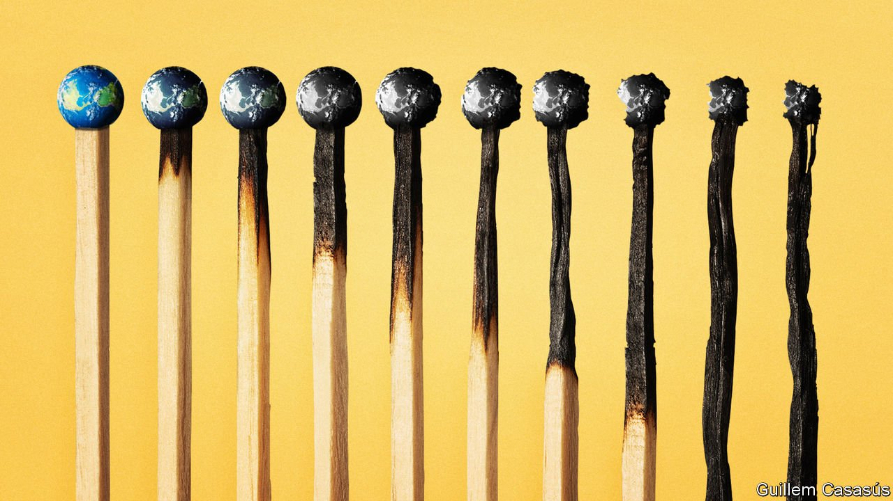
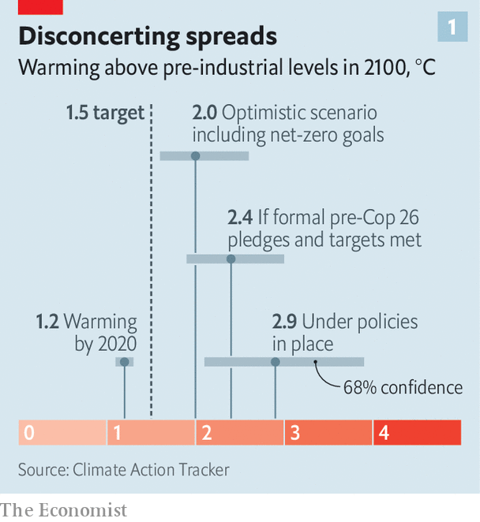
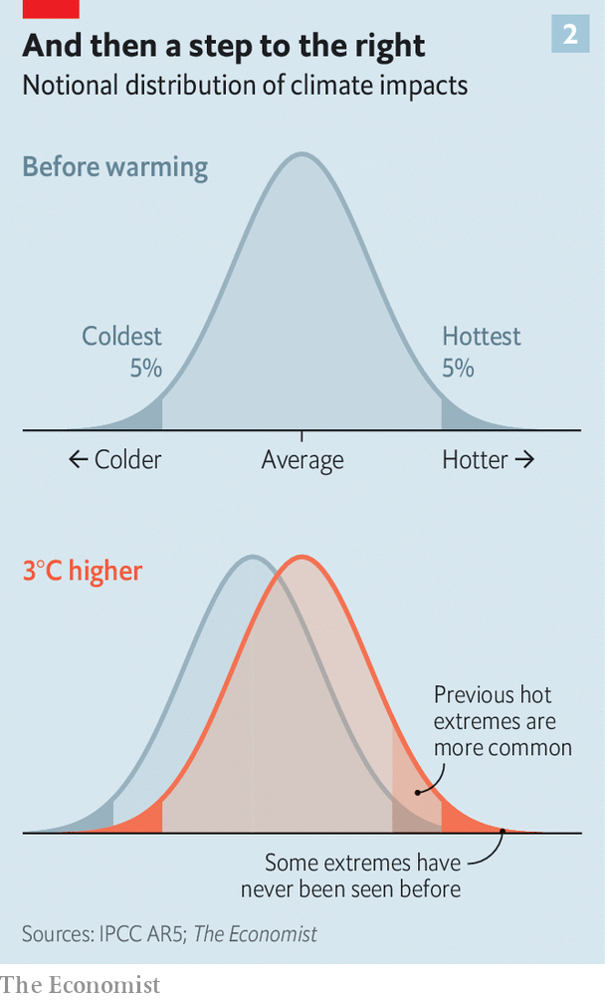

###### What’s the worst that could happen

# Three degrees of global warming is quite plausible and truly disastrous 

##### Rapid emission cuts can reduce the risks but not eliminate them 

 

> Jul 24th 2021 

BY THE STANDARDS of the 21st century as a whole, 2021 will almost certainly go down as a comparatively cool year. By the standards of the rest of human history its weather looks disconcertingly like hell.

On July 20th, as Belgium, Germany, the Netherlands and Switzerland were still coming to terms with the fact that a stationary system of storms had turned entire towns into rivers and shredded the surrounding countryside, hundreds of thousands of people in the Chinese province of Henan were evacuated in the face of floods of their own; the city of Zhengzhou saw a year’s worth of rain in three days.


Also on July 20th Cizre, in Turkey, saw a temperature of 49.1°C (120°F), the highest ever recorded in the country. There has been barely any respite from searingly hot conditions along the northern Pacific coast of North America since the region was hit by an unprecedented heatwave two weeks ago, and already the region is bracing for another. Other places at high latitudes have been seeing similar—if less destructive—anomalies. In the first half of the month Finland experienced its longest heatwave for at least 60 years, with temperatures rising to the low 30°Cs in Lapland. On July 14th the country tossed and turned through its hottest night ever: two weather stations recorded temperatures no lower than 24.2°C.

On July 11th, a National Weather Service thermometer at Furnace Creek in Death Valley recorded a temperature of 54°C. If confirmed by the World Meteorological Organisation (WMO), that would tie a reading taken at the same location last year for the hottest formally recognised daytime temperature ever. On July 19th more than 40% of the Greenland ice cap had meltwater on it. The amount of sea-ice cover in the Arctic was as low as it was at the same point in 2012, which saw the lowest summer sea ice ever recorded.

This is what Earth looks like when, according to the latest data from the WMO, it is 1.1-1.3°C warmer than it was before the steam engine was invented. The Paris agreement of 2015 created a compact to limit global warming to “well below 2°C” above the pre-industrial, ideally seeing it rise no more than 1.5°C.

That more stringent target was demanded by, among others, small-island states which see the amount of sea-level rise inherent in two degrees of warming as an existential threat. A huge subsequent report by the Intergovernmental Panel on Climate Change found that the difference between the two targets, even if it was just 10cm of additional sea-level rise by 2100, would wipe away the livelihoods of millions. Compared with 1.5°C of warming, 2°C would also expose an additional 420m people to record heat. And it would devastate Arctic ice cover.

Those Paris targets were, and remain, both prudent and incredibly ambitious. Right after the conference Climate Action Tracker (CAT), an NGO, set itself the task of totting up all the emission-reduction goals and other policies, like fuel-efficiency standards for cars and trucks and renewable-energy targets, that the various nations had made. To gauge the aggregate impact of those measures, CAT calculated the atmospheric concentrations of carbon dioxide they looked likely to produce and then used the results of climate models to see what those concentrations might mean in terms of warming. Their results showed the world was on track to be 2.7°C hotter than the pre-industrial baseline by 2100.

The people who negotiated the Paris agreement were fully aware of this contradiction. They expected, or hoped, that countries would make new and more ambitious pledges as technology progressed, as confidence that they were all really on board built up and as international co-ordination improved. There is evidence that this is happening. Revised pledges formally submitted to the UN over the past 12 months in the run-up to the COP26 conference to be held in November have knocked CAT’s estimate down a bit. If all government promises and targets are met, warming could be kept down to 2.4°C. Including targets that have been publicly announced but not yet formally entered into the Paris agreement’s ledgers, such as America’s net-zero-by-2050 pledge and China’s promise to be carbon-neutral by 2060, brings the number down to a tantalising 2.0°C.

That sounds promising. But the figure comes with a very big caveat and with large uncertainties.

The caveat is that this estimate includes policies announced but not enacted. A world which follows the policies that are actually in place right now would end up at 2.9°C, according to CAT (the UN Environment Programme, which tracks the gap between actual emissions and those that would deliver Paris, provides a somewhat higher estimate). Almost everyone expects or hopes that policies will tighten up at least somewhat. But any reasonable assessment of the future has to look at what may happen if they do not.

As to the uncertainties, they are many and various. Translating political statements into gigatonnes of carbon dioxide is hardly an exact science. Just as no one knows whether countries will choose to stand by the policies they have mooted, nor can they be sure that those policies will deliver the reductions claimed. And although there is no doubt that greenhouse gases influence climate and are driving the rising temperatures seen around the world, difficulties in untangling various feedback loops and complex countervailing effects mean that there remains considerable uncertainty about how much further climate change a given amount of greenhouse gas brings about.

 


This uncertainty gives the probabilistic estimates made by CAT, and other groups, large error bars. The calculations of peak warming if existing targets are met and promises kept give a 68% chance of a peak temperature between 1.9°C and 3.0°C (see chart 1). In the America-at-net-zero-by-2050 scenario the 68% probability range runs from 1.6°C to 2.6°C. This fits with modelling from elsewhere. According to calculations by Joeri Rogelj and his colleagues at Imperial College London, even emissions scenarios which provide a two-in-three chance of staying below 2.0°C also include a small chance of 2.5-3.0°C of warming: less than one-in-ten, but possibly more than one-in-20.

Hold tight

A 3°C world is thus both a pretty likely outcome if nothing more gets done and the worst that might still happen even if things go very well indeed. That makes it worth looking at in some detail, and the result is alarming. Those modelling climate impacts have long argued that they do not increase linearly. The further you go from the pre-industrial, the steeper the rate at which damages climb. And as what was rare becomes common the never-before-seen comes knocking (see chart 2). Judging by the results of specific studies, the differences between 2°C and 3°C are, in most respects, far starker than those between 1.5°C and 2°C.

 


Just as today’s world is not uniformly 1.2°C warmer than the pre-industrial, a 3°C world is not uniformly 1.8°C warmer than today (see chart 3). Some regions, chiefly the oceans and parts of South America, will warm less; others will get much hotter. The Arctic, including northern Canada, Siberia and Scandinavia, will receive the brunt of the warming. Some more populated regions are also in for above-average temperatures. According to one study mean temperatures in Russia, China and India would increase by 4-5°C, 3.5-4.5°C and 3-5°C, respectively.

 


Warmer regional temperatures will bring more frequent and more extreme heatwaves, including to higher-latitude regions in North America, Europe and Asia that have little or no experience of such things. A comparison of how 1.5°C, 2°C and 3°C of global warming would affect European extremes published in 2018 found that while “tropical” nights where temperatures remain above 20°C from dusk till dawn are currently mostly the preserve of the Mediterranean shoreline, the area affected stretched north as warming progressed until, under a 3°C regime, they became a regular occurrence in the Baltics. It is the lack of enough cooling at night which, by and large, drives deaths during heatwaves.

Striking though such a change would be, hot nights in previously cool wealthy countries can be adapted to. Green roofs, water sprinklers and  can all help. People can switch to more indoor living during the summer months. Construction workers, farm labourers and other people whose jobs are physical and primarily done outdoors, though, would suffer disproportionately, as would those who could not easily afford the additional cost of installing and running air-conditioning.

This is as nothing, though, compared with what increases in heat can do in the humid tropics. Human bodies cool off through the evaporation of sweat, and under humid conditions evaporation is harder. The “wet-bulb” temperature is a measure that reflects this combined effect of heat and moisture on the difficulty of keeping cool.

Except at 100% relative humidity, the wet-bulb temperature is always lower than the temperature proper; dry air means that 54°C in Death Valley equates to a wet-bulb temperature in the low- to mid-20s. Wet-bulb temperatures in the 30s are rare. And that is good. Once the wet-bulb temperature reaches 35°C it is barely possible to cool down, especially if exercising. Above that people start to cook.

Wet-bulb temperatures approaching or exceeding 35°C have been recorded, very occasionally, near the India-Pakistan border and around the Persian Gulf and the Gulf of Mexico. But not all such instances are reported. A re-analysis of weather-station data published in 2020 showed that such extreme humid heat actually occurs more often than is recorded, mostly in very scarcely populated parts of the tropics. The study also found that its incidence had doubled since 1979.

Richard Betts, a climatologist in Britain’s Met Office who has led several surveys of the impacts of high-end global warming, says that beyond 2°C small but densely populated regions of the Indian subcontinent start to be at risk of lethal and near-lethal wet-bulb temperatures. Beyond 2.5°C, he says, places in “pretty much all of the tropics start to see these levels of extreme heat stress for many days, weeks or even a few months per year.”

In less humid places, heat depletes water supplies. A modelling analysis of water scarcity at 1.5°C, 2°C and 3°C found that two-thirds of humanity will experience progressively drier conditions as the climate warms. At 3°C, periods of dryness currently treated as exceptional 1-in-100-year events are projected to happen every two to five years in most of Africa, Australia, southern Europe, southern and central United States, Central America, the Caribbean and parts of South America.

We’re in for nasty weather

The occasional drought can be dealt with by recourse to reservoirs or groundwater. When droughts become prolonged and/or frequent such alternatives dry up. As a result, some modelling suggests that at 3°C more than a quarter of the world’s population would be exposed to extreme drought conditions for at least one month a year. California’s megadrought, which has affected the water supply for consumption, sanitation and irrigation as well as fuelling record-breaking fires, gives a glimpse into what this could look like for large swathes of the planet, almost all of which face far higher hurdles to adaptation than one of America’s richest states (albeit one with a high number of poor people).

This does not necessarily mean that every crop is at risk of heatwaves, or that the world will face a structural food shortage. Some arable land will be blessed with a useful increase in rain, and the fields farmed by Goldilocks may be spared a concomitant increase in flood risk. Temperate climates will benefit from longer growing seasons, and some crops will also benefit from higher carbon-dioxide levels, since it is the raw material of photosynthesis. Although the Intergovernmental Panel on Climate Change (IPCC) estimates that cereal prices might be 29% higher under 3°C of warming, putting 183m people at additional risk of hunger, it also sees it as possible that they might hardly shift at all.

But whatever the averages, there will be a much higher risk of crises which panicky reactions make worse. In the summer of 2010 temperature records which had stood since the 1880s were broken in Russia, the world’s third-largest wheat producer; temperatures stayed up around 40°C for weeks. Wheat yields fell by about one-third: Russia banned exports in order to maintain its own supply. That led to price spikes on global food markets which have since been linked to civil unrest in a number of low-income countries.

More measured policy responses would have helped. But the opportunities for panics over food shocks will undoubtedly increase. A study co-sponsored by Britain’s Foreign, Commonwealth and Development Office estimated that the likelihood of an extreme heatwave capable of wiping out the southern Chinese rice crop in a given year was 1 in 100 under 1°C of warming, but one in ten under 2-3°C of warming.

What sea level would look like at 3°C depends on how quickly things heat up. Because ice takes time to melt and warmth gets into the ocean depths only slowly, sea level takes its time responding to the surface temperature. This means the seas will be lower at the point when 3°C is reached if it is reached quickly than if temperatures rise more slowly.

What matters more than the sea level at the time when the world hits 3°C is the sea level to which a 3°C world would be committed in the long run. The West Antarctic Ice Sheet, which until a decade ago was considered pretty stable, is crumbling at the edges. There is growing evidence that at around 2°C of warming it will begin to break down completely. “If that point is passed, the evidence suggests that the rate of ice loss from West Antarctica will increase dramatically,” says Nerilie Abram of the Australian National University.

The full effects of such a collapse—perhaps 1.6 metres’ worth of sea-level rise—would not be seen for another century or more. But the rate of change would increase much sooner than that. “On our current climate trajectory,” says Dr Abram, “we can expect a very rapid jump in how quickly Antarctica loses ice in just a few decades time.” In a 3°C world similar concerns apply to Greenland, too.

Cities, and indeed low-lying countries, which might hold their own against the 30-90 centimetre sea-level rise expected by 2100 in a 2°C world, might well have to throw in the towel faced by four or five times as much. As with wet-bulb temperatures, there are limits to the extent to which adaptation can offer hope once the world gets to 3°C. And even when lives can be saved, places cannot. Coastal cities that hundreds of millions now call home would be changed utterly if they persist at all. Nor could the indigenous cultures of the Arctic or the rainforest survive in anything like their current form. Much of the Earth-as-was would be forgotten, as well as lost.

There has got to be a way

The limits to adaptation apply to nature, too. Animal and plant species adapt to warming climates by shifting to cooler ones where possible. Already fish are on the move, some species edging away from tropical waters to temperate, others from the temperate to the chilly. Land animals unable to trek to higher latitudes can, if they live in hilly places, find respite at nearby higher altitudes instead. But these strategies only work up to a point: mountains have peaks, and the Earth has poles.

And it only works for species and ecosystems that are able to move faster than the climate warms. Coral reefs do not have that facility. They are predicted to disappear completely in a 3°C world (their boiled, bleached fate is worsened by the fact that higher carbon-dioxide levels make seawater too acidic for them). Some such failures to adapt make the world hotter still. The Amazon rainforest, already weakened by logging and burning, would be very unlikely to survive in such a world. In its passing it would release further gigatonnes of carbon into the atmosphere.

The Amazon will not disappear overnight. Even if emissions go largely unchecked from now on, a 3°C future looms only in the second half of the century, not the first. But the longer it takes to cut emissions, the more avoiding 3°C becomes something only achievable through the application of untested and in some cases troubling technologies designed either to suck carbon from the atmosphere in vast amounts or to throw some of the sun’s warming rays back into space. Humanity would find itself wedged between a geoengineered rock and a very hot place. ■

For more coverage of climate change, register for The Climate Issue, our fortnightly , or visit our 

