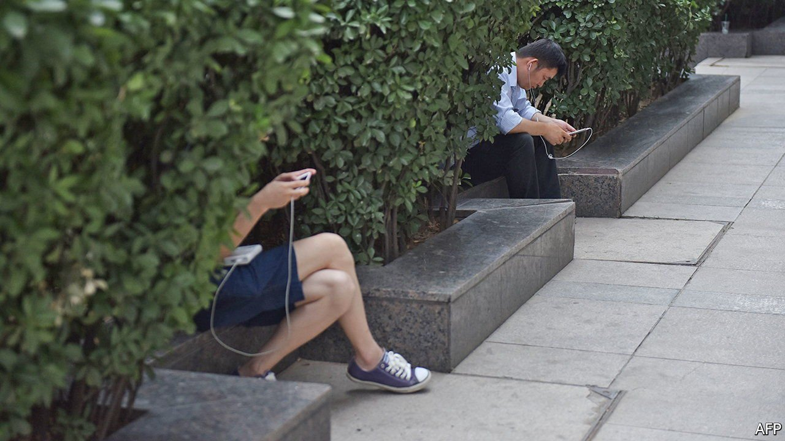

###### LinkedOut

# LinkedIn faces awkward choices in China 

##### To operate in the communist country, Microsoft’s professional social network has to appease censors. So do its users 

 

> Jul 24th 2021 

FOREIGN INTERNET firms have a rough time in China. To stop the spread of ideas it deems dangerous, the Communist Party blocked YouTube’s video-sharing site, Facebook’s social network and Twitter’s microblog in 2009. A year later Google abruptly shut its Chinese search engine after a dispute with censors. Chinese who want to access Western social media must do so via virtual private networks, which is finicky and can be illegal.

One exception to this heavy-handed rule is LinkedIn. China’s government tolerates the professional network, perhaps because most people use it to hunt for jobs and business contacts, not talk about democracy. The number of LinkedIn’s Chinese users has grown rapidly since Microsoft purchased it in 2016, to 53m. They make up around 7% of LinkedIn’s global total, up from 1.4% in 2014. Microsoft does not disclose how much China contributes to LinkedIn’s revenues, which reached $8bn in 2020. Still, the software giant can tout it as a rare Western social-networking win in a market of nearly 1bn netizens.


But operating in a dictatorship presents awkward choices for a platform designed for the exchange of ideas, as well as business cards. To comply with China’s laws, LinkedIn must limit what users can post. Since March, when China’s cyberspace regulator criticised its lax controls, it seems to have stepped up those efforts. Many users have received notices that their profiles and activities are not displayed in China. One academic based in Taiwan, J. Michael Cole, recently discovered that his profile was blocked there. LinkedIn indicated the presence of sensitive content in the “publications” section of his profile but did not elaborate further. Mr Cole believes it may have something to do with references to books he has written about Taiwan, which China claims as part of its territory.

Mr Cole’s experience points to a conundrum for LinkedIn. Like other social media tolerated by Beijing, it must not allow certain words to appear on its service. But the rules are fuzzy, even for large internet platforms. If LinkedIn has received a list from regulators, or come up with an internal one, it does not divulge it. Liu Dongshu, a scholar of China’s internet politics at City University of Hong Kong, thinks LinkedIn probably does not have such a list but instead censors some content that China’s government may potentially find objectionable on a case-to-case basis to avoid trouble. This leaves LinkedIn users in a position not dissimilar to that of the social network itself: with no explicit rules on what they can and cannot post in China, they are, like Mr Cole, left guessing. That, in turn, can lead to self-censorship.

LinkedIn says that it has an “obligation to respect the laws that apply to us, including adhering to Chinese government regulations”. When asked by The Economist to cite the regulations that force it to block user profiles, LinkedIn’s spokeswoman did not respond. Microsoft did not respond to a request for comment.

All foreign firms face difficult trade-offs in China, which is both a vast market and an autocracy. Those with large Chinese operations tend to fall in line. Apple, which both makes and sells lots of iPhones in China, has removed sensitive programs from its Chinese app store. Companies with less exposure to China can take the high road. Facebook, Google and Twitter have reportedly threatened to pull out of Hong Kong, on which the Communist Party has recently tightened its grip.

Microsoft sits somewhere in the middle. China has been a source of grief for the company: from pirated Windows and Office software to raids on its offices by antitrust regulators. On July 19th America and several allies blamed China for a big hack of Microsoft’s Exchange email service. At the same time, many Chinese do pay for its original wares—and Microsoft would no doubt like more of them to do so. It does not break out its Chinese sales but last year its president said they contributed less than 2% to global revenues. If that share is to grow, self-censorship on LinkedIn may be the price. ■

