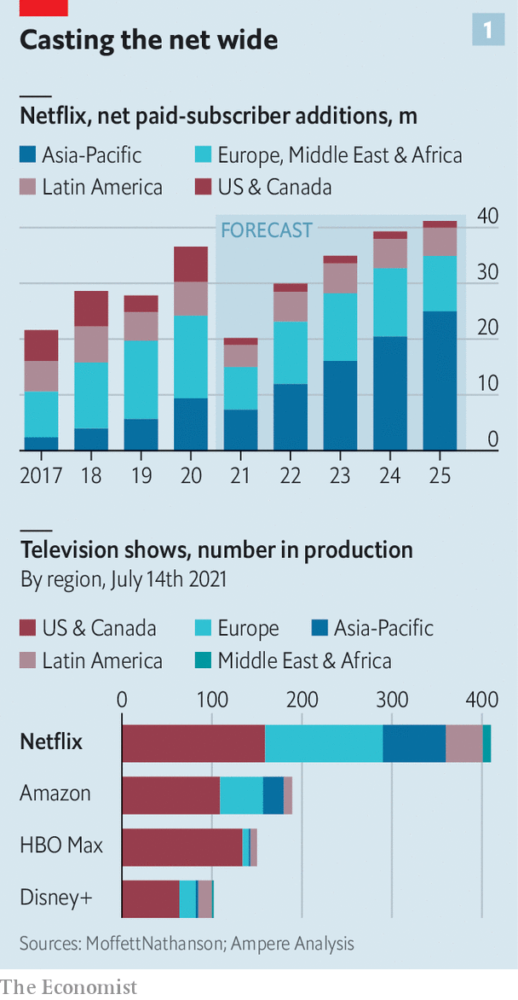
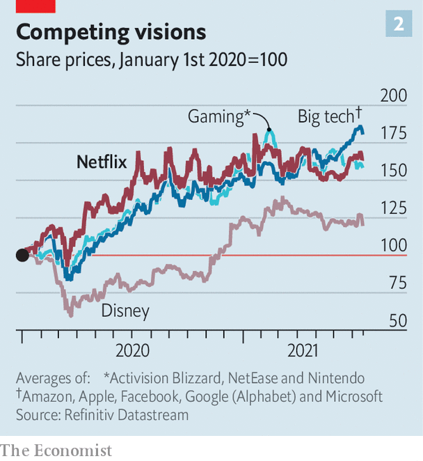

###### Coming soon

# Raising the curtain on Netflix’s ambitious third act 

##### The DVDs-by-mail company conquered America’s video-streaming market. What next? 

 

> Jul 20th 2021 

AS LOCKDOWNS LOOMED last year, people scrambled to stock up on home-survival essentials: food, medicine and a Netflix subscription. In the first half of 2020 the streaming giant registered 25m new members globally, twice as many as had signed up in the same period a year earlier. With viewers hunkering down to see out the pandemic on the sofa, “Outbreak”, a disaster movie from 1995, made Netflix’s top ten.

Now, as the world’s economies reopen, Netflix is sputtering. On July 20th it announced 1.5m new sign-ups between April and June, 85% fewer than a year ago. In America and Canada, where the market is saturated and competitors are multiplying, the total number of subscribers declined by 430,000. Netflix’s share price, which soared by nearly 50% in the first half of 2020, has barely risen in the past year (and dropped by 3% on July 21st).


The stall is unsurprising. Many new members from 2020 pulled forward subscriptions they would have bought this year. It still raises a difficult long-term question for Netflix. The company began by renting DVDs by mail. Its second, stunning act was to invent and dominate subscription video-streaming. Now, as rich markets mature and rivals snap at its heels, growth must come from elsewhere. Netflix’s third season promises exotic new locations and, perhaps, a big plot twist.


Season two has a way to run. Despite the stagnating number of American subscribers, Netflix has scope to charge them more. It makes $14.88 monthly from each, more than double the takings of Disney+, its main rival, reckons MoffettNathanson, a firm of analysts. And yet fewer members quit Netflix a month than ditch other streamers, according to Antenna, a data firm. Further price hikes could lift Netflix’s domestic revenues by 7% annually for the next few years, says MoffettNathanson.

 


The bulk of the growth, though, will come from overseas. Last year, for the first time, Netflix earned more than half its revenues outside America and Canada. By 2025 the share is expected to reach two-thirds. Already nine in ten new subscribers live abroad (see chart 1).

The international game is hard. Most foreigners are poorer, and even the rich ones don’t spend much on TV. The average American cable subscriber shells out nearly $100 a month, so those who “cut the cord” can afford half a dozen streaming services. The equivalent British household spends less than $45. Netflix has resisted price cuts, so even in low-income India it charges users $8.70 a month. Its biggest concession has been to invent a mobile-only plan, now in more than 70 markets. Indians can sign up to this for $2.70.

Like the financial barrier, cultural ones are high in show business. Enders Analysis, a research firm, found that programmes made by British broadcasters were richer in local idiom than those commissioned by foreign streamers. “Sex Education”, a Netflix series set in rural England, had fewer than five British references per hour. “Peep Show”, a home-grown hit, had more than 35, from “johnnies” (condoms) to Findus Crispy Pancakes, a national delicacy. Reed Hastings, Netflix’s boss, said in April that the firm was “still figuring things out” in India, where some senior executives have quit and rivals like Disney+ and Amazon, an e-merchant with a streaming arm, have made headway.

Still, the international battle is one Netflix is winning. By the end of the year it will have 31m subscribers in Asia, half as many as Disney+, estimates Media Partners Asia (MPA), a consultancy in Singapore. But three-quarters of Disney’s are in India, where it has the rights to the cricket Premier League, a national sporting obsession, but earns less than $1 in revenue per subscriber. By contrast, more than 60% of Netflix’s Asian members reside in the rich markets of Australia, Japan and South Korea. MPA expects Netflix’s Asian revenues to reach around $3.2bn this year, compared with $800m for Disney+.

And whereas in America Netflix competes with a dozen or more streamers, in international markets it is seldom up against more than two serious rivals. Once WarnerMedia is spun off from AT&amp;T, its corporate owner, and merged with Discovery, as planned, the global footprint of Warner’s HBO Max will increase. But regulators’ approval for that deal could be a year away, by which time Netflix may have signed up another 30m or so members. A rumoured partnership between Comcast, a cable firm that owns NBCUniversal, and ViacomCBS, another media group, to combine streaming services internationally could take a while to materialise.

Of Netflix’s competitors, only Amazon and Apple, a gadget-maker with entertainment ambitions, are truly global; each claims to be streaming to audiences in more than 100 countries. But both lack Netflix’s production chops. Last year Netflix became the biggest commissioner of European scripted content, overtaking the BBC, France TV and Germany’s ZDF, reckons Ampere Analysis, another research firm. It has more foreign TV shows in the works than its three main rivals combined, and is shooting in regions where Hollywood fears to tread. Recent projects include its first Russian original, an “Anna Karenina” remake, and Korean K-pop-themed shows.

On the strength of this international onslaught, Netflix’s overall revenues will grow by about 14% a year until 2025, calculates MoffettNathanson. The company is raking in an extra $5bn or so each year. This compares favourably with show-business rivals, insiders note.

 


Yet some investors benchmark Netflix not against the entertainment industry but against big tech. That comparison is less flattering. The share prices of America’s tech giants—Alphabet, Amazon, Apple, Facebook and Microsoft—have kept rising even as the pandemic burns out (see chart 2). Their revenue growth to 2025 is expected to be nearer 20% a year. To match them, Netflix needs to think outside the goggle box—not least because, as Matthew Ball, a media venture-capitalist, puts it, consumers are now asking not “What should we watch?”, to which Netflix has become the stock response, but “What should we do?”

The answer, for many, is play video games. Gaming already generates nearly $180bn a year in global revenues, and is expanding fast. PwC, a consultancy, estimates that games’ share of global entertainment-media sales has risen from 15% in 2019 to 19% this year. In America, under-25s already rank gaming as their favourite pastime (and place watching TV shows and films last).

Mr Hastings has long posited that in the attention economy Netflix competes with “Fortnite”, a popular online multiplayer game, as much as it does with HBO. Until now, though, his firm fought for consumers’ attention with its shows (and, more recently, merchandise, live events and podcasts aimed at spurring engagement with its content). Now it is taking the fight directly to the game developers. Under a new gaming boss nabbed from Facebook, Mike Verdu, Netflix plans to offer subscribers games on its mobile app within a year. One person with knowledge of the project says the initial investment is a single-digit percentage of Netflix’s $17bn annual content budget, with hopes that this will grow.

Other media and tech giants have tried and failed to crack gaming, whose interactive nature requires a different technical infrastructure to one-way video-streaming. Disney has closed its games studio. Google and Amazon have struggled to drum up interest in their respective game-streaming services, Stadia and Luna. It is unclear how Netflix plans to get around Apple’s ban on gaming platforms in its app store. And whereas many hits like “Fortnite” make money through in-game micropurchases (of power-ups, say), Netflix will include games in its subscription, a model with few successful examples.

These difficulties lead many to suspect an acquisition is on the cards. “Games are like pharmaceutical companies—you need to spend years building or buying a pipeline,” says a gaming-industry veteran. Though Netflix has preferred to grow organically, it has the means to splash out. It generated free cashflow last year and will generate more as its content binge flattens out. Its stable subscription business lets it safely take on debt. America’s biggest game publisher, Activision-Blizzard, has a market capitalisation of around $70bn, making it a “doable” target for Netflix, which is worth $228bn, believes one of the streamer’s investors. Others speculate about a deal with Microsoft, which has both cloud-gaming technology and a games studio.

The step from video to games is a big one—too big for a firm cosy in its streaming comfort zone, some former Netflixers believe. “It is now much more of a traditional entertainment company,” laments one, adding that its risk-taking culture works less well at a behemoth with 9,000 employees than it did for a startup with a few hundred people. But that still makes it more nimble than the tech giants, with workforces in the hundreds of thousands and more rigid bureaucracies, notes a shareholder. And the move into gaming may not be as big as the transition from the postal service to the internet, which Netflix pulled off with aplomb. Searching for a cinematic analogy to describe the company, the share-owning optimist settles on a classic from 1953: “The Wild One”. ■

