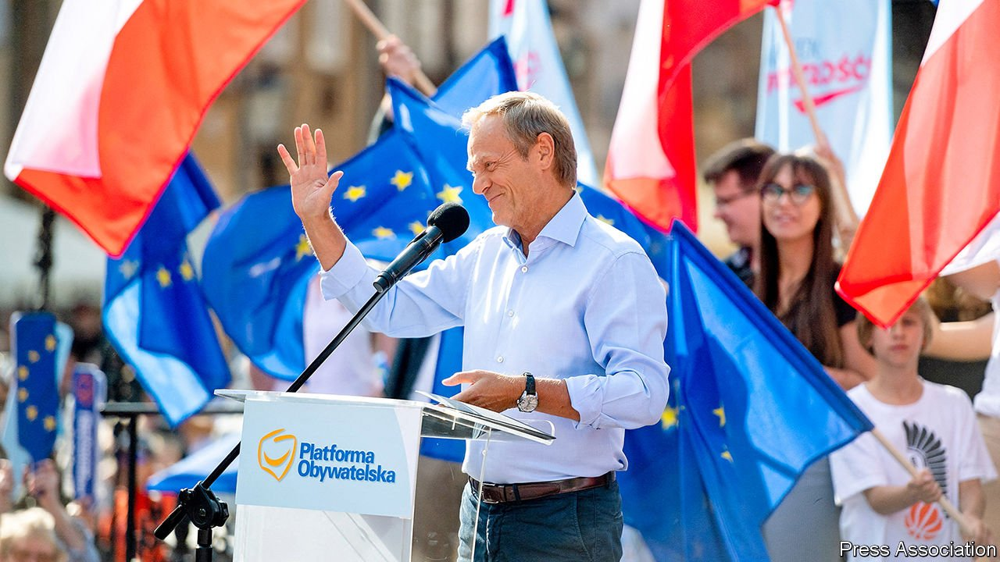

###### The return of the Donald

# Donald Tusk has taken over as leader of Poland’s main opposition party 

##### He has a big hill to climb 

 

> Jul 24th 2021 

POLITICAL COMEBACKS are always a gamble. “Can the soufflé rise twice?” was the withering putdown once delivered by Australia’s then treasurer, Paul Keating, to a re-emergent rival. (It turned out that it couldn’t.) For Donald Tusk, a former prime minister of Poland who returned to domestic politics this month after an international career that took him to the presidency of the EU’s Council, the obstacles are formidable. Since coming to power in 2015, the right-wing populist Law and Justice party has put its stamp on Poland’s institutions and found itself at loggerheads with the European Commission, which accuses it of undermining the rule of law. Liberals hope that Mr Tusk’s return as leader of the centrist Civic Platform, the largest opposition party, will help defeat the populists. It will not be easy.

Moderate and pro-European, Mr Tusk has long presented himself as the antithesis of Law and Justice and of Jaroslaw Kaczynski, its veteran leader. In the late 2000s Mr Tusk appealed to Poles by offering what he called a policy of “warm water in the tap”, focusing on gradually raising living standards (with the help of EU funds, of which Poland has been the largest net beneficiary), rather than on grand projects. Civic Platform, which he co-founded in 2001, did well: it ran Poland for eight years from 2007 onwards, with Mr Tusk as prime minister for seven of them. Yet since he left for Brussels in 2014 to head the European Council, the party has floundered. The following year, Law and Justice swept to power by appealing to poorer Poles, often from outside the cities, who felt left behind by the social and economic changes since 1989. It has been there ever since.


Now Mr Tusk, at 64, hopes to save his old party. On July 3rd he became Civic Platform’s leader again after Borys Budka, its chairman, stepped aside. “The evil that Law and Justice is performing is evident, shameless and permanent,” Mr Tusk said in a speech at a party congress that day. “Regaining faith in…the possibility of winning” is the key, he added.

Mr Tusk’s fans hope he will give his party a much-needed boost. Recently, Civic Platform has faced a new challenger for centrist votes: the Poland 2050 movement led by Szymon Holownia, a former TV-show host who came third in last year’s presidential election. Its proposals include the separation of church and state, a nod to Poles frustrated by the church’s continuing involvement in politics. Polls earlier this year put the new party in second place behind Law and Justice, challenging Civic Platform’s status as the main opposition.

Mr Tusk’s experience in Brussels, most recently as head of the European People’s Party, the EU’s largest grouping of centre-right parties, could also help patch up Warsaw’s relations with the EU, which have been fraught. In the latest stage of the dispute over the government’s judicial reforms, the European Court of Justice ruled on July 15th that Poland’s system for disciplining judges goes against EU law.

Since Mr Tusk’s return, there have been signs that Civic Platform may again be closing the gap with Law and Justice, thanks perhaps to a “Tusk effect”. In one poll last week, Law and Justice was on 30%, with Civic Platform at 23%, three points more than a month earlier and a solid eight points ahead of Poland 2050.

Not all voters are convinced: only 23% of Poles believe that Mr Tusk can become prime minister again, according to a survey conducted at the end of June, with almost 50% reckoning that he can’t. His return also spells tension with Rafal Trzaskowski, Warsaw’s liberal Civic Platform mayor, who narrowly lost last year’s presidential race to Andrzej Duda, who was backed by Law and Justice. The next general election is not due until 2023. Can the Tusk effect last that long? ■

