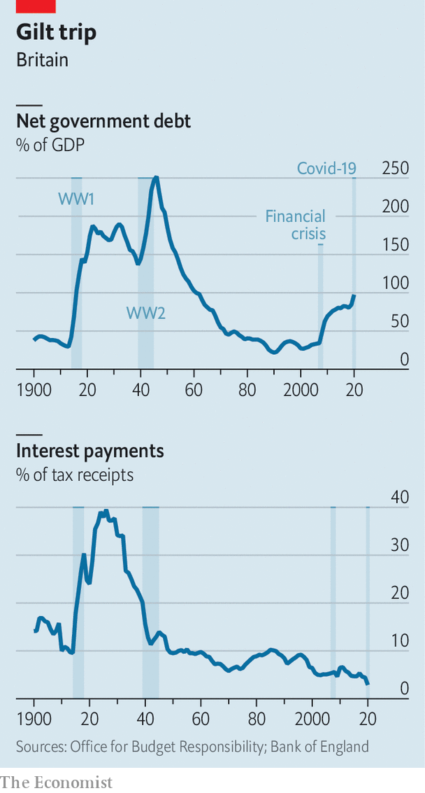

###### Free exchange

# Lessons from Britain on the balance between monetary and fiscal policy 

##### A warning from Britain 

 

> Jul 24th 2021 

NOWADAYS THE Bank of England, like most rich-country central banks, has two main functions: maintaining monetary stability and ensuring the soundness of the financial system. For most of its life, though, it was also responsible for managing government debt. (Thankfully, the original reason for the bank’s creation in 1694, to raise money for “carrying on the war against France”, fell by the wayside.) That function was only hived off to the newly created Debt Management Office (DMO) in 1997, when the bank was given free rein over monetary policy. But in the past decade the bank’s successive rounds of quantitative easing (QE), whereby it creates new money to buy bonds, have left it holding more than a third of the government’s entire stock of debt. That has, awkwardly, dragged it back into the realm of public-debt management.

Britain ran a fiscal deficit of 14.3% of GDP in the latest financial year, higher than in any peacetime year on record and comparable to the wartime borrowing of 1914-18 or 1939-45. The stock of government debt has risen from around 80% of GDP before covid-19 to 100%. The pandemic is the second fiscal shock in little over a decade, after the global financial crisis of 2007-09. As the experience of managing debt after war shows, the divisions between fiscal and monetary policy can often become hazy in times of high public debt and wide deficits, and especially so during crises.


Policy pick ‘n’ mix

Britain’s government debt to GDP over the past century tells a dramatic but familiar story. The huge borrowing of the two world wars is clearly visible, as is the impact of the banking crisis and the pandemic. Looking at servicing costs changes that dramatic narrative. Despite a large increase in debt in the second world war, the burden on taxpayers of servicing that debt fell compared with the 1920s. In the latest financial year debt rose to its highest since the early 1960s but the ratio of interest costs to tax receipts dropped to new lows (see chart). Understanding the varying relationship between debt levels and interest costs means looking at how the functions of fiscal and monetary policy have varied over time.

 


The first world war may have ended in a military victory for Britain but it was also a fiscal disaster. Interest rates rose, enticing investors into buying gilts. The 1917 War Loan, a bond issued by the government, came with a yield of 5%, compared with a pre-war norm of under 3%. This left a toxic legacy for the 1920s, especially as much of the borrowing was short-term and left the Treasury exposed to rising interest rates. Monetary policy in that decade was primarily concerned with returning sterling to the gold standard. The result was higher interest rates than needed for domestic purposes, which not only depressed demand and employment but added to soaring interest costs for the Treasury.

The fiscal crisis of the 1920s and 1930s cast a long shadow, leading things to take a different course during the second world war. John Maynard Keynes outlined his plans for a “three per cent war”. The “business-as-usual” approach that had characterised the early years of the first world war was entirely absent in the second. Monetary policy was made subservient to debt management and the purpose of the Bank of England became to help finance war.

Debt management remained central to monetary policy between the 1940s and the mid-1970s. Interest rates were set with an eye on sustaining the public-debt burden, and fiscal policy took the lead in trying to stabilise the economy. Central banks were, in other words, subject to what economists call “fiscal dominance”. Real interest rates were negative for more than half of the period 1945-80, thanks in part to high inflation. A 2011 paper by Carmen Reinhart and Belen Sbrancia found that such financial repression—a combination of negative real rates with capital controls and the use of prudential powers to force domestic investors to hold public debt—accounted for most of the reduction in the debt ratio after 1945. Similar policies were pursued in America and much of Europe.

Only in the late 1970s and 1980s, as concerns about inflation intensified, did British monetary policy downplay the importance of debt management in setting interest rates. By the late 1990s a new framework was in place. Monetary policy, set by an independent central bank, would target inflation and stabilise the economy. Debt management would be handled by the DMO. For as long as the debt stock remained low, this separation appeared to work well.

Those low-debt days now seem like a distant memory, however. The question of the roles of monetary and fiscal policy therefore looms again. Suborning monetary policy to fiscal needs can make managing public debt much less painful. A spell of low or even negative real interest rates may well provoke fewer political problems than years of tight spending and high taxes. But while austerity is not popular, nor was the inflation that accompanied financial repression. Independent central banks stabilised inflation expectations in the 1990s and 2000s. That hard-won credibility would vanish if investors thought that helping the government meet its bills was the main job of monetary policy.

Worryingly, some investors already seem to believe that the monetary-fiscal separation has broken down in Britain. A survey by the Financial Times of the 18 largest gilt managers in January 2021 found that most believed that the main aim of QE was to lower government-borrowing costs. Cynics note that monthly asset purchases by the Bank of England between April and December last year almost exactly tracked DMO issuance. Andy Haldane, the Bank of England’s departing chief economist, warned in June of the risk of “fiscal dominance”. On July 16th a House of Lords committee, led by Lord Mervyn King, a former governor of the Bank of England, branded QE “a dangerous addiction”, arguing that the trade-offs involved were only acceptable as a temporary measure.

The fears are understandable. The subordination of monetary policy to fiscal needs is not inevitable, but history suggests that when debt is high the temptation will always be strong. The central bank could do more to reassure investors that it is not bending to political pressure. It could start by more openly setting out the rationale for QE, and outlining its plans for an eventual exit. ■

