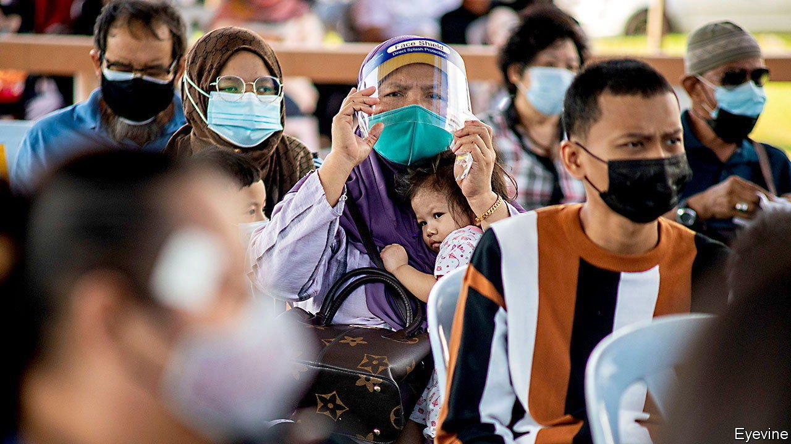

###### The Delta effect

# Outbreaks of covid-19 leave South-East Asia with little policy room 

##### The return to economic normality will be arduous 

 

> Jul 24th 2021 

LAST YEAR many South-East Asian countries were praised for preventing large outbreaks of covid-19, even as they recorded sharp declines in output. They have not escaped unscathed this year. While widespread vaccination may limit the spread and the severity of the Delta variant in much of the rich world, the vast majority of South-East Asians are still unjabbed. Indonesia, Malaysia, Myanmar and Thailand are reporting more cases than ever. New daily cases in Vietnam are three times higher than the annual total for 2020.

High-frequency indicators suggest that the surge in cases has knocked economic activity. Daily mobility figures from Google suggest that people in Indonesia and Vietnam are spending more time at home than they did during the outbreaks of last summer. The most reliable indication of the scale of the economic impact may come from Malaysia, which was hit by a fresh outbreak a little before its neighbours. There the manufacturing purchasing-managers’ index, a gauge of activity in the sector, fell to 39.9 in June, the lowest since April 2020. (A figure below 50 indicates contraction.)


On July 20th the Asian Development Bank (ADB) pared back its growth forecasts for South-East Asia. It now expects an expansion of 4% this year, compared with an earlier forecast of 4.4%. That may not sound so bad, given the scale of the public-health catastrophe. But it means that the region is no longer expected to return to its pre-pandemic level of output by the end of 2021. Some countries, moreover, will suffer much more than others. And they have fewer tools available to soften the blow.

Vietnam has perhaps been luckiest. The country’s goods trade runs to 201% of its GDP, third-highest in the world after the free-trading ports of Hong Kong and Singapore. Burgeoning demand for consumer products from locked-down Westerners helped the country to one of the fastest recoveries in the world, and made it one of the few economies to expand in 2020. Though the ADB has trimmed its 2021 growth forecast for Vietnam, it is still among the highest in the region, at 5.8%.

By contrast, Thailand has suffered without tourists, whose spending accounts for around a fifth of the country’s GDP. The economy shrank by more than 6% last year, and the ADB expects growth of only 2% this year. Faced with this dire economic picture, Phuket has reopened to some vaccinated foreign tourists, a move that Prayut Chan-o-cha, the Thai prime minister, described bluntly last month as a “calculated risk”. The decision by Indonesia’s government to ease lockdown restrictions from July 26th, while cases are still perilously close to their highs, likewise illustrates the difficult choices many middle-income countries face.

Yet reopening at home alone cannot restore economic normality. The recent outbreaks have also dashed any remaining hope of the resumption of tourism from China. Chinese visitors made up between a quarter and a third of tourists in Cambodia, Myanmar, Thailand and Vietnam before the pandemic. Beijing’s reluctance to open its borders, which could persist well into next year or beyond, adds to the economic squeeze.

Meanwhile, central banks in the region are less able to stoke domestic demand and cushion the impact of the outbreaks than they were when the pandemic began. Last year interest rates were slashed to historical lows in most emerging markets. Central banks in Indonesia and the Philippines even joined those in rich countries in pursuing modest bond-buying schemes. Nothing similar seems likely this time. Currencies across the region have stumbled, with selloffs accelerating in the past month. In May Thailand ran its widest current-account deficit in eight years, leaving the country little room to lower interest rates, for fear of discouraging foreign capital. The combination of more covid-19 and less policy space will make the climb back to normality far more arduous than it looked even a few months ago. ■

Dig deeper

All our stories relating to the pandemic and the vaccines can be found on our . You can also find trackers showing ,  and the virus’s spread across  and .

