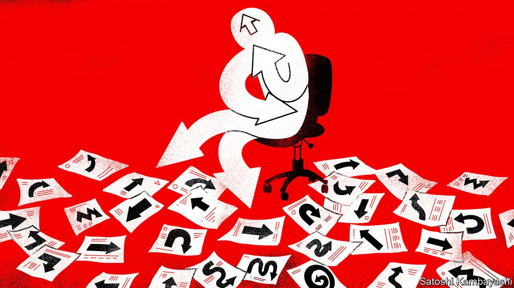
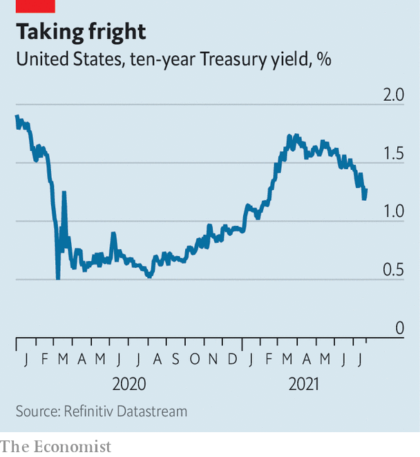

###### Mixed messages

# The anatomy of a growth scare 

##### Depending on where you look, the economic recovery is either on track or in trouble 

 

> Jul 24th 2021 

SO MUCH IS unfamiliar about the pandemic that it has never been easy to make sense of what is going on. Yet in recent days uncertainty has gone into overdrive. Stockmarkets are volatile; uncertainty about the path of inflation and labour markets is high. The fate of the economic recovery seems to hinge on the answers to a number of big questions. Will the spread of the Delta variant of the coronavirus derail the global recovery? Will underlying weaknesses be revealed as governments unwind stimulus? How enthusiastic are households and firms about spending? But the answers are unclear. And four gauges of the recovery—market prices, “high-frequency” activity indicators, hard data and economists’ forecasts—are all giving mixed signals.

Start with markets. America’s Treasuries are a haven in uncertain times. In March investors sold them off as they took fright at rising inflation, pushing the ten-year Treasury yield up to 1.7%. But it has slowly slipped back since, as doubts about the continued strength of the economic recovery have taken hold. The growth scare seemed to intensify on July 19th, when the ten-year yield dipped to 1.19%. The S&amp;P 500, America’s main stock index, fell by 1.6%, with smaller companies hit hardest. Commodity prices also took a knock. That of Brent crude oil fell by 7% to $69 a barrel. The dollar strengthened against other rich-world currencies.


All this seems consistent with concerns about the recovery and, in particular, a reassessment of what is known as the “reflation trade”, where investors buy assets most likely to benefit from an economic upswing. Yet by the next day the growth scare had seemingly blown over. Stockmarkets reversed their fall. The oil price and bond yields recovered a little.

High-frequency data present a similarly muddled picture. Global mobility measures are still edging up, according to a recent report by JPMorgan Chase, a bank, suggesting continued growth in GDP. Yet Britain, the first big, rich country to be hit hard by the Delta variant, is telling a different story. Our “economic-activity index” for the country, using Google data on visits to workplaces, transit stations and sites of retail and recreation, has dropped by about 5% since peaking in June (and there is little sign of greater mobility from July 19th onwards, when England lifted all domestic covid-19 restrictions). The British story seems likely to set a trend to a degree. In America surveys suggest that the uptick in coronavirus infections linked to the Delta variant has been accompanied by a pickup in people’s reported fear of the virus.

 


The hardest sort of data—releases from official statistical agencies—do not yet reflect the impact of rising covid-19 infections. But they also give contradictory signals. Measures of economic “surprise” in activity indicators (ie, a comparison of the published numbers with economists’ forecasts) still look fairly positive, especially in Europe. Housebuilding in America is proving more vigorous than almost anyone expected; Britain’s government is borrowing less than economic forecasters thought it would, a sign of a decent recovery in tax receipts. But there have also been disappointments. In America, for instance, the University of Michigan’s index of consumer sentiment declined in July, against expectations of an increase.

Owing in part to the movements in activity indicators, economists’ revisions to their expectations of GDP growth—our fourth measure—also send mixed messages. Analysts at JPMorgan reckon that American output will rise at an annual rate of 4.3% in July, which is lower than what they had forecast a week ago (yet represents an acceleration compared with the month of June). Economists at Goldman Sachs, another bank, see downside risks to the global economy but still expect a robust recovery in 2021.

Bring all this together and the picture is one of increasing uncertainty about whether or not the global economic recovery carries on at a rapid clip. In the rich world consumers are still sitting on piles of hoarded savings, and workers are in high demand. Yet the biggest rebound in activity, flattered by a favourable comparison with last year’s lockdown-induced depths and, in America, generous stimulus cheques, has passed. In its place are niggling doubts about whether the recovery can be sustained. Governments’ emergency stimulus programmes are coming to an end. There are growing fears that, as the Delta variant of the coronavirus spreads, the resurgence in cases could impinge on economic growth, especially in places with large unvaccinated populations. ■

