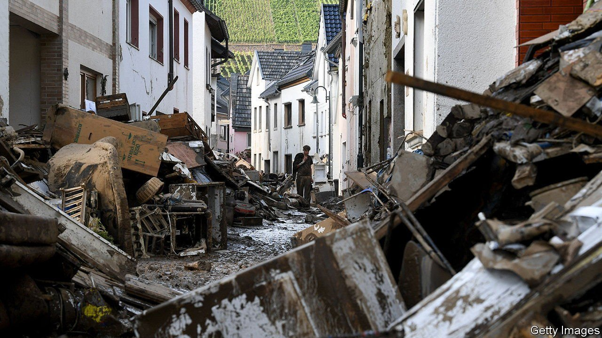

###### Overlooked no more

# The private sector starts to invest in climate adaptation 

##### Companies and investors hope to avert losses to climate catastrophes 

 

> Jul 24th 2021 

“WE’RE GOING to make a lot of money,” says Ken LaRoe, chief executive of Florida’s Climate First Bank. That might seem like an unseemly boast from a traditional banker peddling conventional loans. But the lender aims to make its profits by financing green refrigeration, construction retrofits and other investments designed to help borrowers adapt to climate change. “Storm-hardening is getting to be a really big thing in Florida,” Mr LaRoe reckons, “which will be a nice lending opportunity for us.”

The need for such spending is clear. The UN Environment Programme reckons that annual adaptation costs in poor countries alone are likely to rise from around $70bn today to $140bn-300bn in 2030, and twice that by 2050, in nominal terms. It seems likely that private investors will have to get more involved. According to the Climate Policy Initiative, an expert body, they contributed a paltry 2% to global adaptation spending in 2018. The apathy reflected, among other things, a lack of reliable data on climate risks and the perception that adaptation offers low returns. But the mood could be shifting, as Mr LaRoe’s enthusiasm suggests.


There is reason to think that investing in climate adaptation can pay off handsomely, if only because not making such investments can cost companies. A study in 2019 by BlackRock, an asset manager, argued that property will be especially badly hit by the impacts of climate change. Beyond the immediate damage from storms and floods, it pointed to costlier or reduced insurance coverage, pricier energy, costs of installing backup generators and other emergency systems, and falling property prices in vulnerable areas.

In hurricane-prone Florida a study of insurance data found that new buildings adhering to a stricter building code suffered far less damage, yielding $3.50 in benefits for every dollar in extra compliance costs. A recent report by the Global Commission on Adaptation (GCA), an NGO of worthies that include Bill Gates, identified $1.8trn in investments that could deliver net benefits of $7.1trn by 2030.

It makes sense, then, that reinsurers are also banging the drum. Swiss Re reckons it is far cheaper to invest ahead of climate disaster than to pay to fix it afterwards. Boffins at Munich Re have co-written a recent paper showing that linking adaptation and insurance, for example by restoring coral reefs that reduce the damage done by subsequent storms, could lead to reduced premiums and a sixfold return on initial costs over 25 years.

The trickle of investment into climate adaptation could turn into a torrent as companies are forced to disclose climate-related risks. The EU is moving towards mandatory disclosure. In America, President Joe Biden issued an executive order in May along the same lines, and the Securities and Exchange Commission is expected to unveil a related proposal soon.

Investors are paying more attention. “If you are not protected against climate risk, you are probably going to get lower financial returns in future,” says Vivek Pathak of the International Finance Corporation, the private-sector arm of the World Bank. Natalie Ambrosio Preudhomme of Four Twenty Seven, an advisory firm, points to the emergence of resilience bonds, the proceeds of which must go to climate adaptation, as something that fits with “the investment strategies of many large institutional investors”. An issuance in 2019 by the European Bank for Reconstruction and Development was oversubscribed.

Resilience-focused investment funds are emerging too. Sanjay Wagle, co-founder of Lightsmith Group, a private-equity firm, is ploughing money into technologies such as geospatial imaging, weather analytics and precision agriculture. On July 19th Generate Capital, an American sustainable infrastructure firm, said it had raised $2bn. Scott Jacobs, its boss, insists that “we do not accept lower returns for investments with resilience benefits.” He points to his firm’s durable electric “microgrids” in Texas and California, which kept the power flowing and continued to earn revenues during recent outages caused by freezing weather and wildfires.

Utilities firms may prove to be keenest on resilience of them all. Mr Wagle contrasts Pacific Gas &amp; Electric, a northern Californian utility driven to bankruptcy in large part by its failure to prepare for wildfires and weather-related shocks, with Southern California Edison, its flourishing southern counterpart that is spending more than $1bn a year on resilience. BlackRock’s report analysed the climate exposure of 269 American utilities and found that the most resilient of them trade at a premium. “We believe this premium could increase...as the risks compound and investors pay greater attention to the dangers,” it concluded. Adaptation sceptics should note that its lead author was Brian Deese, now a top adviser to Mr Biden. ■

 An earlier version of this story described Generate Capital as a private-equity fund. It is in fact a sustainable-infrastructure firm. Sorry.

For more coverage of climate change, register for The Climate Issue, our fortnightly , or visit our 

